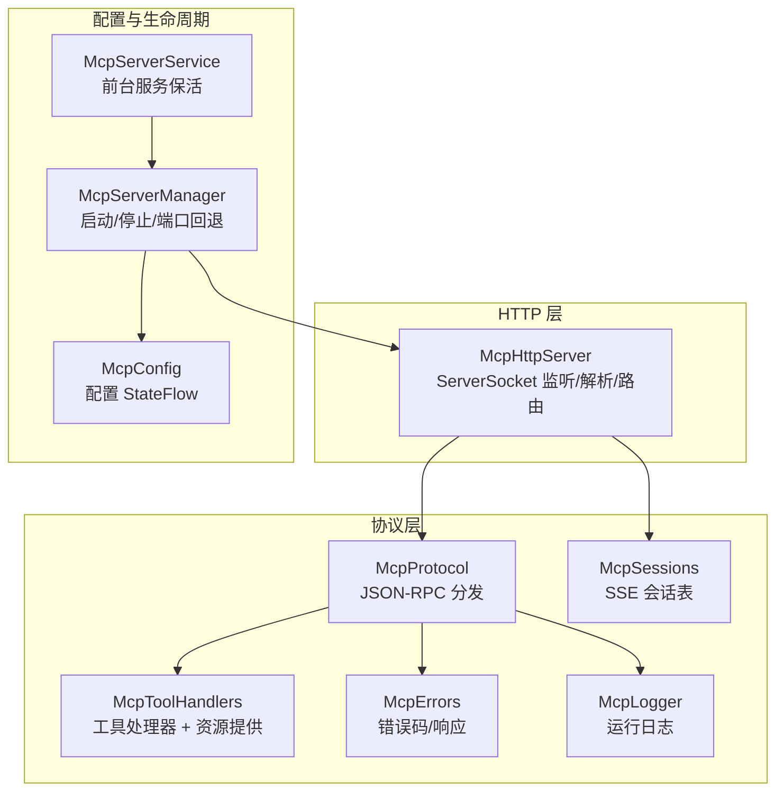
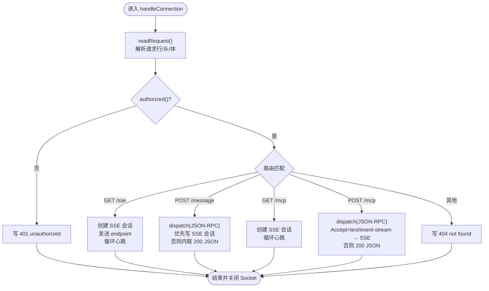
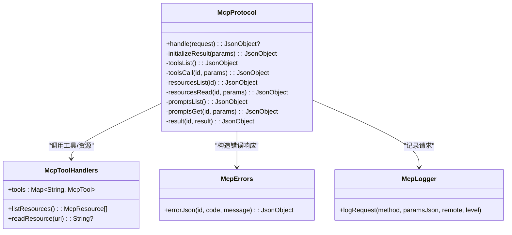
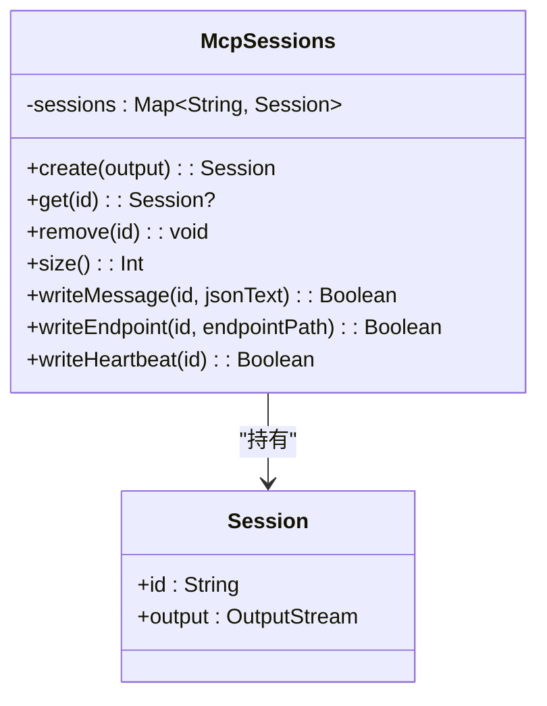
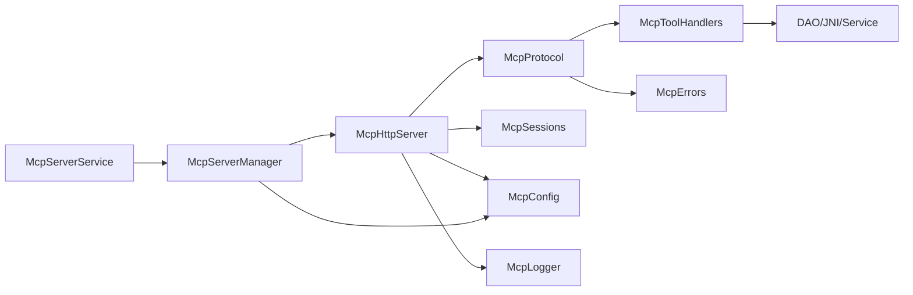

# HTTP 服务器架构

<cite>
**本文引用的文件**   
- [McpHttpServer.kt](file://app/src/main/java/com/ai/fler/core/mcp/McpHttpServer.kt)
- [McpProtocol.kt](file://app/src/main/java/com/ai/fler/core/mcp/McpProtocol.kt)
- [McpSessions.kt](file://app/src/main/java/com/ai/fler/core/mcp/McpSessions.kt)
- [McpConfig.kt](file://app/src/main/java/com/ai/fler/core/mcp/McpConfig.kt)
- [McpToolHandlers.kt](file://app/src/main/java/com/ai/fler/core/mcp/McpToolHandlers.kt)
- [McpErrors.kt](file://app/src/main/java/com/ai/fler/core/mcp/McpErrors.kt)
- [McpLogger.kt](file://app/src/main/java/com/ai/fler/core/mcp/McpLogger.kt)
- [McpResource.kt](file://app/src/main/java/com/ai/fler/core/mcp/McpResource.kt)
- [McpServerManager.kt](file://app/src/main/java/com/ai/fler/features/mcp/McpServerManager.kt)
- [McpServerService.kt](file://app/src/main/java/com/ai/fler/features/mcp/McpServerService.kt)
</cite>

## 目录
1. [简介](#简介)
2. [项目结构](#项目结构)
3. [核心组件](#核心组件)
4. [架构总览](#架构总览)
5. [详细组件分析](#详细组件分析)
6. [依赖关系分析](#依赖关系分析)
7. [性能考量](#性能考量)
8. [故障排查指南](#故障排查指南)
9. [结论](#结论)
10. [附录：HTTP 协议实现细节与端点说明](#附录http-协议实现细节与端点说明)

## 简介
本文件为 MCP HTTP 服务器的架构文档，聚焦于基于 ServerSocket 自实现的无第三方依赖 HTTP 服务器设计。内容涵盖连接处理、请求解析、路由分发、线程池管理（固定 8 线程）、心跳机制（5 秒间隔）、会话管理与错误处理策略；并详细说明四个端点的行为与协议格式：GET /sse（legacy HTTP+SSE）、POST /message（legacy 消息端点）、POST /mcp（MCP Streamable HTTP JSON-RPC）、GET /mcp（服务器→客户端事件流）。同时给出认证机制的实现原理与安全建议、性能优化建议与故障排查指南。

## 项目结构
MCP HTTP 服务器位于 core/mcp 包中，由以下关键类组成：
- McpHttpServer：基于 ServerSocket 的 HTTP 服务器实现，负责监听、接受连接、解析请求、路由分发、响应输出、心跳与 SSE 会话管理。
- McpProtocol：JSON-RPC 协议分发器，处理 initialize、ping、tools.*、resources.*、prompts.* 等方法。
- McpSessions：SSE 会话注册表，维护每个连接的 OutputStream，支持 endpoint、message、heartbeat 事件推送。
- McpConfig：配置中心（启用开关、绑定模式、端口、Token、补丁工具开关），通过 StateFlow 暴露状态。
- McpToolHandlers：工具处理器集合，将现有分析服务映射为 MCP 工具，并实现资源提供者接口。
- McpErrors：JSON-RPC 错误码与错误响应构造。
- McpLogger：有界内存日志，供设置页展示。
- McpResource：资源描述与资源数据源接口。
- McpServerManager：服务器生命周期管理，包括启动、停止、端口回退、状态广播。
- McpServerService：Android 前台服务，用于局域网模式保活。



图表来源
- [McpHttpServer.kt:1-286](file://app/src/main/java/com/ai/fler/core/mcp/McpHttpServer.kt#L1-L286)
- [McpProtocol.kt:1-240](file://app/src/main/java/com/ai/fler/core/mcp/McpProtocol.kt#L1-L240)
- [McpSessions.kt:1-81](file://app/src/main/java/com/ai/fler/core/mcp/McpSessions.kt#L1-L81)
- [McpConfig.kt:1-62](file://app/src/main/java/com/ai/fler/core/mcp/McpConfig.kt#L1-L62)
- [McpToolHandlers.kt:1-800](file://app/src/main/java/com/ai/fler/core/mcp/McpToolHandlers.kt#L1-L800)
- [McpErrors.kt:1-29](file://app/src/main/java/com/ai/fler/core/mcp/McpErrors.kt#L1-L29)
- [McpLogger.kt:1-81](file://app/src/main/java/com/ai/fler/core/mcp/McpLogger.kt#L1-L81)
- [McpServerManager.kt:1-143](file://app/src/main/java/com/ai/fler/features/mcp/McpServerManager.kt#L1-L143)
- [McpServerService.kt:1-111](file://app/src/main/java/com/ai/fler/features/mcp/McpServerService.kt#L1-L111)

章节来源
- [McpHttpServer.kt:1-286](file://app/src/main/java/com/ai/fler/core/mcp/McpHttpServer.kt#L1-L286)
- [McpProtocol.kt:1-240](file://app/src/main/java/com/ai/fler/core/mcp/McpProtocol.kt#L1-L240)
- [McpSessions.kt:1-81](file://app/src/main/java/com/ai/fler/core/mcp/McpSessions.kt#L1-L81)
- [McpConfig.kt:1-62](file://app/src/main/java/com/ai/fler/core/mcp/McpConfig.kt#L1-L62)
- [McpToolHandlers.kt:1-800](file://app/src/main/java/com/ai/fler/core/mcp/McpToolHandlers.kt#L1-L800)
- [McpErrors.kt:1-29](file://app/src/main/java/com/ai/fler/core/mcp/McpErrors.kt#L1-L29)
- [McpLogger.kt:1-81](file://app/src/main/java/com/ai/fler/core/mcp/McpLogger.kt#L1-L81)
- [McpServerManager.kt:1-143](file://app/src/main/java/com/ai/fler/features/mcp/McpServerManager.kt#L1-L143)
- [McpServerService.kt:1-111](file://app/src/main/java/com/ai/fler/features/mcp/McpServerService.kt#L1-L111)

## 核心组件
- McpHttpServer：实现 HTTP 协议栈（请求行、头部、Body 读取）、路由分发、SSE 握手与心跳、认证校验、线程池管理（固定 8 线程）和连接生命周期管理。
- McpProtocol：JSON-RPC 方法分发，统一返回结果或通知，封装错误响应。
- McpSessions：并发安全的会话表，支持写入 event: message、event: endpoint、: ping 心跳，失败自动清理。
- McpConfig：持久化配置，StateFlow 驱动 UI 与运行时行为（如 Token 鉴权、绑定模式、端口）。
- McpToolHandlers：工具注册与执行，包含分析、浏览、反汇编、ELF、地址转换、汇编等能力，并实现资源列表与读取。
- McpErrors：标准 JSON-RPC 错误码与自定义错误段。
- McpLogger：有界内存日志，记录请求方法与参数、远程地址、级别。
- McpServerManager：启动/停止、端口回退、状态广播（端口、活跃会话数、URL）。
- McpServerService：前台服务，保障局域网模式下进程存活。

章节来源
- [McpHttpServer.kt:1-286](file://app/src/main/java/com/ai/fler/core/mcp/McpHttpServer.kt#L1-L286)
- [McpProtocol.kt:1-240](file://app/src/main/java/com/ai/fler/core/mcp/McpProtocol.kt#L1-L240)
- [McpSessions.kt:1-81](file://app/src/main/java/com/ai/fler/core/mcp/McpSessions.kt#L1-L81)
- [McpConfig.kt:1-62](file://app/src/main/java/com/ai/fler/core/mcp/McpConfig.kt#L1-L62)
- [McpToolHandlers.kt:1-800](file://app/src/main/java/com/ai/fler/core/mcp/McpToolHandlers.kt#L1-L800)
- [McpErrors.kt:1-29](file://app/src/main/java/com/ai/fler/core/mcp/McpErrors.kt#L1-L29)
- [McpLogger.kt:1-81](file://app/src/main/java/com/ai/fler/core/mcp/McpLogger.kt#L1-L81)
- [McpServerManager.kt:1-143](file://app/src/main/java/com/ai/fler/features/mcp/McpServerManager.kt#L1-L143)
- [McpServerService.kt:1-111](file://app/src/main/java/com/ai/fler/features/mcp/McpServerService.kt#L1-L111)

## 架构总览
下图展示了从客户端到服务器各层的调用链路与数据流向。

```mermaid
sequenceDiagram
participant Client as "客户端"
participant Http as "McpHttpServer<br/>ServerSocket/线程池"
participant Router as "路由分发"
participant Proto as "McpProtocol<br/>JSON-RPC"
participant Tools as "McpToolHandlers<br/>工具/资源"
participant Sess as "McpSessions<br/>SSE 会话"
participant Log as "McpLogger"
Client->>Http : TCP 连接
Http->>Http : acceptLoop() 接收连接
Http->>Http : handleConnection()<br/>readRequest()/authorized()
alt GET /sse
Http->>Sess : create(output)
Http->>Sess : writeEndpoint(id, "/message?sessionId=...")
loop 心跳
Http->>Sess : writeHeartbeat(id)
end
else POST /message
Http->>Proto : dispatch(body)
Proto-->>Http : JsonObject?
opt 存在 SSE 会话
Http->>Sess : writeMessage(id, response)
else 无会话
Http-->>Client : 200 application/json(response)
end
Http-->>Client : 202 Accepted
else GET /mcp
Http->>Sess : create(output)
loop 心跳
Http->>Sess : writeHeartbeat(id)
end
else POST /mcp
Http->>Proto : dispatch(body)
Proto-->>Http : JsonObject?
alt Accept : text/event-stream
Http->>Client : 200 text/event-stream<br/>event : message/data : ...
else 普通 JSON
Http-->>Client : 200 application/json(response)
end
else 其他
Http-->>Client : 404 Not Found
end
```

图表来源
- [McpHttpServer.kt:72-166](file://app/src/main/java/com/ai/fler/core/mcp/McpHttpServer.kt#L72-L166)
- [McpProtocol.kt:34-53](file://app/src/main/java/com/ai/fler/core/mcp/McpProtocol.kt#L34-L53)
- [McpSessions.kt:20-79](file://app/src/main/java/com/ai/fler/core/mcp/McpSessions.kt#L20-L79)

章节来源
- [McpHttpServer.kt:72-166](file://app/src/main/java/com/ai/fler/core/mcp/McpHttpServer.kt#L72-L166)
- [McpProtocol.kt:34-53](file://app/src/main/java/com/ai/fler/core/mcp/McpProtocol.kt#L34-L53)
- [McpSessions.kt:20-79](file://app/src/main/java/com/ai/fler/core/mcp/McpSessions.kt#L20-L79)

## 详细组件分析

### McpHttpServer：HTTP 服务器与连接处理
- 线程模型：使用固定大小线程池（THREADS=8）处理连接，acceptLoop 在独立线程中循环 accept，每次连接提交到线程池处理。
- 请求解析：readRequest 手动解析请求行（方法、路径、查询参数）、头部（键值对）、Body（Content-Length 控制读取）。
- 路由分发：根据 method+path 分派到 legacy SSE、Streamable SSE、legacy message、streamable mcp 处理函数。
- 认证机制：若配置了 token，则要求 Authorization: Bearer <token>，否则拒绝 401。
- 响应格式：writeResponse 构建 HTTP/1.1 响应头（Content-Type、Content-Length、Connection: close），writeSseHeaders 构建 SSE 响应头（text/event-stream、no-cache、keep-alive）。
- 心跳机制：SSE 会话每 5 秒发送 : ping 心跳，异常或断线时清理会话。
- 错误处理：未授权 401，未找到 404，空请求/解析失败返回 JSON-RPC 错误。



图表来源
- [McpHttpServer.kt:83-166](file://app/src/main/java/com/ai/fler/core/mcp/McpHttpServer.kt#L83-L166)
- [McpHttpServer.kt:194-267](file://app/src/main/java/com/ai/fler/core/mcp/McpHttpServer.kt#L194-L267)
- [McpHttpServer.kt:269-279](file://app/src/main/java/com/ai/fler/core/mcp/McpHttpServer.kt#L269-L279)

章节来源
- [McpHttpServer.kt:72-166](file://app/src/main/java/com/ai/fler/core/mcp/McpHttpServer.kt#L72-L166)
- [McpHttpServer.kt:194-267](file://app/src/main/java/com/ai/fler/core/mcp/McpHttpServer.kt#L194-L267)
- [McpHttpServer.kt:269-279](file://app/src/main/java/com/ai/fler/core/mcp/McpHttpServer.kt#L269-L279)

### McpProtocol：JSON-RPC 协议分发
- 入口 handle(request) 解析 method、params，按方法名分发到 initialize、ping、tools/list、tools/call、resources/list、resources/read、prompts/list、prompts/get。
- tools/call 调用具体工具处理器，捕获 McpToolException 与通用异常，分别返回 isError=true 文本或标准错误响应。
- resources/list 与 resources/read 委托给 McpResourceProvider（由 McpToolHandlers 实现）。
- prompts/get 生成引导分析的提示文本。
- 所有成功响应通过 result(id, result) 包装为标准 JSON-RPC 2.0 响应。



图表来源
- [McpProtocol.kt:34-234](file://app/src/main/java/com/ai/fler/core/mcp/McpProtocol.kt#L34-L234)
- [McpToolHandlers.kt:1-800](file://app/src/main/java/com/ai/fler/core/mcp/McpToolHandlers.kt#L1-L800)
- [McpErrors.kt:19-28](file://app/src/main/java/com/ai/fler/core/mcp/McpErrors.kt#L19-L28)
- [McpLogger.kt:41-57](file://app/src/main/java/com/ai/fler/core/mcp/McpLogger.kt#L41-L57)

章节来源
- [McpProtocol.kt:34-234](file://app/src/main/java/com/ai/fler/core/mcp/McpProtocol.kt#L34-L234)
- [McpToolHandlers.kt:1-800](file://app/src/main/java/com/ai/fler/core/mcp/McpToolHandlers.kt#L1-L800)
- [McpErrors.kt:19-28](file://app/src/main/java/com/ai/fler/core/mcp/McpErrors.kt#L19-L28)
- [McpLogger.kt:41-57](file://app/src/main/java/com/ai/fler/core/mcp/McpLogger.kt#L41-L57)

### McpSessions：SSE 会话管理
- 使用 ConcurrentHashMap 存储 id→Session（id + OutputStream）。
- create/remove/get 提供基本 CRUD。
- writeMessage/writeEndpoint/writeHeartbeat 以 synchronized 保证单会话写入安全，失败时移除会话。
- 心跳 : ping 用于检测连接存活。



图表来源
- [McpSessions.kt:14-80](file://app/src/main/java/com/ai/fler/core/mcp/McpSessions.kt#L14-L80)

章节来源
- [McpSessions.kt:14-80](file://app/src/main/java/com/ai/fler/core/mcp/McpSessions.kt#L14-L80)

### McpConfig：配置与认证
- 提供 enabled、bindMode（LOCAL/LAN）、port、token、patchEnabled 等配置项，均为 StateFlow 可观察。
- Token 为空时放行所有请求；非空时要求 Authorization: Bearer <token>。
- 默认端口 8765。

章节来源
- [McpConfig.kt:22-61](file://app/src/main/java/com/ai/fler/core/mcp/McpConfig.kt#L22-L61)
- [McpHttpServer.kt:269-274](file://app/src/main/java/com/ai/fler/core/mcp/McpHttpServer.kt#L269-L274)

### McpToolHandlers：工具与资源
- 工具分类：分析、浏览、反汇编/ELF/地址、补丁等，均通过 McpTool(name, description, inputSchema, handler) 注册。
- 资源提供：实现 listResources 与 readResource，供 McpProtocol 的 resources/* 方法使用。
- 工具调用：参数校验、业务逻辑执行、异常捕获与错误响应构造。

章节来源
- [McpToolHandlers.kt:1-800](file://app/src/main/java/com/ai/fler/core/mcp/McpToolHandlers.kt#L1-L800)
- [McpResource.kt:1-15](file://app/src/main/java/com/ai/fler/core/mcp/McpResource.kt#L1-L15)

### McpServerManager：生命周期与端口回退
- 启动时根据 bindMode 选择 127.0.0.1 或 0.0.0.0，尝试 base..base+9 端口回退。
- 成功后更新状态（端口、活跃会话数、本地与局域网 URL）。
- 周期性刷新活跃会话数。

章节来源
- [McpServerManager.kt:33-126](file://app/src/main/java/com/ai/fler/features/mcp/McpServerManager.kt#L33-L126)

### McpServerService：前台服务保活
- 局域网模式启动前台服务，避免进程被杀导致服务中断。
- 提供 start/stop 静态方法，使用 START_STICKY 重启策略。

章节来源
- [McpServerService.kt:25-111](file://app/src/main/java/com/ai/fler/features/mcp/McpServerService.kt#L25-L111)

## 依赖关系分析
- McpHttpServer 依赖 McpProtocol、McpConfig、McpSessions、McpLogger。
- McpProtocol 依赖 McpToolHandlers、McpLogger、McpResourceProvider（由 McpToolHandlers 实现）。
- McpToolHandlers 依赖多个 DAO 与 JNI 绑定（Capstone、ElfParser、Keystone），以及 AddressTranslator、McpPatchService、EngineMcpToolRegistry。
- McpServerManager 依赖 McpConfig、McpToolHandlers、McpLogger、McpSessions、McpHttpServer。
- McpServerService 依赖 McpServerManager。



图表来源
- [McpHttpServer.kt:29-34](file://app/src/main/java/com/ai/fler/core/mcp/McpHttpServer.kt#L29-L34)
- [McpProtocol.kt:23-27](file://app/src/main/java/com/ai/fler/core/mcp/McpProtocol.kt#L23-L27)
- [McpToolHandlers.kt:39-50](file://app/src/main/java/com/ai/fler/core/mcp/McpToolHandlers.kt#L39-L50)
- [McpServerManager.kt:33-41](file://app/src/main/java/com/ai/fler/features/mcp/McpServerManager.kt#L33-L41)
- [McpServerService.kt:25-28](file://app/src/main/java/com/ai/fler/features/mcp/McpServerService.kt#L25-L28)

章节来源
- [McpHttpServer.kt:29-34](file://app/src/main/java/com/ai/fler/core/mcp/McpHttpServer.kt#L29-L34)
- [McpProtocol.kt:23-27](file://app/src/main/java/com/ai/fler/core/mcp/McpProtocol.kt#L23-L27)
- [McpToolHandlers.kt:39-50](file://app/src/main/java/com/ai/fler/core/mcp/McpToolHandlers.kt#L39-L50)
- [McpServerManager.kt:33-41](file://app/src/main/java/com/ai/fler/features/mcp/McpServerManager.kt#L33-L41)
- [McpServerService.kt:25-28](file://app/src/main/java/com/ai/fler/features/mcp/McpServerService.kt#L25-L28)

## 性能考量
- 线程池大小固定为 8，适合中等并发 IO 场景；若 CPU 密集任务增多，需评估是否扩展线程池或异步化工具调用。
- SSE 心跳 5 秒间隔，避免频繁网络开销；长连接下注意客户端超时与重连策略。
- Body 读取基于 Content-Length，避免无限读；大对象（如 srcCode）应限制长度或分页返回。
- 数据库查询采用 SQL 下推与分页，减少内存占用；搜索类工具限制 limit。
- 日志有界（最多 500 条），防止内存增长。
- 建议：
  - 对耗时工具调用使用协程 IO 调度（已在 HTTP 层使用 runBlocking(Dispatchers.IO) 包裹协议处理）。
  - 对大响应进行压缩（GZIP）或分块传输（需自行实现 HTTP/1.1 chunked）。
  - 增加请求速率限制与连接数上限，防止滥用。
  - 监控线程池队列长度与活跃连接数，动态调整。

[本节为通用指导，不直接分析具体文件]

## 故障排查指南
- 无法连接：
  - 检查端口占用与回退策略（base..base+9），确认实际端口与 URL。
  - 确认防火墙/SELinux 允许本机或局域网访问。
- 401 Unauthorized：
  - 检查 Authorization: Bearer <token> 是否与配置一致。
- 404 Not Found：
  - 检查请求路径与方法是否正确。
- JSON 解析失败：
  - 检查请求体是否为合法 JSON，查看日志中的错误信息。
- SSE 断开：
  - 检查心跳是否正常发送，客户端是否及时重连。
- 工具调用异常：
  - 查看 McpLogger 中的错误日志，定位工具名与参数。
- 内存/CPU 高：
  - 检查是否有大对象未截断、SQL 未分页、线程池饱和。

章节来源
- [McpHttpServer.kt:83-107](file://app/src/main/java/com/ai/fler/core/mcp/McpHttpServer.kt#L83-L107)
- [McpHttpServer.kt:169-190](file://app/src/main/java/com/ai/fler/core/mcp/McpHttpServer.kt#L169-L190)
- [McpLogger.kt:27-57](file://app/src/main/java/com/ai/fler/core/mcp/McpLogger.kt#L27-L57)
- [McpServerManager.kt:60-93](file://app/src/main/java/com/ai/fler/features/mcp/McpServerManager.kt#L60-L93)

## 结论
该 MCP HTTP 服务器以极简方式实现了完整的 HTTP/SSE/JSON-RPC 能力，无需第三方依赖，便于在 Android 环境中嵌入与调试。通过固定线程池、心跳机制与会话管理，保证了基本的稳定性与可观测性。结合工具处理器与资源提供者，提供了丰富的分析与调试能力。建议在后续迭代中增强限流、压缩、监控与错误恢复能力，以提升在高并发与复杂场景下的鲁棒性。

[本节为总结，不直接分析具体文件]

## 附录：HTTP 协议实现细节与端点说明

### 请求行与头部解析
- 请求行：METHOD PATH QUERY
- 头部：KEY: VALUE（小写键）
- Body：仅 POST 且 Content-Length > 0 时读取 UTF-8 字符串

章节来源
- [McpHttpServer.kt:194-231](file://app/src/main/java/com/ai/fler/core/mcp/McpHttpServer.kt#L194-L231)

### 响应格式
- 普通响应：HTTP/1.1 STATUS Reason\r\nContent-Type: ...\r\nContent-Length: N\r\nConnection: close\r\n\r\nBODY
- SSE 响应：HTTP/1.1 200 OK\r\nContent-Type: text/event-stream\r\nCache-Control: no-cache\r\nConnection: keep-alive\r\n\r\n

章节来源
- [McpHttpServer.kt:249-267](file://app/src/main/java/com/ai/fler/core/mcp/McpHttpServer.kt#L249-L267)

### 端点说明
- GET /sse（legacy HTTP+SSE）
  - 建立 SSE 会话，发送 event: endpoint 指向 /message?sessionId=...
  - 保持连接，每 5 秒发送 : ping 心跳
- POST /message（legacy 消息端点）
  - 接收 JSON-RPC 请求，优先通过对应 sessionId 的 SSE 会话回发 event: message
  - 若无会话，直接返回 200 application/json 响应
- POST /mcp（MCP Streamable HTTP JSON-RPC）
  - 若 Accept 包含 text/event-stream，返回 SSE 事件 event: message/data: ...
  - 否则返回 200 application/json
- GET /mcp（服务器→客户端事件流）
  - 建立 SSE 会话，保持连接，每 5 秒发送 : ping 心跳

章节来源
- [McpHttpServer.kt:95-166](file://app/src/main/java/com/ai/fler/core/mcp/McpHttpServer.kt#L95-L166)
- [McpSessions.kt:38-79](file://app/src/main/java/com/ai/fler/core/mcp/McpSessions.kt#L38-L79)

### 认证机制与安全考虑
- 若配置 token 非空，必须携带 Authorization: Bearer <token>，否则返回 401
- 建议：
  - 生产环境强制启用 token，并使用 HTTPS（可通过反向代理实现）
  - 限制来源 IP 白名单（可在上层网关实现）
  - 定期轮换 token，最小权限原则

章节来源
- [McpConfig.kt:41-51](file://app/src/main/java/com/ai/fler/core/mcp/McpConfig.kt#L41-L51)
- [McpHttpServer.kt:269-274](file://app/src/main/java/com/ai/fler/core/mcp/McpHttpServer.kt#L269-L274)