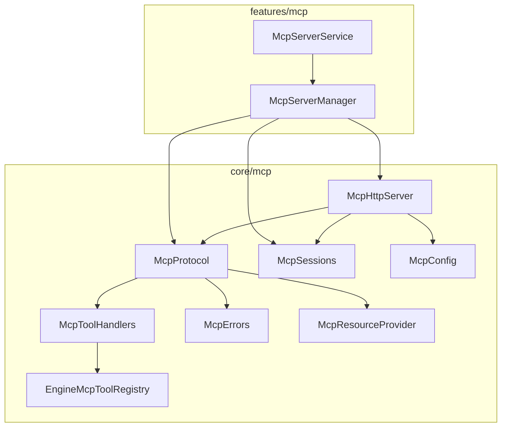
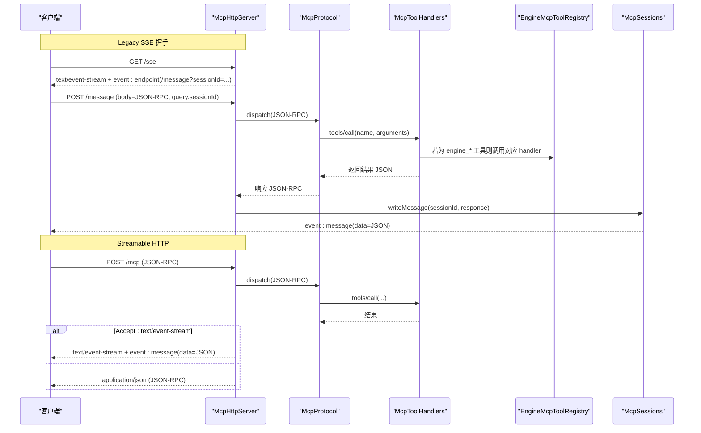
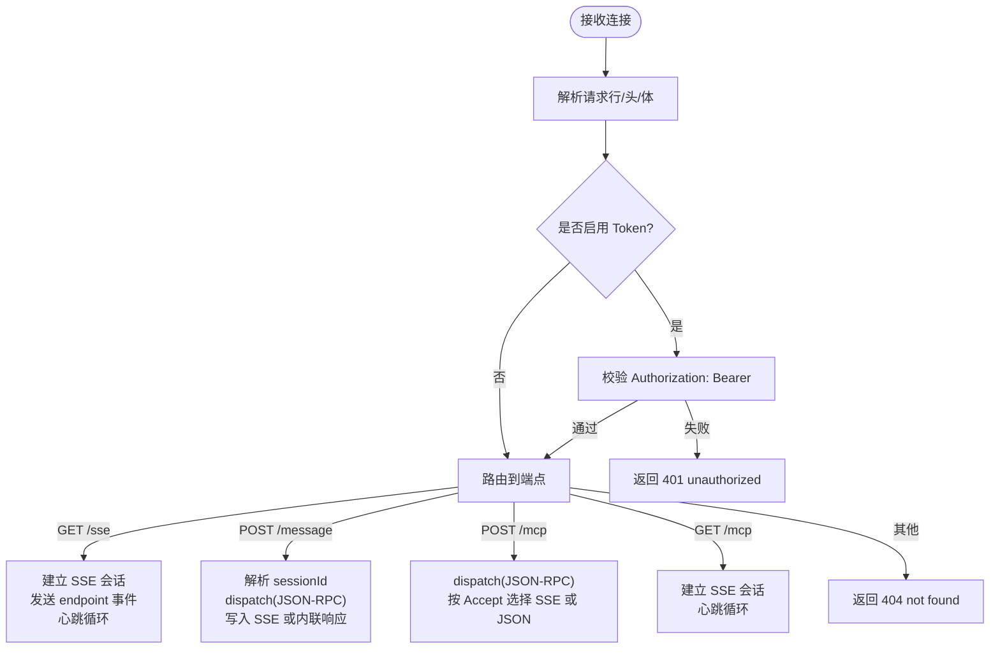
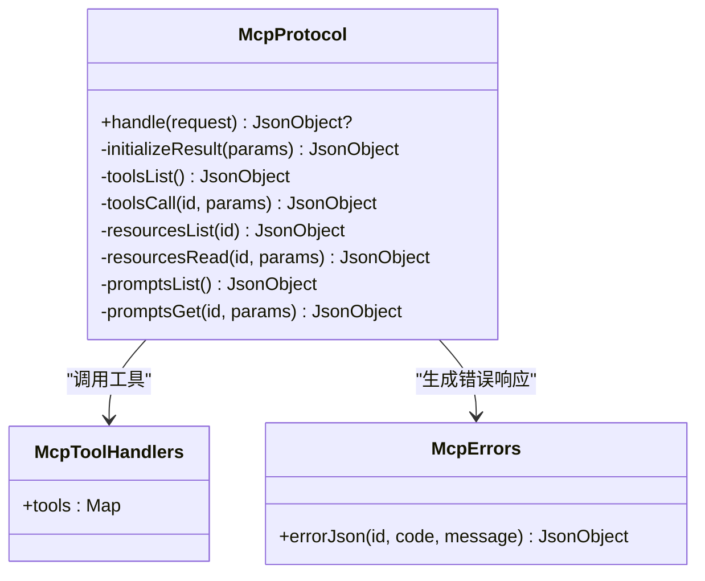
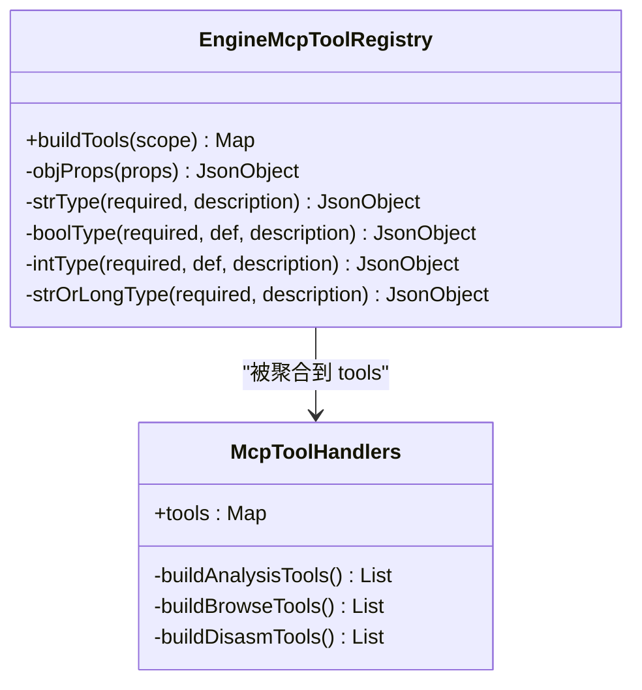
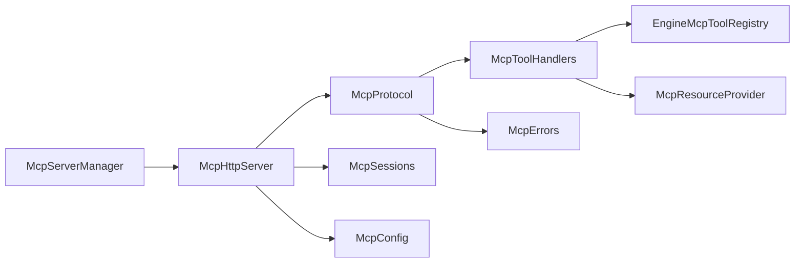

# MCP 服务器

<cite>
**本文引用的文件**   
- [McpHttpServer.kt](file://app/src/main/java/com/ai/fler/core/mcp/McpHttpServer.kt)
- [McpProtocol.kt](file://app/src/main/java/com/ai/fler/core/mcp/McpProtocol.kt)
- [EngineMcpToolRegistry.kt](file://app/src/main/java/com/ai/fler/core/mcp/EngineMcpToolRegistry.kt)
- [McpToolHandlers.kt](file://app/src/main/java/com/ai/fler/core/mcp/McpToolHandlers.kt)
- [McpConfig.kt](file://app/src/main/java/com/ai/fler/core/mcp/McpConfig.kt)
- [McpSessions.kt](file://app/src/main/java/com/ai/fler/core/mcp/McpSessions.kt)
- [McpErrors.kt](file://app/src/main/java/com/ai/fler/core/mcp/McpErrors.kt)
- [McpResource.kt](file://app/src/main/java/com/ai/fler/core/mcp/McpResource.kt)
- [McpServerManager.kt](file://app/src/main/java/com/ai/fler/features/mcp/McpServerManager.kt)
- [McpServerService.kt](file://app/src/main/java/com/ai/fler/features/mcp/McpServerService.kt)
</cite>

## 目录
1. [简介](#简介)
2. [项目结构](#项目结构)
3. [核心组件](#核心组件)
4. [架构总览](#架构总览)
5. [详细组件分析](#详细组件分析)
6. [依赖关系分析](#依赖关系分析)
7. [性能考量](#性能考量)
8. [故障排查指南](#故障排查指南)
9. [结论](#结论)
10. [附录](#附录)

## 简介
本文件为 Fler 的 MCP（Model Context Protocol）服务器提供全面 API 文档。该服务器采用内嵌 HTTP 服务器，基于 Java ServerSocket 自实现，无第三方网络框架依赖。支持两类交互模式：
- Legacy HTTP+SSE（兼容 Claude Desktop）：GET /sse、POST /message
- MCP Streamable HTTP JSON-RPC：POST /mcp（请求）、GET /mcp（服务器→客户端事件流）

同时说明 Bearer Token 认证机制、JSON-RPC 协议格式与消息类型、实时交互流程，以及 EngineMcpToolRegistry 如何根据引擎能力自动生成 MCP 工具（如 engine_open、engine_disassemble、engine_write_bytes 等）。文末给出客户端集成示例与调试技巧。

## 项目结构
MCP 服务器相关代码集中在 core/mcp 与 features/mcp 两个包中：
- core/mcp：HTTP 服务器、协议分发、会话管理、错误码、资源描述、工具注册与处理器
- features/mcp：服务器生命周期管理、前台服务保活、状态暴露

图表来源
- [McpServerManager.kt:33-93](file://app/src/main/java/com/ai/fler/features/mcp/McpServerManager.kt#L33-L93)
- [McpServerService.kt:25-50](file://app/src/main/java/com/ai/fler/features/mcp/McpServerService.kt#L25-L50)
- [McpHttpServer.kt:29-107](file://app/src/main/java/com/ai/fler/core/mcp/McpHttpServer.kt#L29-L107)
- [McpProtocol.kt:23-53](file://app/src/main/java/com/ai/fler/core/mcp/McpProtocol.kt#L23-L53)
- [McpToolHandlers.kt:38-70](file://app/src/main/java/com/ai/fler/core/mcp/McpToolHandlers.kt#L38-L70)
- [EngineMcpToolRegistry.kt:49-70](file://app/src/main/java/com/ai/fler/core/mcp/EngineMcpToolRegistry.kt#L49-L70)
- [McpSessions.kt:14-33](file://app/src/main/java/com/ai/fler/core/mcp/McpSessions.kt#L14-L33)
- [McpConfig.kt:22-51](file://app/src/main/java/com/ai/fler/core/mcp/McpConfig.kt#L22-L51)
- [McpErrors.kt:9-28](file://app/src/main/java/com/ai/fler/core/mcp/McpErrors.kt#L9-L28)
- [McpResource.kt:10-14](file://app/src/main/java/com/ai/fler/core/mcp/McpResource.kt#L10-L14)

章节来源
- [McpServerManager.kt:33-93](file://app/src/main/java/com/ai/fler/features/mcp/McpServerManager.kt#L33-L93)
- [McpServerService.kt:25-50](file://app/src/main/java/com/ai/fler/features/mcp/McpServerService.kt#L25-L50)
- [McpHttpServer.kt:29-107](file://app/src/main/java/com/ai/fler/core/mcp/McpHttpServer.kt#L29-L107)

## 核心组件
- McpHttpServer：基于 ServerSocket 的内嵌 HTTP 服务器，负责解析请求、鉴权、路由到 SSE 或 JSON-RPC 处理逻辑。
- McpProtocol：JSON-RPC 协议分发器，处理 initialize、ping、tools.*、resources.*、prompts.* 等方法。
- McpToolHandlers：将现有分析/浏览/反汇编/补丁能力封装为 MCP 工具；并聚合 EngineMcpToolRegistry 生成的 engine_* 工具。
- EngineMcpToolRegistry：按引擎能力自动暴露 MCP 工具（如 engine_open、engine_disassemble、engine_write_bytes 等），定义参数 Schema 与返回值。
- McpSessions：SSE 会话表，维护连接输出流，支持 event: message、event: endpoint、心跳。
- McpConfig：配置项（启用、绑定模式、端口、Token、补丁开关），持久化至 SharedPreferences。
- McpErrors：JSON-RPC 标准错误码与错误响应构造。
- McpResourceProvider：资源列表与读取接口，由 McpToolHandlers 实现。

章节来源
- [McpHttpServer.kt:29-107](file://app/src/main/java/com/ai/fler/core/mcp/McpHttpServer.kt#L29-L107)
- [McpProtocol.kt:23-53](file://app/src/main/java/com/ai/fler/core/mcp/McpProtocol.kt#L23-L53)
- [McpToolHandlers.kt:38-70](file://app/src/main/java/com/ai/fler/core/mcp/McpToolHandlers.kt#L38-L70)
- [EngineMcpToolRegistry.kt:49-70](file://app/src/main/java/com/ai/fler/core/mcp/EngineMcpToolRegistry.kt#L49-L70)
- [McpSessions.kt:14-33](file://app/src/main/java/com/ai/fler/core/mcp/McpSessions.kt#L14-L33)
- [McpConfig.kt:22-51](file://app/src/main/java/com/ai/fler/core/mcp/McpConfig.kt#L22-L51)
- [McpErrors.kt:9-28](file://app/src/main/java/com/ai/fler/core/mcp/McpErrors.kt#L9-L28)
- [McpResource.kt:10-14](file://app/src/main/java/com/ai/fler/core/mcp/McpResource.kt#L10-L14)

## 架构总览
下图展示从客户端到服务器的完整调用链，包括 SSE 握手、消息路由、JSON-RPC 分发与工具执行。

图表来源
- [McpHttpServer.kt:95-166](file://app/src/main/java/com/ai/fler/core/mcp/McpHttpServer.kt#L95-L166)
- [McpProtocol.kt:34-53](file://app/src/main/java/com/ai/fler/core/mcp/McpProtocol.kt#L34-L53)
- [McpToolHandlers.kt:61-70](file://app/src/main/java/com/ai/fler/core/mcp/McpToolHandlers.kt#L61-L70)
- [EngineMcpToolRegistry.kt:59-70](file://app/src/main/java/com/ai/fler/core/mcp/EngineMcpToolRegistry.kt#L59-L70)
- [McpSessions.kt:38-50](file://app/src/main/java/com/ai/fler/core/mcp/McpSessions.kt#L38-L50)

## 详细组件分析

### 内嵌 HTTP 服务器（McpHttpServer）
- 使用 ServerSocket 监听端口，固定线程池处理连接。
- 支持四种端点：
  - GET /sse：Legacy SSE 握手，发送 endpoint 事件，维持心跳
  - POST /message：Legacy 消息端点，通过 sessionId 回写 SSE 流
  - POST /mcp：Streamable HTTP JSON-RPC，可返回 JSON 或 SSE 事件
  - GET /mcp：服务器→客户端事件流（SSE）
- 鉴权：当配置了 token 时，校验 Authorization: Bearer <token>，否则拒绝。
- 请求解析：手动解析 HTTP 行、头部、Body（Content-Length）。
- 响应：统一 writeResponse 与 writeSseHeaders。

图表来源
- [McpHttpServer.kt:72-107](file://app/src/main/java/com/ai/fler/core/mcp/McpHttpServer.kt#L72-L107)
- [McpHttpServer.kt:111-166](file://app/src/main/java/com/ai/fler/core/mcp/McpHttpServer.kt#L111-L166)
- [McpHttpServer.kt:194-231](file://app/src/main/java/com/ai/fler/core/mcp/McpHttpServer.kt#L194-L231)
- [McpHttpServer.kt:269-274](file://app/src/main/java/com/ai/fler/core/mcp/McpHttpServer.kt#L269-L274)

章节来源
- [McpHttpServer.kt:29-107](file://app/src/main/java/com/ai/fler/core/mcp/McpHttpServer.kt#L29-L107)
- [McpHttpServer.kt:111-166](file://app/src/main/java/com/ai/fler/core/mcp/McpHttpServer.kt#L111-L166)
- [McpHttpServer.kt:194-231](file://app/src/main/java/com/ai/fler/core/mcp/McpHttpServer.kt#L194-L231)
- [McpHttpServer.kt:269-274](file://app/src/main/java/com/ai/fler/core/mcp/McpHttpServer.kt#L269-L274)

### JSON-RPC 协议分发（McpProtocol）
- 支持的 JSON-RPC 方法：
  - initialize：协商协议版本与能力
  - ping：健康检查
  - tools/list：列出可用工具（含 schema）
  - tools/call：调用工具（name + arguments）
  - resources/list、resources/read：资源列表与读取
  - prompts/list、prompts/get：提示模板
- 通知类方法（notifications/*）无需响应。
- 工具调用成功时，以 content.text 包裹工具返回的 JSON；异常时设置 isError=true 或返回标准错误码。

图表来源
- [McpProtocol.kt:34-53](file://app/src/main/java/com/ai/fler/core/mcp/McpProtocol.kt#L34-L53)
- [McpProtocol.kt:80-135](file://app/src/main/java/com/ai/fler/core/mcp/McpProtocol.kt#L80-L135)
- [McpErrors.kt:9-28](file://app/src/main/java/com/ai/fler/core/mcp/McpErrors.kt#L9-L28)

章节来源
- [McpProtocol.kt:34-53](file://app/src/main/java/com/ai/fler/core/mcp/McpProtocol.kt#L34-L53)
- [McpProtocol.kt:80-135](file://app/src/main/java/com/ai/fler/core/mcp/McpProtocol.kt#L80-L135)

### 工具处理器与引擎能力映射（McpToolHandlers & EngineMcpToolRegistry）
- McpToolHandlers 汇总三类工具：
  - 分析工具（list_analyses、get_analysis、list_projects、get_project）
  - 浏览工具（list_classes、list_methods、get_method、get_pp_entry、search_strings、search_calls、get_class、list_strings、get_method_callers、get_pp_references）
  - 反汇编/ELF/地址工具（disassemble_range、list_elf_sections、list_elf_symbols、find_symbol_offset、translate_address、assemble_instruction、read_so_bytes、search_elf_symbols 等）
- EngineMcpToolRegistry 根据引擎能力自动生成 engine_* 工具，包括但不限于：
  - engine_list_engines：列出分析/仿真引擎及其能力
  - engine_open：打开 so 会话（可选 autoAnalyze）
  - engine_close：关闭会话
  - engine_get_info：获取架构/位宽/保护位信息
  - engine_list_sections：列出节区（可按权限/类型过滤）
  - engine_list_symbols：列出符号（支持模糊查询、类型/绑定过滤）
  - engine_list_functions：列出函数（aflj 结构）
  - engine_find_function_at：按地址查找函数
  - engine_function_cfg：函数基本块 CFG
  - engine_xrefs_to / engine_xrefs_from：交叉引用查询
  - engine_disassemble：反汇编指定偏移 N 字节
  - engine_assemble：汇编指令为机器码
  - engine_read_bytes：读取字节（hex 输出）
  - engine_write_bytes：写入字节补丁（带撤销栈）
  - engine_scan_strings：扫描 ASCII 字符串（长度限制、过滤、分页）
  - engine_md5 / engine_sha256 / engine_crc32：哈希计算

图表来源
- [EngineMcpToolRegistry.kt:59-70](file://app/src/main/java/com/ai/fler/core/mcp/EngineMcpToolRegistry.kt#L59-L70)
- [EngineMcpToolRegistry.kt:98-132](file://app/src/main/java/com/ai/fler/core/mcp/EngineMcpToolRegistry.kt#L98-L132)
- [EngineMcpToolRegistry.kt:144-168](file://app/src/main/java/com/ai/fler/core/mcp/EngineMcpToolRegistry.kt#L144-L168)
- [EngineMcpToolRegistry.kt:170-202](file://app/src/main/java/com/ai/fler/core/mcp/EngineMcpToolRegistry.kt#L170-L202)
- [EngineMcpToolRegistry.kt:204-239](file://app/src/main/java/com/ai/fler/core/mcp/EngineMcpToolRegistry.kt#L204-L239)
- [EngineMcpToolRegistry.kt:242-271](file://app/src/main/java/com/ai/fler/core/mcp/EngineMcpToolRegistry.kt#L242-L271)
- [EngineMcpToolRegistry.kt:273-293](file://app/src/main/java/com/ai/fler/core/mcp/EngineMcpToolRegistry.kt#L273-L293)
- [EngineMcpToolRegistry.kt:295-315](file://app/src/main/java/com/ai/fler/core/mcp/EngineMcpToolRegistry.kt#L295-L315)
- [EngineMcpToolRegistry.kt:318-361](file://app/src/main/java/com/ai/fler/core/mcp/EngineMcpToolRegistry.kt#L318-L361)
- [EngineMcpToolRegistry.kt:364-392](file://app/src/main/java/com/ai/fler/core/mcp/EngineMcpToolRegistry.kt#L364-L392)
- [EngineMcpToolRegistry.kt:395-414](file://app/src/main/java/com/ai/fler/core/mcp/EngineMcpToolRegistry.kt#L395-L414)
- [EngineMcpToolRegistry.kt:417-435](file://app/src/main/java/com/ai/fler/core/mcp/EngineMcpToolRegistry.kt#L417-L435)
- [EngineMcpToolRegistry.kt:437-454](file://app/src/main/java/com/ai/fler/core/mcp/EngineMcpToolRegistry.kt#L437-L454)
- [EngineMcpToolRegistry.kt:457-489](file://app/src/main/java/com/ai/fler/core/mcp/EngineMcpToolRegistry.kt#L457-L489)
- [EngineMcpToolRegistry.kt:492-526](file://app/src/main/java/com/ai/fler/core/mcp/EngineMcpToolRegistry.kt#L492-L526)
- [McpToolHandlers.kt:61-70](file://app/src/main/java/com/ai/fler/core/mcp/McpToolHandlers.kt#L61-L70)

章节来源
- [EngineMcpToolRegistry.kt:59-70](file://app/src/main/java/com/ai/fler/core/mcp/EngineMcpToolRegistry.kt#L59-L70)
- [EngineMcpToolRegistry.kt:98-132](file://app/src/main/java/com/ai/fler/core/mcp/EngineMcpToolRegistry.kt#L98-L132)
- [EngineMcpToolRegistry.kt:144-168](file://app/src/main/java/com/ai/fler/core/mcp/EngineMcpToolRegistry.kt#L144-L168)
- [EngineMcpToolRegistry.kt:170-202](file://app/src/main/java/com/ai/fler/core/mcp/EngineMcpToolRegistry.kt#L170-L202)
- [EngineMcpToolRegistry.kt:204-239](file://app/src/main/java/com/ai/fler/core/mcp/EngineMcpToolRegistry.kt#L204-L239)
- [EngineMcpToolRegistry.kt:242-271](file://app/src/main/java/com/ai/fler/core/mcp/EngineMcpToolRegistry.kt#L242-L271)
- [EngineMcpToolRegistry.kt:273-293](file://app/src/main/java/com/ai/fler/core/mcp/EngineMcpToolRegistry.kt#L273-L293)
- [EngineMcpToolRegistry.kt:295-315](file://app/src/main/java/com/ai/fler/core/mcp/EngineMcpToolRegistry.kt#L295-L315)
- [EngineMcpToolRegistry.kt:318-361](file://app/src/main/java/com/ai/fler/core/mcp/EngineMcpToolRegistry.kt#L318-L361)
- [EngineMcpToolRegistry.kt:364-392](file://app/src/main/java/com/ai/fler/core/mcp/EngineMcpToolRegistry.kt#L364-L392)
- [EngineMcpToolRegistry.kt:395-414](file://app/src/main/java/com/ai/fler/core/mcp/EngineMcpToolRegistry.kt#L395-L414)
- [EngineMcpToolRegistry.kt:417-435](file://app/src/main/java/com/ai/fler/core/mcp/EngineMcpToolRegistry.kt#L417-L435)
- [EngineMcpToolRegistry.kt:437-454](file://app/src/main/java/com/ai/fler/core/mcp/EngineMcpToolRegistry.kt#L437-L454)
- [EngineMcpToolRegistry.kt:457-489](file://app/src/main/java/com/ai/fler/core/mcp/EngineMcpToolRegistry.kt#L457-L489)
- [EngineMcpToolRegistry.kt:492-526](file://app/src/main/java/com/ai/fler/core/mcp/EngineMcpToolRegistry.kt#L492-L526)
- [McpToolHandlers.kt:61-70](file://app/src/main/java/com/ai/fler/core/mcp/McpToolHandlers.kt#L61-L70)

### 会话与 SSE（McpSessions）
- 每个 SSE 连接一个 Session，持有 OutputStream。
- 支持三种事件：
  - event: endpoint：legacy 握手，告知 /message?sessionId=...
  - event: message：post 消息的响应推送
  - 心跳：: ping
- 写入失败自动清理会话。

章节来源
- [McpSessions.kt:14-33](file://app/src/main/java/com/ai/fler/core/mcp/McpSessions.kt#L14-L33)
- [McpSessions.kt:38-50](file://app/src/main/java/com/ai/fler/core/mcp/McpSessions.kt#L38-L50)
- [McpSessions.kt:52-65](file://app/src/main/java/com/ai/fler/core/mcp/McpSessions.kt#L52-L65)
- [McpSessions.kt:67-79](file://app/src/main/java/com/ai/fler/core/mcp/McpSessions.kt#L67-L79)

### 配置与安全（McpConfig 与鉴权）
- 配置项：enabled、bindMode（LOCAL/LAN）、port、token、patchEnabled。
- 鉴权：当 token 非空时，所有请求必须携带 Authorization: Bearer <token>，否则返回 401。
- 局域网模式通过前台服务保活，避免进程被杀导致服务中断。

章节来源
- [McpConfig.kt:22-51](file://app/src/main/java/com/ai/fler/core/mcp/McpConfig.kt#L22-L51)
- [McpHttpServer.kt:269-274](file://app/src/main/java/com/ai/fler/core/mcp/McpHttpServer.kt#L269-L274)
- [McpServerService.kt:25-50](file://app/src/main/java/com/ai/fler/features/mcp/McpServerService.kt#L25-L50)

## 依赖关系分析
- McpServerManager 负责启动/停止服务器，暴露运行状态（端口、URL、活动会话数）。
- McpHttpServer 依赖 McpProtocol、McpConfig、McpSessions、McpLogger。
- McpProtocol 依赖 McpToolHandlers、McpLogger、McpResourceProvider（由 McpToolHandlers 实现）。
- McpToolHandlers 依赖多个 DAO、AddressTranslator、McpPatchService，并聚合 EngineMcpToolRegistry。
- EngineMcpToolRegistry 依赖 EngineRegistry、AnalysisSession，动态生成工具。

图表来源
- [McpServerManager.kt:33-93](file://app/src/main/java/com/ai/fler/features/mcp/McpServerManager.kt#L33-L93)
- [McpHttpServer.kt:29-107](file://app/src/main/java/com/ai/fler/core/mcp/McpHttpServer.kt#L29-L107)
- [McpProtocol.kt:23-53](file://app/src/main/java/com/ai/fler/core/mcp/McpProtocol.kt#L23-L53)
- [McpToolHandlers.kt:38-70](file://app/src/main/java/com/ai/fler/core/mcp/McpToolHandlers.kt#L38-L70)
- [EngineMcpToolRegistry.kt:49-70](file://app/src/main/java/com/ai/fler/core/mcp/EngineMcpToolRegistry.kt#L49-L70)

章节来源
- [McpServerManager.kt:33-93](file://app/src/main/java/com/ai/fler/features/mcp/McpServerManager.kt#L33-L93)
- [McpHttpServer.kt:29-107](file://app/src/main/java/com/ai/fler/core/mcp/McpHttpServer.kt#L29-L107)
- [McpProtocol.kt:23-53](file://app/src/main/java/com/ai/fler/core/mcp/McpProtocol.kt#L23-L53)
- [McpToolHandlers.kt:38-70](file://app/src/main/java/com/ai/fler/core/mcp/McpToolHandlers.kt#L38-L70)
- [EngineMcpToolRegistry.kt:49-70](file://app/src/main/java/com/ai/fler/core/mcp/EngineMcpToolRegistry.kt#L49-L70)

## 性能考量
- 连接处理：固定线程池（默认 8）处理 accept 与请求，避免阻塞主线程。
- SSE 心跳：每 5 秒发送一次心跳，检测断线。
- 工具执行：在 IO 调度上执行 suspend 工具，避免阻塞网络线程。
- 数据量控制：部分工具对返回条数进行上限限制（如 limit、pageSize、size 范围）。
- 内存与 I/O：大字段（如 srcCode）默认截断，避免过大响应。

[本节为通用指导，不直接分析具体文件]

## 故障排查指南
- 401 Unauthorized：未设置或错误的 Authorization: Bearer <token>。检查 McpConfig.token 与请求头。
- 404 Not Found：请求路径不在支持的路由中。确认 /sse、/message、/mcp。
- JSON 解析失败：请求体不是合法 JSON。检查 body 编码与格式。
- 工具不存在：tools/call 的 name 不在 handlers.tools 中。确认工具名拼写。
- 会话丢失：SSE 连接断开后无法推送消息。检查客户端是否保持连接，服务端心跳是否正常。
- 端口占用：启动失败时尝试 base..base+9 回退。查看实际端口与日志。

章节来源
- [McpHttpServer.kt:269-279](file://app/src/main/java/com/ai/fler/core/mcp/McpHttpServer.kt#L269-L279)
- [McpProtocol.kt:34-53](file://app/src/main/java/com/ai/fler/core/mcp/McpProtocol.kt#L34-L53)
- [McpErrors.kt:9-28](file://app/src/main/java/com/ai/fler/core/mcp/McpErrors.kt#L9-L28)
- [McpServerManager.kt:60-93](file://app/src/main/java/com/ai/fler/features/mcp/McpServerManager.kt#L60-L93)

## 结论
Fler 的 MCP 服务器通过自实现的轻量 HTTP 层与清晰的协议分发，提供了稳定的 Legacy SSE 与 Streamable HTTP 两种交互模式。工具层通过 McpToolHandlers 与 EngineMcpToolRegistry 实现了强大的二进制分析与引擎能力暴露。结合 Bearer Token 鉴权与前台服务保活，适合本地与局域网环境下的 AI 代理集成。

[本节为总结，不直接分析具体文件]

## 附录

### API 端点与行为
- GET /sse
  - 用途：Legacy SSE 握手，返回 endpoint 事件（/message?sessionId=...）
  - 鉴权：同全局 Token 策略
  - 心跳：服务端周期性发送 : ping
- POST /message
  - 用途：Legacy 消息端点，携带 JSON-RPC 请求，query.sessionId 指定 SSE 会话
  - 响应：优先通过 SSE event: message 回发；若会话不可用则内联返回 JSON
- POST /mcp
  - 用途：MCP Streamable HTTP JSON-RPC
  - 响应：若 Accept 包含 text/event-stream，则以 SSE event: message 返回；否则返回 application/json
- GET /mcp
  - 用途：服务器→客户端事件流（SSE），用于长连接事件推送

章节来源
- [McpHttpServer.kt:95-166](file://app/src/main/java/com/ai/fler/core/mcp/McpHttpServer.kt#L95-L166)
- [McpSessions.kt:38-50](file://app/src/main/java/com/ai/fler/core/mcp/McpSessions.kt#L38-L50)

### JSON-RPC 协议格式与消息类型
- 请求体：JSON 对象，包含 jsonrpc="2.0"、id（可为 null）、method、params
- 方法：
  - initialize：返回 protocolVersion、capabilities、serverInfo
  - ping：返回空 result
  - tools/list：返回 tools 数组（name、description、inputSchema）
  - tools/call：返回 result.content[0].text（工具返回的 JSON 文本）或 isError=true
  - resources/list、resources/read：返回资源列表与内容
  - prompts/list、prompts/get：返回提示模板
- 错误：遵循 JSON-RPC 2.0 标准错误码（PARSE_ERROR、INVALID_REQUEST、METHOD_NOT_FOUND、INVALID_PARAMS、SERVER_ERROR、TOOL_NOT_FOUND）

章节来源
- [McpProtocol.kt:34-53](file://app/src/main/java/com/ai/fler/core/mcp/McpProtocol.kt#L34-L53)
- [McpProtocol.kt:80-135](file://app/src/main/java/com/ai/fler/core/mcp/McpProtocol.kt#L80-L135)
- [McpErrors.kt:9-28](file://app/src/main/java/com/ai/fler/core/mcp/McpErrors.kt#L9-L28)

### Bearer Token 认证与安全建议
- 启用方式：在 McpConfig 中设置 token
- 校验位置：McpHttpServer.authorized(req)，比较 Authorization: Bearer <token>
- 安全建议：
  - 仅在可信网络（LAN）开启 LAN 模式
  - 定期轮换 token
  - 结合防火墙限制访问 IP
  - 生产环境建议使用 HTTPS 反向代理（如 nginx）

章节来源
- [McpConfig.kt:22-51](file://app/src/main/java/com/ai/fler/core/mcp/McpConfig.kt#L22-L51)
- [McpHttpServer.kt:269-274](file://app/src/main/java/com/ai/fler/core/mcp/McpHttpServer.kt#L269-L274)

### Engine 工具清单与参数规范（节选）
- engine_open
  - 参数：soPath（必填）、engineId（可选）、autoAnalyze（可选，默认 true）
  - 返回：ok/handle/engineId/filePath 或 ok=false/reason
- engine_disassemble
  - 参数：offset（必填，hex/dec）、size（可选，默认 4096，上限 65536）
  - 返回：baseAddress、count、instructions[]（address、size、mnemonic、opStr、bytes）
- engine_write_bytes
  - 参数：offset（必填）、hex（必填，空格分隔十六进制）
  - 返回：ok、wrote
- engine_read_bytes
  - 参数：offset（必填）、size（可选，默认 256，上限 1MB）
  - 返回：offset、size、hex
- engine_list_sections
  - 参数：perm（可选）、type（可选）
  - 返回：sections[]（name、type、offset、address、size、perm、flags）
- engine_list_symbols
  - 参数：query（可选）、type（可选）、bind（可选）、limit（可选，默认 2000）
  - 返回：symbols[]（name、demangled、type、bind、address、size、section）
- engine_list_functions
  - 参数：query（可选）、limit（可选，默认 5000）
  - 返回：functions[]（name、signature、offset、vaddr、size、nargs、nbbs、edges、callConv）
- engine_xrefs_to / engine_xrefs_from
  - 参数：target/from（必填）、limit（可选，默认 200）
  - 返回：xrefs[]（from、to、type、perm）
- engine_scan_strings
  - 参数：minLen（可选，默认 4）、maxLen（可选，默认 512）、limit（可选，默认 2000）、query（可选）
  - 返回：strings[]（address、paddr、size、section、string）
- engine_md5 / engine_sha256 / engine_crc32
  - 参数：crc32 支持 offset/size
  - 返回：hash 值与 ok 标志

章节来源
- [EngineMcpToolRegistry.kt:98-132](file://app/src/main/java/com/ai/fler/core/mcp/EngineMcpToolRegistry.kt#L98-L132)
- [EngineMcpToolRegistry.kt:364-392](file://app/src/main/java/com/ai/fler/core/mcp/EngineMcpToolRegistry.kt#L364-L392)
- [EngineMcpToolRegistry.kt:417-435](file://app/src/main/java/com/ai/fler/core/mcp/EngineMcpToolRegistry.kt#L417-L435)
- [EngineMcpToolRegistry.kt:437-454](file://app/src/main/java/com/ai/fler/core/mcp/EngineMcpToolRegistry.kt#L437-L454)
- [EngineMcpToolRegistry.kt:170-202](file://app/src/main/java/com/ai/fler/core/mcp/EngineMcpToolRegistry.kt#L170-L202)
- [EngineMcpToolRegistry.kt:204-239](file://app/src/main/java/com/ai/fler/core/mcp/EngineMcpToolRegistry.kt#L204-L239)
- [EngineMcpToolRegistry.kt:242-271](file://app/src/main/java/com/ai/fler/core/mcp/EngineMcpToolRegistry.kt#L242-L271)
- [EngineMcpToolRegistry.kt:318-361](file://app/src/main/java/com/ai/fler/core/mcp/EngineMcpToolRegistry.kt#L318-L361)
- [EngineMcpToolRegistry.kt:457-489](file://app/src/main/java/com/ai/fler/core/mcp/EngineMcpToolRegistry.kt#L457-L489)
- [EngineMcpToolRegistry.kt:492-526](file://app/src/main/java/com/ai/fler/core/mcp/EngineMcpToolRegistry.kt#L492-L526)

### 客户端集成示例（步骤）
- 初始化连接
  - 连接 GET /sse，订阅 event: endpoint，获取 /message?sessionId=...
  - 或使用 POST /mcp（Accept: application/json）直接走 Streamable HTTP
- 发送 JSON-RPC 请求
  - 先调用 initialize 协商协议版本
  - 调用 tools/list 获取工具列表与输入 Schema
  - 调用 tools/call(name, arguments) 执行工具
- 处理响应
  - Legacy SSE：监听 event: message，解析 data 中的 JSON
  - Streamable HTTP：根据 Accept 决定解析 JSON 或 SSE 事件
- 鉴权
  - 设置 Authorization: Bearer <token>

章节来源
- [McpHttpServer.kt:111-166](file://app/src/main/java/com/ai/fler/core/mcp/McpHttpServer.kt#L111-L166)
- [McpProtocol.kt:34-53](file://app/src/main/java/com/ai/fler/core/mcp/McpProtocol.kt#L34-L53)
- [McpSessions.kt:38-50](file://app/src/main/java/com/ai/fler/core/mcp/McpSessions.kt#L38-L50)

### 调试技巧
- 启用日志：观察 McpLogger 输出的请求与方法名、参数摘要
- 抓包：使用 Wireshark/tcpdump 抓取 HTTP/SSE 流量，验证事件顺序
- 最小用例：先用 ping 与 tools/list 验证连通性与工具可用性
- 逐步推进：先 engine_open，再 disassemble/read_bytes，最后 write_bytes（谨慎）
- 错误定位：关注 JSON 解析失败、工具不存在、会话丢失等常见错误码

章节来源
- [McpHttpServer.kt:168-190](file://app/src/main/java/com/ai/fler/core/mcp/McpHttpServer.kt#L168-L190)
- [McpErrors.kt:9-28](file://app/src/main/java/com/ai/fler/core/mcp/McpErrors.kt#L9-L28)