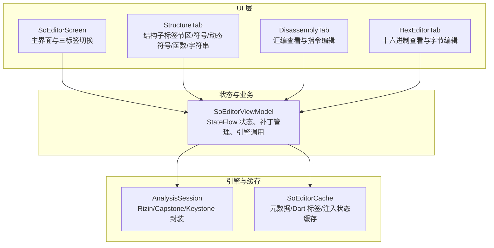
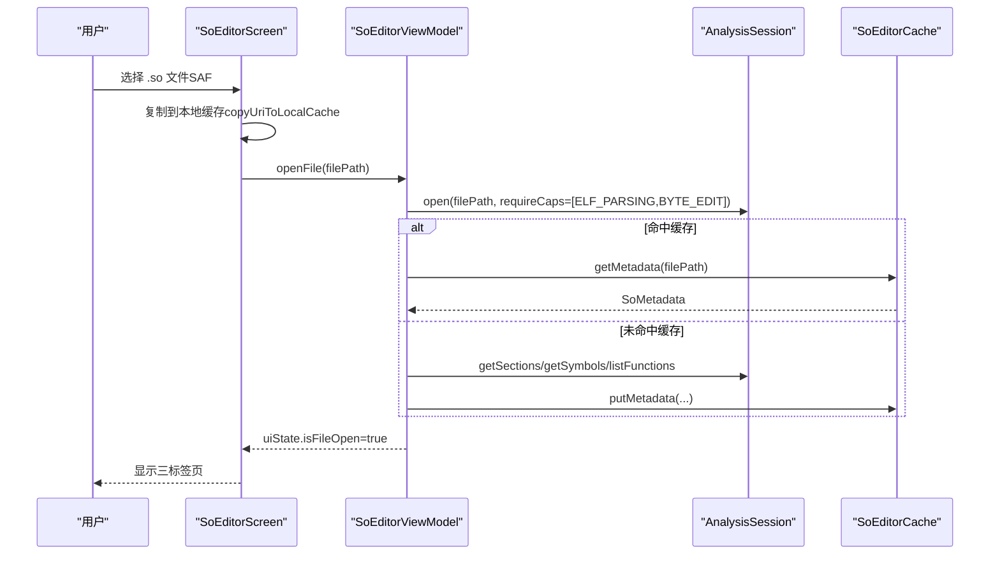
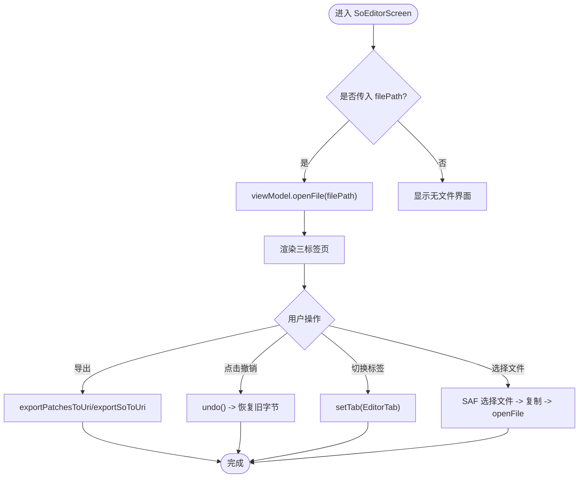
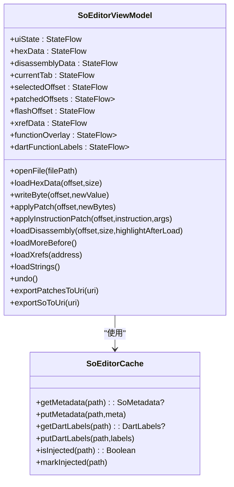
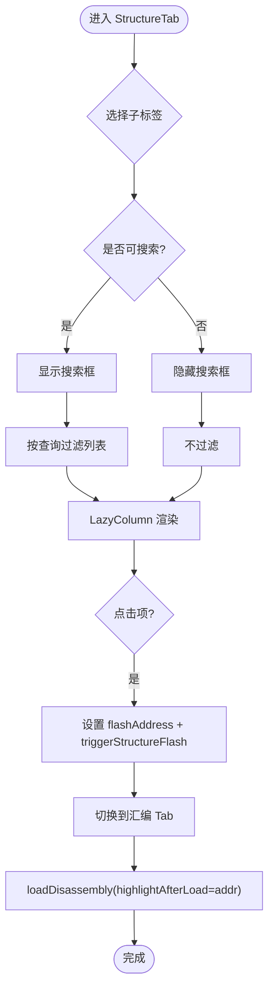
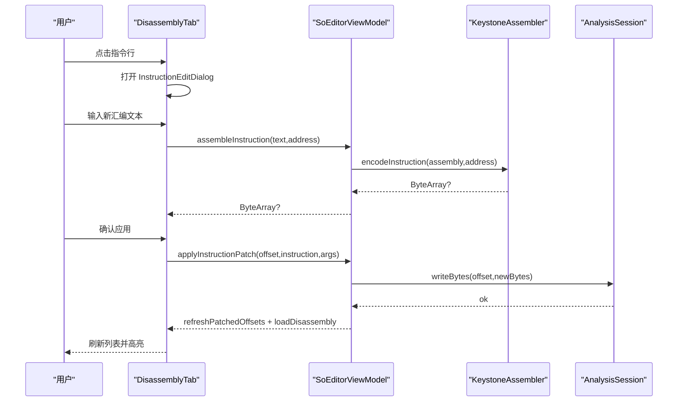
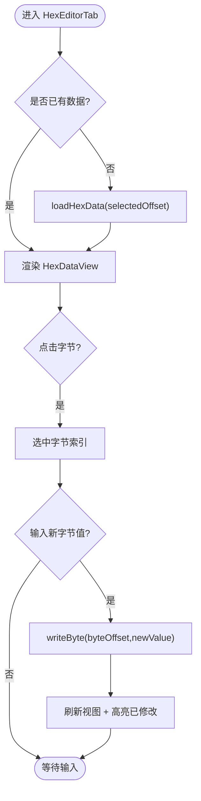
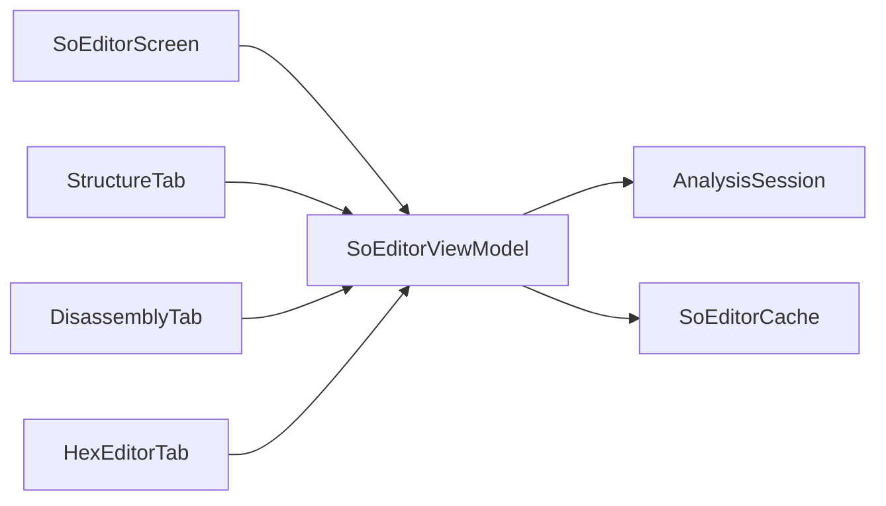

# SO 编辑器

<cite>
**本文引用的文件**   
- [SoEditorScreen.kt](file://app/src/main/java/com/ai/fler/features/so_editor/SoEditorScreen.kt)
- [SoEditorViewModel.kt](file://app/src/main/java/com/ai/fler/features/so_editor/SoEditorViewModel.kt)
- [StructureTab.kt](file://app/src/main/java/com/ai/fler/features/so_editor/StructureTab.kt)
- [DisassemblyTab.kt](file://app/src/main/java/com/ai/fler/features/so_editor/DisassemblyTab.kt)
- [HexEditorTab.kt](file://app/src/main/java/com/ai/fler/features/so_editor/HexEditorTab.kt)
- [AsmHelp.kt](file://app/src/main/java/com/ai/fler/features/so_editor/AsmHelp.kt)
- [CompactTextField.kt](file://app/src/main/java/com/ai/fler/features/so_editor/CompactTextField.kt)
- [SoEditorCache.kt](file://app/src/main/java/com/ai/fler/core/analysis/SoEditorCache.kt)
</cite>

## 目录
1. [简介](#简介)
2. [项目结构](#项目结构)
3. [核心组件](#核心组件)
4. [架构总览](#架构总览)
5. [详细组件分析](#详细组件分析)
6. [依赖关系分析](#依赖关系分析)
7. [性能考量](#性能考量)
8. [故障排查指南](#故障排查指南)
9. [结论](#结论)
10. [附录](#附录)

## 简介
本文件面向 Fler 的 SO 编辑器功能，提供从用户界面到状态管理、引擎调用封装与缓存机制的系统性说明。SO 编辑器采用三标签页架构：
- 结构标签页：展示节区（Sections）、符号（Symbols）、动态符号（Dynamic Symbols）、函数（Functions）、字符串（Strings），支持搜索与跳转。
- 汇编标签页：ARM64 反汇编查看与指令编辑，支持无限滚动、点击编辑、长按交叉引用、地址跳转、函数边界标注等。
- 十六进制标签页：字节级查看与编辑，支持偏移跳转、翻页、撤销重做、高亮已修改字节。

文档将深入解释 SoEditorScreen 的三标签页交互、SoEditorViewModel 的状态管理与补丁管理、文件打开流程、引擎调用封装、缓存机制、用户交互模式以及性能优化建议与常见问题解决方案。

## 项目结构
SO 编辑器位于 features/so_editor 包下，UI 层由 Compose 实现，状态与业务逻辑集中在 ViewModel，底层通过 AnalysisSession 与 Rizin/Capstone/Keystone 等引擎交互，并通过 SoEditorCache 进行跨实例缓存。

图表来源
- [SoEditorScreen.kt:1-120](file://app/src/main/java/com/ai/fler/features/so_editor/SoEditorScreen.kt#L1-L120)
- [SoEditorViewModel.kt:1-120](file://app/src/main/java/com/ai/fler/features/so_editor/SoEditorViewModel.kt#L1-L120)
- [SoEditorCache.kt:1-86](file://app/src/main/java/com/ai/fler/core/analysis/SoEditorCache.kt#L1-L86)

章节来源
- [SoEditorScreen.kt:1-120](file://app/src/main/java/com/ai/fler/features/so_editor/SoEditorScreen.kt#L1-L120)
- [SoEditorViewModel.kt:1-120](file://app/src/main/java/com/ai/fler/features/so_editor/SoEditorViewModel.kt#L1-L120)

## 核心组件
- SoEditorScreen：顶层 UI，负责文件选择、导出、撤销、保存、三标签切换与状态显示。
- SoEditorViewModel：集中管理所有 StateFlow 状态（UI 状态、Hex 数据、汇编数据、当前标签、选中偏移、补丁偏移、闪烁触发器、交叉引用、函数覆盖、Dart 标签、最近文件等），并封装打开文件、加载 Hex/汇编、应用补丁、撤销、导出等操作。
- StructureTab：结构子标签列表，支持搜索过滤、滚动位置持久化、返回时闪烁定位。
- DisassemblyTab：汇编查看与编辑，支持无限滚动、点击编辑、长按交叉引用、地址跳转、函数边界标注、帮助文档。
- HexEditorTab：十六进制查看与编辑，支持偏移跳转、翻页、字节写入、撤销重做高亮。
- SoEditorCache：进程内单例缓存，存储 SO 元数据、Dart 方法标签、注入状态，避免重复分析。

章节来源
- [SoEditorScreen.kt:1-120](file://app/src/main/java/com/ai/fler/features/so_editor/SoEditorScreen.kt#L1-L120)
- [SoEditorViewModel.kt:1-120](file://app/src/main/java/com/ai/fler/features/so_editor/SoEditorViewModel.kt#L1-L120)
- [StructureTab.kt:1-120](file://app/src/main/java/com/ai/fler/features/so_editor/StructureTab.kt#L1-L120)
- [DisassemblyTab.kt:1-120](file://app/src/main/java/com/ai/fler/features/so_editor/DisassemblyTab.kt#L1-L120)
- [HexEditorTab.kt:1-120](file://app/src/main/java/com/ai/fler/features/so_editor/HexEditorTab.kt#L1-L120)
- [SoEditorCache.kt:1-86](file://app/src/main/java/com/ai/fler/core/analysis/SoEditorCache.kt#L1-L86)

## 架构总览
SO 编辑器采用 MVVM + Compose 架构，UI 层通过 collectAsStateWithLifecycle 订阅 ViewModel 的 StateFlow，ViewModel 通过 AnalysisSession 调用底层引擎（Rizin/Capstone/Keystone），并使用 SoEditorCache 进行跨实例缓存。

图表来源
- [SoEditorScreen.kt:100-160](file://app/src/main/java/com/ai/fler/features/so_editor/SoEditorScreen.kt#L100-L160)
- [SoEditorViewModel.kt:155-240](file://app/src/main/java/com/ai/fler/features/so_editor/SoEditorViewModel.kt#L155-L240)
- [SoEditorCache.kt:40-86](file://app/src/main/java/com/ai/fler/core/analysis/SoEditorCache.kt#L40-L86)

章节来源
- [SoEditorScreen.kt:100-160](file://app/src/main/java/com/ai/fler/features/so_editor/SoEditorScreen.kt#L100-L160)
- [SoEditorViewModel.kt:155-240](file://app/src/main/java/com/ai/fler/features/so_editor/SoEditorViewModel.kt#L155-L240)

## 详细组件分析

### SoEditorScreen：三标签页与文件操作
- 三标签页：结构、Hex、汇编，使用 AnimatedContent 实现方向性转场（回结构 Tab 快速淡入，其他 Tab 滑入）。
- 文件打开：通过 SAF GetContent 选择任意 .so 文件，复制到本地缓存后调用 viewModel.openFile。
- 导出与撤销：支持导出补丁（.patch）和修改后的 SO（.so），撤销按钮调用 viewModel.undo。
- 返回键处理：非结构 Tab 先回到结构 Tab；在结构 Tab 关闭文件。

图表来源
- [SoEditorScreen.kt:148-162](file://app/src/main/java/com/ai/fler/features/so_editor/SoEditorScreen.kt#L148-L162)
- [SoEditorScreen.kt:200-300](file://app/src/main/java/com/ai/fler/features/so_editor/SoEditorScreen.kt#L200-L300)
- [SoEditorScreen.kt:354-459](file://app/src/main/java/com/ai/fler/features/so_editor/SoEditorScreen.kt#L354-L459)

章节来源
- [SoEditorScreen.kt:1-120](file://app/src/main/java/com/ai/fler/features/so_editor/SoEditorScreen.kt#L1-L120)
- [SoEditorScreen.kt:354-459](file://app/src/main/java/com/ai/fler/features/so_editor/SoEditorScreen.kt#L354-L459)

### SoEditorViewModel：状态管理与补丁管理
- 状态管理：使用多个 MutableStateFlow 暴露给 UI，包括 uiState、hexData、disassemblyData、currentTab、selectedOffset、patchedOffsets、flashOffset、xrefData、functionOverlay、dartFunctionLabels、structureScrollStates、recentFiles 等。
- 打开文件：顺序串行调用 session.open，优先读取 SoEditorCache 中的元数据，否则查询 Rizin 并缓存。
- 补丁管理：writeByte/applyPatch/applyInstructionPatch 写盘，BackupManager 记录补丁序列号，commitChanges 标记已保存，undo 恢复旧字节。
- 汇编加载：loadDisassembly 支持 highlightAfterLoad，向前追加加载 loadMoreBefore，更新函数覆盖 updateFunctionOverlay。
- Dart 标签：loadDartFunctionLabels 合并 Blutter 分析的 Dart 方法标签，注入 Rizin 并补充 xref。

图表来源
- [SoEditorViewModel.kt:35-120](file://app/src/main/java/com/ai/fler/features/so_editor/SoEditorViewModel.kt#L35-L120)
- [SoEditorCache.kt:24-86](file://app/src/main/java/com/ai/fler/core/analysis/SoEditorCache.kt#L24-L86)

章节来源
- [SoEditorViewModel.kt:1-120](file://app/src/main/java/com/ai/fler/features/so_editor/SoEditorViewModel.kt#L1-L120)
- [SoEditorViewModel.kt:155-240](file://app/src/main/java/com/ai/fler/features/so_editor/SoEditorViewModel.kt#L155-L240)
- [SoEditorViewModel.kt:240-340](file://app/src/main/java/com/ai/fler/features/so_editor/SoEditorViewModel.kt#L240-L340)
- [SoEditorViewModel.kt:335-435](file://app/src/main/java/com/ai/fler/features/so_editor/SoEditorViewModel.kt#L335-L435)
- [SoEditorViewModel.kt:520-662](file://app/src/main/java/com/ai/fler/features/so_editor/SoEditorViewModel.kt#L520-L662)

### StructureTab：结构子标签与搜索
- 子标签：节区、符号、动态符号、函数、字符串，每个子标签独立 LazyListState 保存滚动位置。
- 搜索：仅对符号、动态符号、函数、字符串开放，支持名称/去修饰名/地址 hex 模糊匹配。
- 闪烁定位：从汇编切回结构 Tab 时，根据上次点击地址定位行并触发呼吸脉冲动画。

图表来源
- [StructureTab.kt:90-160](file://app/src/main/java/com/ai/fler/features/so_editor/StructureTab.kt#L90-L160)
- [StructureTab.kt:250-336](file://app/src/main/java/com/ai/fler/features/so_editor/StructureTab.kt#L250-L336)

章节来源
- [StructureTab.kt:1-120](file://app/src/main/java/com/ai/fler/features/so_editor/StructureTab.kt#L1-L120)
- [StructureTab.kt:250-336](file://app/src/main/java/com/ai/fler/features/so_editor/StructureTab.kt#L250-L336)

### DisassemblyTab：汇编查看与指令编辑
- 无限滚动：滚到顶部前 3 条时触发 loadMoreBefore，往前追加加载 2048 字节（约 512 条 ARM64 指令）。
- 点击编辑：点击指令行弹出 InstructionEditDialog，实时校验汇编文本（Capstone cs_asm），确认后 applyInstructionPatch 写盘。
- 长按交叉引用：弹出 XrefBottomSheet，支持类型筛选与地址搜索，点击跳转到目标地址。
- 函数边界标注：updateFunctionOverlay 基于函数列表与 Dart 标签生成函数起始地址映射。

图表来源
- [DisassemblyTab.kt:218-270](file://app/src/main/java/com/ai/fler/features/so_editor/DisassemblyTab.kt#L218-L270)
- [SoEditorViewModel.kt:303-334](file://app/src/main/java/com/ai/fler/features/so_editor/SoEditorViewModel.kt#L303-L334)
- [SoEditorViewModel.kt:335-383](file://app/src/main/java/com/ai/fler/features/so_editor/SoEditorViewModel.kt#L335-L383)

章节来源
- [DisassemblyTab.kt:1-120](file://app/src/main/java/com/ai/fler/features/so_editor/DisassemblyTab.kt#L1-L120)
- [DisassemblyTab.kt:218-270](file://app/src/main/java/com/ai/fler/features/so_editor/DisassemblyTab.kt#L218-L270)
- [SoEditorViewModel.kt:335-435](file://app/src/main/java/com/ai/fler/features/so_editor/SoEditorViewModel.kt#L335-L435)

### HexEditorTab：十六进制查看与字节编辑
- 传统 Hex 布局：偏移 | 00 01 ...0F | ASCII，每行 16 字节。
- 偏移跳转与翻页：支持 hex/dec 输入跳转，上一页/下一页以 256 字节为步长。
- 字节编辑：点击字节选中，底部输入框输入新字节值，写入后刷新视图并高亮已修改字节。
- 撤销重做：通过 BackupManager 记录补丁序列号，commitChanges 标记已保存，undo 恢复旧字节。

图表来源
- [HexEditorTab.kt:70-170](file://app/src/main/java/com/ai/fler/features/so_editor/HexEditorTab.kt#L70-L170)
- [SoEditorViewModel.kt:246-281](file://app/src/main/java/com/ai/fler/features/so_editor/SoEditorViewModel.kt#L246-L281)

章节来源
- [HexEditorTab.kt:1-120](file://app/src/main/java/com/ai/fler/features/so_editor/HexEditorTab.kt#L1-L120)
- [HexEditorTab.kt:170-270](file://app/src/main/java/com/ai/fler/features/so_editor/HexEditorTab.kt#L170-L270)
- [SoEditorViewModel.kt:246-281](file://app/src/main/java/com/ai/fler/features/so_editor/SoEditorViewModel.kt#L246-L281)

### AsmHelp 与 CompactTextField：辅助组件
- AsmHelp：ARM64 指令帮助文档，包含语法、寄存器、常用指令、条件码等，供新手学习参考。
- CompactTextField：紧凑输入框，用于地址、搜索、字节输入等场景，高度 ~36dp，圆角边框，占位符提示。

章节来源
- [AsmHelp.kt:1-120](file://app/src/main/java/com/ai/fler/features/so_editor/AsmHelp.kt#L1-L120)
- [CompactTextField.kt:1-92](file://app/src/main/java/com/ai/fler/features/so_editor/CompactTextField.kt#L1-L92)

## 依赖关系分析
- SoEditorScreen 依赖 SoEditorViewModel 提供状态与操作。
- SoEditorViewModel 依赖 AnalysisSession 进行文件打开、字节读写、反汇编、交叉引用查询，依赖 SoEditorCache 进行元数据与 Dart 标签缓存。
- StructureTab、DisassemblyTab、HexEditorTab 均依赖 SoEditorViewModel 提供的 StateFlow 状态。

图表来源
- [SoEditorScreen.kt:1-120](file://app/src/main/java/com/ai/fler/features/so_editor/SoEditorScreen.kt#L1-L120)
- [SoEditorViewModel.kt:1-120](file://app/src/main/java/com/ai/fler/features/so_editor/SoEditorViewModel.kt#L1-L120)

章节来源
- [SoEditorScreen.kt:1-120](file://app/src/main/java/com/ai/fler/features/so_editor/SoEditorScreen.kt#L1-L120)
- [SoEditorViewModel.kt:1-120](file://app/src/main/java/com/ai/fler/features/so_editor/SoEditorViewModel.kt#L1-L120)

## 性能考量
- 大文件处理：Hex 与汇编分页加载（HEX_PAGE_SIZE=2048，DISASM_PAGE_SIZE=4096），汇编无限滚动向前追加加载，避免一次性加载全部数据。
- 内存管理：StructureTab 使用 derivedStateOf 缓存过滤结果，LazyColumn 虚拟化列表，减少 GC 压力。
- 异步加载：所有 I/O 操作（文件复制、引擎调用、数据库查询）均在 Dispatchers.IO 执行，避免阻塞主线程。
- 缓存机制：SoEditorCache 缓存元数据、Dart 标签、注入状态，避免重复分析，提升“秒开”体验。
- 动画优化：结构 Tab 回退使用快速淡入，避免慢速滑入导致的 Layout 排队；呼吸脉冲动画使用 Animatable 驱动，减少重组开销。

[本节为通用指导，无需特定文件引用]

## 故障排查指南
- 文件打开失败：检查 SoEditorScreen.copyUriToLocalCache 是否正确复制文件，确认 URI 权限与路径有效性。
- 反汇编不可用：确认 Capstone 可用，若为空则检查 disassembleWithCapstone 返回值与错误信息。
- 汇编编码失败：检查 KeystoneAssembler.assemble 是否支持该指令形式，尝试小写或常见指令（NOP/MOV/B/BL）。
- 交叉引用加载失败：检查 session.xrefsTo/xrefsFrom 是否返回空，必要时重新分析 xref（reanalyzeXrefs）。
- 撤销无效：确认 BackupManager 是否创建备份，commitChanges 是否正确标记已保存序列号。

章节来源
- [SoEditorScreen.kt:651-729](file://app/src/main/java/com/ai/fler/features/so_editor/SoEditorScreen.kt#L651-L729)
- [SoEditorViewModel.kt:335-383](file://app/src/main/java/com/ai/fler/features/so_editor/SoEditorViewModel.kt#L335-L383)
- [SoEditorViewModel.kt:303-334](file://app/src/main/java/com/ai/fler/features/so_editor/SoEditorViewModel.kt#L303-L334)
- [SoEditorViewModel.kt:450-473](file://app/src/main/java/com/ai/fler/features/so_editor/SoEditorViewModel.kt#L450-L473)
- [SoEditorViewModel.kt:680-708](file://app/src/main/java/com/ai/fler/features/so_editor/SoEditorViewModel.kt#L680-L708)

## 结论
SO 编辑器通过清晰的三标签页架构与完善的 ViewModel 状态管理，提供了强大的 ELF/SO 文件分析与编辑能力。结合 SoEditorCache 的跨实例缓存与 Engine 封装，实现了高性能与大文件友好体验。用户可通过直观的界面进行结构浏览、汇编编辑与十六进制修改，同时支持撤销、导出与交叉引用导航，满足逆向工程与调试需求。

[本节为总结，无需特定文件引用]

## 附录
- 常用操作路径：
  - 打开文件：SoEditorScreen.filePickerLauncher -> copyUriToLocalCache -> viewModel.openFile
  - 汇编编辑：DisassemblyTab.InstructionEditDialog -> viewModel.applyInstructionPatch
  - 十六进制编辑：HexEditorTab.SelectedByteInfo -> viewModel.writeByte
  - 交叉引用：DisassemblyTab.XrefBottomSheet -> viewModel.loadXrefs
  - 撤销重做：SoEditorScreen.undo -> viewModel.undo -> BackupManager.undo

章节来源
- [SoEditorScreen.kt:100-160](file://app/src/main/java/com/ai/fler/features/so_editor/SoEditorScreen.kt#L100-L160)
- [DisassemblyTab.kt:218-270](file://app/src/main/java/com/ai/fler/features/so_editor/DisassemblyTab.kt#L218-L270)
- [HexEditorTab.kt:134-170](file://app/src/main/java/com/ai/fler/features/so_editor/HexEditorTab.kt#L134-L170)
- [SoEditorViewModel.kt:450-473](file://app/src/main/java/com/ai/fler/features/so_editor/SoEditorViewModel.kt#L450-L473)
- [SoEditorViewModel.kt:694-708](file://app/src/main/java/com/ai/fler/features/so_editor/SoEditorViewModel.kt#L694-L708)