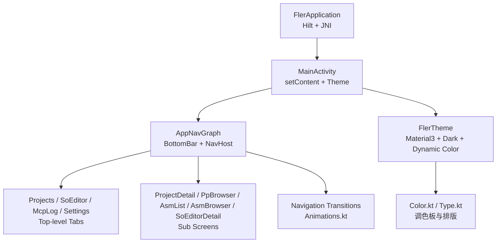
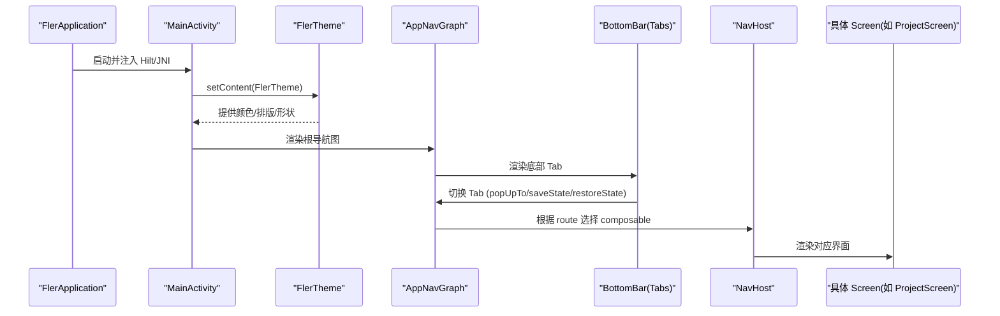
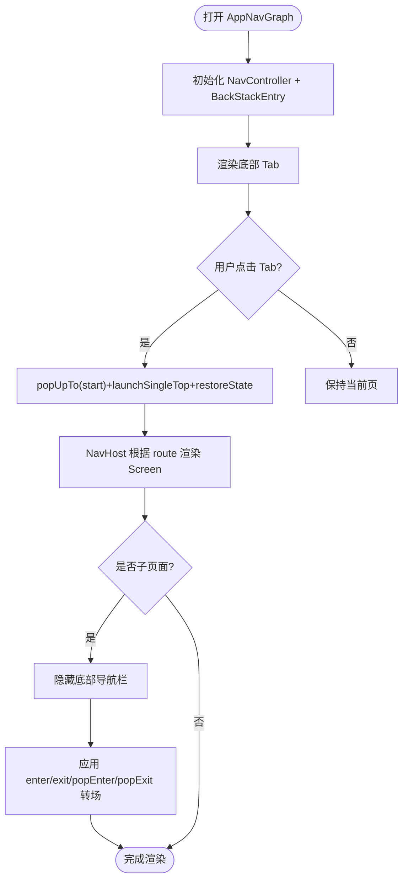
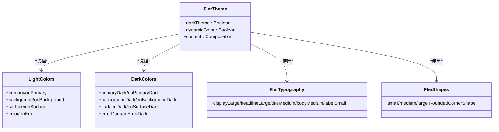
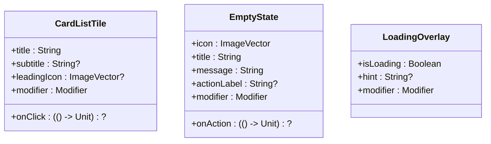
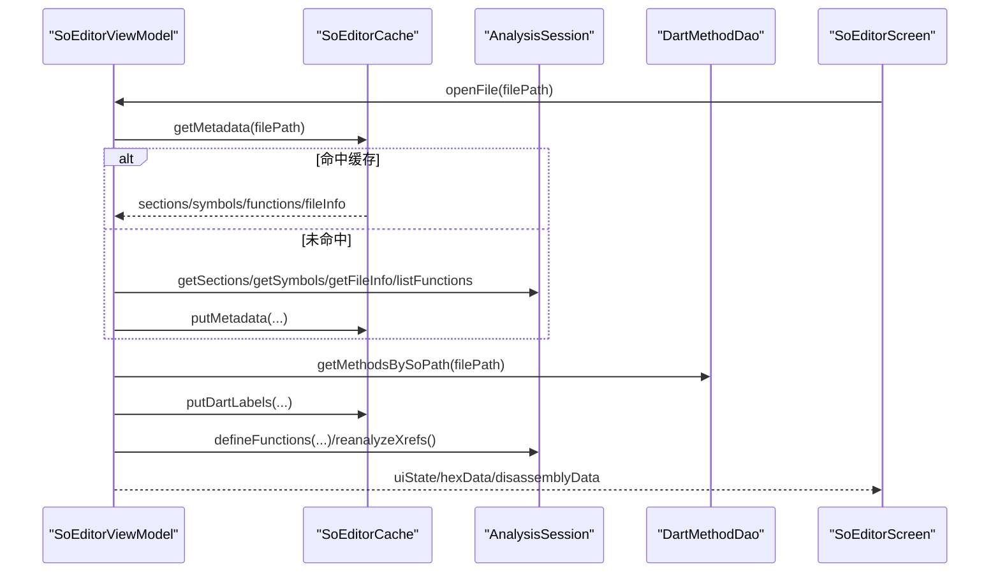
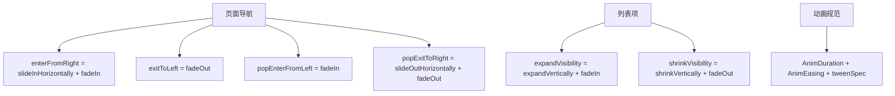
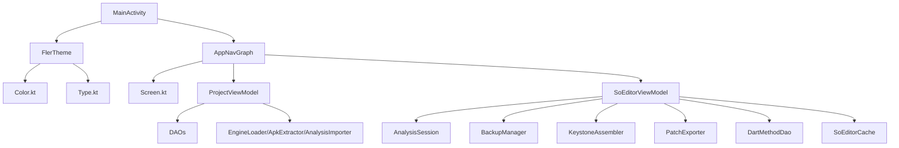

# UI 架构

<cite>
**本文引用的文件**   
- [MainActivity.kt](file://app/src/main/java/com/ai/fler/MainActivity.kt)
- [FlerApplication.kt](file://app/src/main/java/com/ai/fler/FlerApplication.kt)
- [AppNavGraph.kt](file://app/src/main/java/com/ai/fler/app/navigation/AppNavGraph.kt)
- [Screen.kt](file://app/src/main/java/com/ai/fler/app/navigation/Screen.kt)
- [Theme.kt](file://app/src/main/java/com/ai/fler/app/theme/Theme.kt)
- [Color.kt](file://app/src/main/java/com/ai/fler/app/theme/Color.kt)
- [Type.kt](file://app/src/main/java/com/ai/fler/app/theme/Type.kt)
- [CardListTile.kt](file://app/src/main/java/com/ai/fler/ui/components/CardListTile.kt)
- [EmptyState.kt](file://app/src/main/java/com/ai/fler/ui/components/EmptyState.kt)
- [LoadingOverlay.kt](file://app/src/main/java/com/ai/fler/ui/components/LoadingOverlay.kt)
- [ProjectViewModel.kt](file://app/src/main/java/com/ai/fler/feature/project/ProjectViewModel.kt)
- [ProjectState.kt](file://app/src/main/java/com/ai/fler/feature/project/ProjectState.kt)
- [SoEditorViewModel.kt](file://app/src/main/java/com/ai/fler/features/so_editor/SoEditorViewModel.kt)
- [Animations.kt](file://app/src/main/java/com/ai/fler/ui/animation/Animations.kt)
- [AnimationConstants.kt](file://app/src/main/java/com/ai/fler/ui/animation/AnimationConstants.kt)
</cite>

## 目录
1. [简介](#简介)
2. [项目结构](#项目结构)
3. [核心组件](#核心组件)
4. [架构总览](#架构总览)
5. [详细组件分析](#详细组件分析)
6. [依赖关系分析](#依赖关系分析)
7. [性能考量](#性能考量)
8. [故障排查指南](#故障排查指南)
9. [结论](#结论)
10. [附录](#附录)

## 简介
本文件为 Fler 的 UI 架构文档，聚焦于基于 Jetpack Compose 与 Navigation Compose 的导航系统、Material 3 主题体系、可复用 Composable 组件组织、状态管理与持久化策略、响应式设计与可访问性指导原则，以及动画与性能优化实践。目标是帮助开发者快速理解并扩展 UI 层，同时保证一致性与可维护性。

## 项目结构
UI 层采用“入口 Activity + 根主题 + 根导航图”的分层组织：
- 应用入口：FlerApplication（启用 Hilt、加载 JNI）
- 唯一 Activity：MainActivity（设置 Edge-to-Edge、装载主题与根导航）
- 导航层：AppNavGraph（底部 Tab + NavHost + 子页面路由）
- 主题层：Theme/Color/Type（Material 3 颜色、排版、形状、暗色模式）
- 组件层：ui/components（通用卡片、空态、加载覆盖等）
- 功能 ViewModel：feature/* 与 features/*（业务状态与交互逻辑）
- 动画层：ui/animation（统一时长、缓动与转场）

图表来源
- [FlerApplication.kt:1-22](file://app/src/main/java/com/ai/fler/FlerApplication.kt#L1-L22)
- [MainActivity.kt:1-49](file://app/src/main/java/com/ai/fler/MainActivity.kt#L1-L49)
- [AppNavGraph.kt:1-339](file://app/src/main/java/com/ai/fler/app/navigation/AppNavGraph.kt#L1-L339)
- [Theme.kt:1-124](file://app/src/main/java/com/ai/fler/app/theme/Theme.kt#L1-L124)
- [Color.kt:1-62](file://app/src/main/java/com/ai/fler/app/theme/Color.kt#L1-L62)
- [Type.kt:1-68](file://app/src/main/java/com/ai/fler/app/theme/Type.kt#L1-L68)
- [Animations.kt:1-90](file://app/src/main/java/com/ai/fler/ui/animation/Animations.kt#L1-L90)

章节来源
- [FlerApplication.kt:1-22](file://app/src/main/java/com/ai/fler/FlerApplication.kt#L1-L22)
- [MainActivity.kt:1-49](file://app/src/main/java/com/ai/fler/MainActivity.kt#L1-L49)
- [AppNavGraph.kt:1-339](file://app/src/main/java/com/ai/fler/app/navigation/AppNavGraph.kt#L1-L339)
- [Theme.kt:1-124](file://app/src/main/java/com/ai/fler/app/theme/Theme.kt#L1-L124)

## 核心组件
- 导航系统
  - 底部 Tab：Projects、SoEditor、McpLog、Settings（顺序由 TopLevelTabs 定义）
  - 子页面：ProjectDetail、PpBrowser、AsmList、AsmBrowser、SoEditorDetail（带参数路由）
  - 转场：水平滑入/淡出、返回淡入/滑出，统一在 AppNavGraph 中配置
- 主题系统
  - Material 3 颜色：浅/深两套调色板，Android 12+ 动态取色
  - 字体排版：默认 Roboto 字族，统一字号/行高
  - 形状：统一的圆角体系
- 通用组件
  - CardListTile：列表条目卡片（图标 + 主副标题 + 箭头指示）
  - EmptyState：空状态占位（图标 + 标题 + 说明 + 可选操作）
  - LoadingOverlay：半透明加载覆盖层（进度指示 + 提示文字）
- 状态管理
  - StateFlow + ViewModel：项目列表与分析进度、SO 编辑器多状态流
  - SavedStateHandle：用于跨重建的状态恢复（示例见 SoEditorViewModel）

章节来源
- [AppNavGraph.kt:1-339](file://app/src/main/java/com/ai/fler/app/navigation/AppNavGraph.kt#L1-L339)
- [Screen.kt:1-76](file://app/src/main/java/com/ai/fler/app/navigation/Screen.kt#L1-L76)
- [Theme.kt:1-124](file://app/src/main/java/com/ai/fler/app/theme/Theme.kt#L1-L124)
- [Color.kt:1-62](file://app/src/main/java/com/ai/fler/app/theme/Color.kt#L1-L62)
- [Type.kt:1-68](file://app/src/main/java/com/ai/fler/app/theme/Type.kt#L1-L68)
- [CardListTile.kt:1-73](file://app/src/main/java/com/ai/fler/ui/components/CardListTile.kt#L1-L73)
- [EmptyState.kt:1-75](file://app/src/main/java/com/ai/fler/ui/components/EmptyState.kt#L1-L75)
- [LoadingOverlay.kt:1-73](file://app/src/main/java/com/ai/fler/ui/components/LoadingOverlay.kt#L1-L73)
- [ProjectViewModel.kt:1-544](file://app/src/main/java/com/ai/fler/feature/project/ProjectViewModel.kt#L1-L544)
- [ProjectState.kt:1-39](file://app/src/main/java/com/ai/fler/feature/project/ProjectState.kt#L1-L39)
- [SoEditorViewModel.kt:1-800](file://app/src/main/java/com/ai/fler/features/so_editor/SoEditorViewModel.kt#L1-L800)

## 架构总览
下图展示从 Activity 到主题、导航、子页面的整体调用链与数据流向。

图表来源
- [FlerApplication.kt:1-22](file://app/src/main/java/com/ai/fler/FlerApplication.kt#L1-L22)
- [MainActivity.kt:1-49](file://app/src/main/java/com/ai/fler/MainActivity.kt#L1-L49)
- [AppNavGraph.kt:1-339](file://app/src/main/java/com/ai/fler/app/navigation/AppNavGraph.kt#L1-L339)
- [Theme.kt:1-124](file://app/src/main/java/com/ai/fler/app/theme/Theme.kt#L1-L124)

## 详细组件分析

### 导航系统设计（Navigation Compose）
- 顶层 Tab 与子页面
  - 顶层：Projects、SoEditor、McpLog、Settings（通过 BottomBar 驱动）
  - 子页面：ProjectDetail、PpBrowser、AsmList、AsmBrowser、SoEditorDetail（带参数）
- 路由定义
  - 使用 sealed class 集中定义 route 与 createRoute，避免字符串硬编码
  - SoEditorDetail 的路径参数使用 URL-safe Base64 编码，防止特殊字符导致匹配失败
- 导航行为
  - Tab 切换：popUpTo(startDestination, saveState=true) + launchSingleTop + restoreState，确保状态保留与栈整洁
  - 子页面：隐藏底部导航栏（全屏覆盖），进入/退出使用滑入淡出组合
- 跨层依赖注入
  - 通过 EntryPointAccessors 在 Composable 回调中获取 DAO/AddressTranslator，避免在导航层直接持有复杂依赖

图表来源
- [AppNavGraph.kt:1-339](file://app/src/main/java/com/ai/fler/app/navigation/AppNavGraph.kt#L1-L339)
- [Screen.kt:1-76](file://app/src/main/java/com/ai/fler/app/navigation/Screen.kt#L1-L76)

章节来源
- [AppNavGraph.kt:1-339](file://app/src/main/java/com/ai/fler/app/navigation/AppNavGraph.kt#L1-L339)
- [Screen.kt:1-76](file://app/src/main/java/com/ai/fler/app/navigation/Screen.kt#L1-L76)

### 主题系统（Material 3）
- 颜色体系
  - 浅色/深色两套调色板，涵盖 primary/secondary/tertiary/background/surface/error 等语义色
  - Android 12+ 优先动态取色（Material You），老设备回退自定义品牌蓝
- 字体与排版
  - 使用默认 Roboto 字族，统一 display/headline/title/body/label 的字号与行高
- 形状系统
  - 统一 small/medium/large 圆角，避免各处不一致
- 系统栏适配
  - SideEffect 控制状态栏/导航栏图标深浅，配合 enableEdgeToEdge 实现沉浸式

图表来源
- [Theme.kt:1-124](file://app/src/main/java/com/ai/fler/app/theme/Theme.kt#L1-L124)
- [Color.kt:1-62](file://app/src/main/java/com/ai/fler/app/theme/Color.kt#L1-L62)
- [Type.kt:1-68](file://app/src/main/java/com/ai/fler/app/theme/Type.kt#L1-L68)

章节来源
- [Theme.kt:1-124](file://app/src/main/java/com/ai/fler/app/theme/Theme.kt#L1-L124)
- [Color.kt:1-62](file://app/src/main/java/com/ai/fler/app/theme/Color.kt#L1-L62)
- [Type.kt:1-68](file://app/src/main/java/com/ai/fler/app/theme/Type.kt#L1-L68)

### 可复用 Composable 组件设计
- CardListTile
  - 用途：列表项卡片，支持可选 leadingIcon、主副标题、右侧箭头指示
  - 交互：可选 onClick；未设置时不显示箭头
  - 样式：遵循 Material 3 色彩与排版
- EmptyState
  - 用途：空结果占位，包含图标、标题、说明与可选操作按钮
  - 布局：垂直居中，间距统一
- LoadingOverlay
  - 用途：半透明遮罩 + 进度指示 + 可选提示文字
  - 交互：消费点击事件阻止穿透，使用 AnimatedVisibility 控制显隐

图表来源
- [CardListTile.kt:1-73](file://app/src/main/java/com/ai/fler/ui/components/CardListTile.kt#L1-L73)
- [EmptyState.kt:1-75](file://app/src/main/java/com/ai/fler/ui/components/EmptyState.kt#L1-L75)
- [LoadingOverlay.kt:1-73](file://app/src/main/java/com/ai/fler/ui/components/LoadingOverlay.kt#L1-L73)

章节来源
- [CardListTile.kt:1-73](file://app/src/main/java/com/ai/fler/ui/components/CardListTile.kt#L1-L73)
- [EmptyState.kt:1-75](file://app/src/main/java/com/ai/fler/ui/components/EmptyState.kt#L1-L75)
- [LoadingOverlay.kt:1-73](file://app/src/main/java/com/ai/fler/ui/components/LoadingOverlay.kt#L1-L73)

### 状态管理策略（StateFlow + ViewModel + SavedStateHandle）
- 项目模块（ProjectViewModel）
  - 使用 MutableStateFlow 暴露 projectListState 与 analysisProgress
  - 分析流程分阶段更新进度，失败时统一 failAnalysis 并记录错误信息
  - 数据库读写与引擎加载在协程中执行，避免阻塞 UI
- SO 编辑器（SoEditorViewModel）
  - 多状态流：uiState、hexData、disassemblyData、currentTab、selectedOffset、patchedOffsets、flashTrigger、xrefData、functionOverlay、dartFunctionLabels、structureScrollStates、recentFiles 等
  - 使用 SavedStateHandle 参与状态持久化（例如最近文件、滚动位置、闪烁地址等）
  - 打开文件流程：检查缓存 → 读取元数据 → 合并 Dart 标签 → Rizin 注入 → xref 补充扫描
  - 指令补丁：Keystone 汇编 → applyPatch → 刷新高亮与 Hex/Disassembly 视图
  - 撤销/导出：BackupManager + PatchExporter，支持导出补丁或已修改的 SO

图表来源
- [SoEditorViewModel.kt:1-800](file://app/src/main/java/com/ai/fler/features/so_editor/SoEditorViewModel.kt#L1-L800)
- [ProjectViewModel.kt:1-544](file://app/src/main/java/com/ai/fler/feature/project/ProjectViewModel.kt#L1-L544)
- [ProjectState.kt:1-39](file://app/src/main/java/com/ai/fler/feature/project/ProjectState.kt#L1-L39)

章节来源
- [SoEditorViewModel.kt:1-800](file://app/src/main/java/com/ai/fler/features/so_editor/SoEditorViewModel.kt#L1-L800)
- [ProjectViewModel.kt:1-544](file://app/src/main/java/com/ai/fler/feature/project/ProjectViewModel.kt#L1-L544)
- [ProjectState.kt:1-39](file://app/src/main/java/com/ai/fler/feature/project/ProjectState.kt#L1-L39)

### 动画效果实现
- 页面级转场
  - 进入：从右侧滑入 + 淡入
  - 退出：淡出
  - 返回：淡入 + 从右侧滑出
- 列表项展开/收缩
  - 垂直展开/收缩 + 淡入淡出
- 统一时长与缓动
  - AnimDuration：micro/fast/normal/slow/xslow/shimmer
  - AnimEasing：entry/exit/linear/emphasize
  - tweenSpec 辅助创建动画规格

图表来源
- [Animations.kt:1-90](file://app/src/main/java/com/ai/fler/ui/animation/Animations.kt#L1-L90)
- [AnimationConstants.kt:1-66](file://app/src/main/java/com/ai/fler/ui/animation/AnimationConstants.kt#L1-L66)

章节来源
- [Animations.kt:1-90](file://app/src/main/java/com/ai/fler/ui/animation/Animations.kt#L1-L90)
- [AnimationConstants.kt:1-66](file://app/src/main/java/com/ai/fler/ui/animation/AnimationConstants.kt#L1-L66)

## 依赖关系分析
- 入口与主题
  - MainActivity 依赖 FlerTheme，FlerTheme 依赖 Color/Type/Shapes
- 导航与功能
  - AppNavGraph 依赖各 Screen 的 Composable，并通过 EntryPointAccessors 获取 DAO/AddressTranslator
- 状态与数据
  - ProjectViewModel 依赖 DAO、EngineLoader、ApkExtractor、AnalysisImporter、AddressTranslator
  - SoEditorViewModel 依赖 AnalysisSession、BackupManager、KeystoneAssembler、PatchExporter、DartMethodDao、SoEditorCache

图表来源
- [MainActivity.kt:1-49](file://app/src/main/java/com/ai/fler/MainActivity.kt#L1-L49)
- [Theme.kt:1-124](file://app/src/main/java/com/ai/fler/app/theme/Theme.kt#L1-L124)
- [AppNavGraph.kt:1-339](file://app/src/main/java/com/ai/fler/app/navigation/AppNavGraph.kt#L1-L339)
- [ProjectViewModel.kt:1-544](file://app/src/main/java/com/ai/fler/feature/project/ProjectViewModel.kt#L1-L544)
- [SoEditorViewModel.kt:1-800](file://app/src/main/java/com/ai/fler/features/so_editor/SoEditorViewModel.kt#L1-L800)

章节来源
- [MainActivity.kt:1-49](file://app/src/main/java/com/ai/fler/MainActivity.kt#L1-L49)
- [AppNavGraph.kt:1-339](file://app/src/main/java/com/ai/fler/app/navigation/AppNavGraph.kt#L1-L339)
- [ProjectViewModel.kt:1-544](file://app/src/main/java/com/ai/fler/feature/project/ProjectViewModel.kt#L1-L544)
- [SoEditorViewModel.kt:1-800](file://app/src/main/java/com/ai/fler/features/so_editor/SoEditorViewModel.kt#L1-L800)

## 性能考量
- 导航与渲染
  - Tab 切换使用 popUpTo(saveState=true) + restoreState，避免重复构建与状态丢失
  - 子页面全屏覆盖，减少不必要的布局重绘
- 数据与缓存
  - SoEditorViewModel 对元数据与 Dart 标签进行缓存（SoEditorCache），跨实例复用，避免重复查询
  - 反汇编分页加载与追加加载（loadMoreBefore），降低首屏压力
- 异步与线程
  - 所有 IO/重型计算在 viewModelScope 与 Dispatchers.IO 执行，避免阻塞主线程
- 动画与过渡
  - 统一时长与缓动，避免过度动画造成卡顿
- 内存与生命周期
  - SoEditorViewModel 故意不调用 session.closeAll()，保留会话以提升二次打开速度

[本节为通用指导，不直接分析具体文件]

## 故障排查指南
- 导航问题
  - 路径参数异常：检查 SoEditorDetail.createRoute 的 Base64 编码是否正确
  - Tab 切换状态丢失：确认 popUpTo/saveState/restoreState 配置
- 主题与显示
  - 暗色模式不生效：检查 FlerTheme 的 darkTheme 与系统设置
  - 系统栏颜色突兀：确认 SideEffect 中 isAppearanceLightStatusBars/isAppearanceLightNavigationBars 设置
- 状态与数据
  - 项目分析卡住：查看 ProjectViewModel 的阶段日志与 failAnalysis 的错误信息
  - SO 编辑器无法打开：检查 AnalysisSession.open 的结果与 SoEditorCache 是否命中
- 动画与交互
  - 转场异常：核对 AppNavGraph 中 enter/exit/popEnter/popExit 的配置
  - 加载遮罩无效：确认 LoadingOverlay 的 isLoading 状态与 AnimatedVisibility

章节来源
- [AppNavGraph.kt:1-339](file://app/src/main/java/com/ai/fler/app/navigation/AppNavGraph.kt#L1-L339)
- [Theme.kt:1-124](file://app/src/main/java/com/ai/fler/app/theme/Theme.kt#L1-L124)
- [ProjectViewModel.kt:1-544](file://app/src/main/java/com/ai/fler/feature/project/ProjectViewModel.kt#L1-L544)
- [SoEditorViewModel.kt:1-800](file://app/src/main/java/com/ai/fler/features/so_editor/SoEditorViewModel.kt#L1-L800)

## 结论
Fler 的 UI 架构以 Compose + Navigation Compose 为核心，结合 Material 3 主题与统一动画体系，形成清晰的分层与一致的视觉体验。通过 StateFlow + ViewModel 的状态管理、SavedStateHandle 的持久化、以及丰富的缓存与异步策略，保证了良好的性能与用户体验。建议在后续扩展中继续遵循现有模式，保持导航、主题、组件与状态的规范性。

[本节为总结，不直接分析具体文件]

## 附录
- 响应式设计建议
  - 使用 Modifier.fillMaxWidth()/fillMaxSize() 与 Padding 适配不同屏幕尺寸
  - 列表与网格布局考虑纵向滚动与懒加载
- 可访问性合规
  - 为 Icon 与交互元素提供 contentDescription（必要时为空以避免读屏冗余）
  - 确保对比度符合 WCAG 标准，使用 Material 3 语义色
- 最佳实践
  - 将路由集中在 Screen.kt，避免字符串硬编码
  - 使用统一的动画常量与转场函数，保持节奏一致
  - 在 ViewModel 中处理业务逻辑，Composable 仅负责展示与交互

[本节为通用指导，不直接分析具体文件]