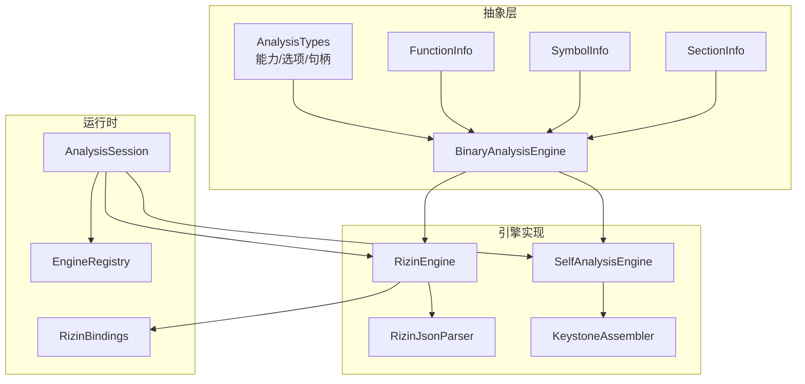
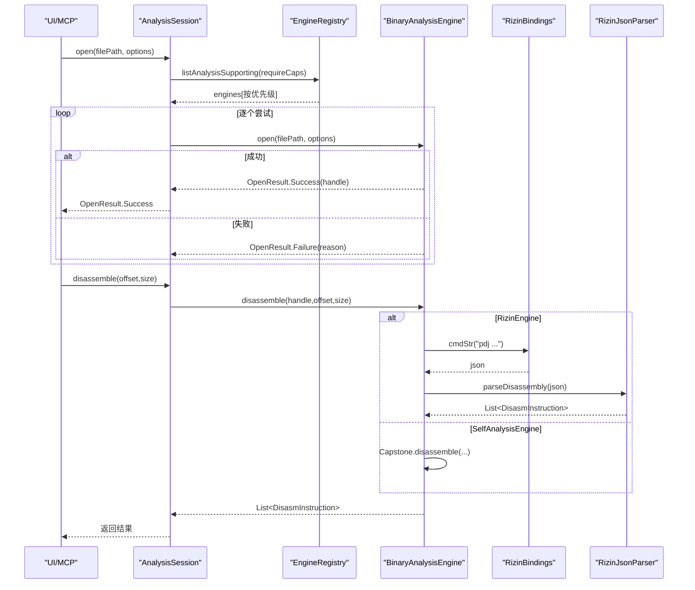
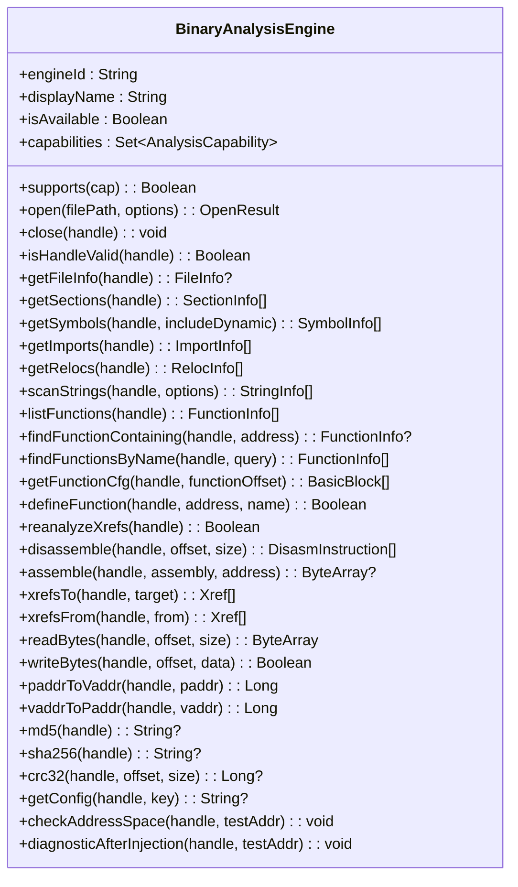
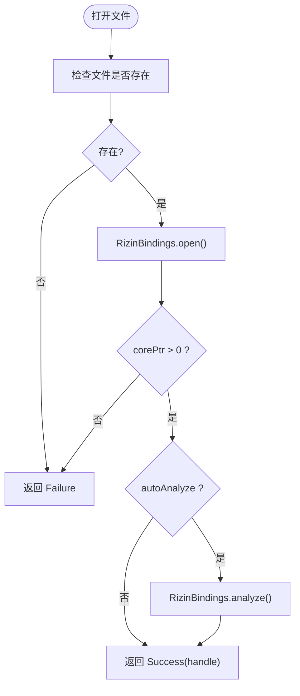
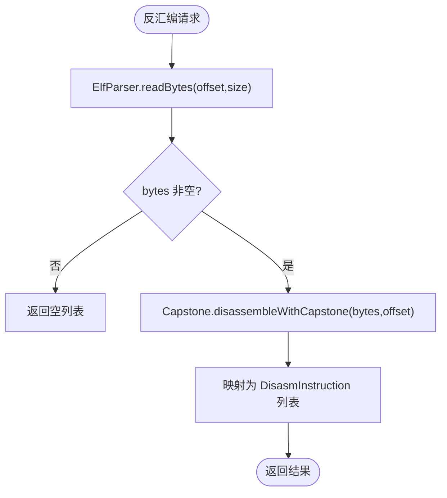
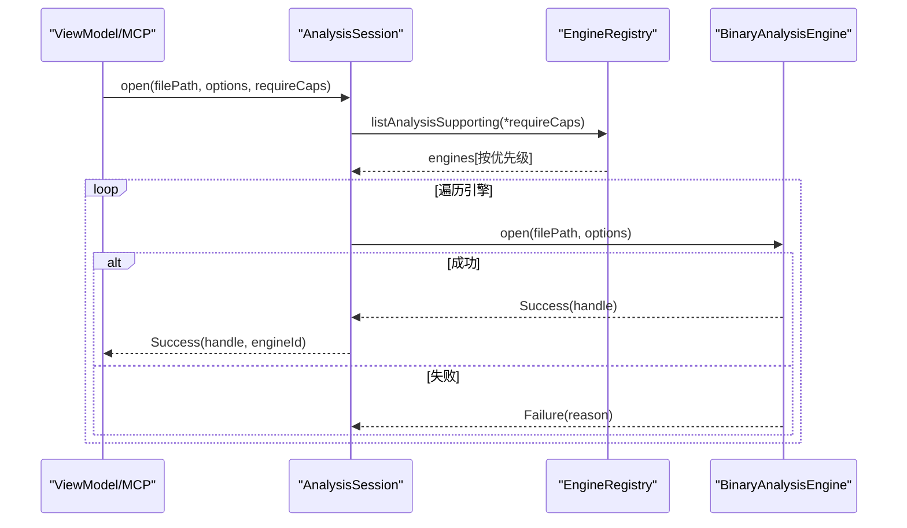
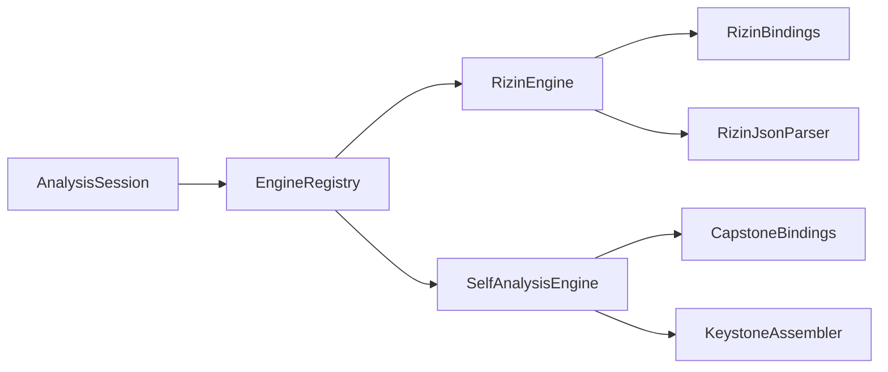

# 二进制分析引擎

<cite>
**本文引用的文件**   
- [BinaryAnalysisEngine.kt](file://app/src/main/java/com/ai/fler/core/analysis/BinaryAnalysisEngine.kt)
- [RizinEngine.kt](file://app/src/main/java/com/ai/fler/core/analysis/engine/RizinEngine.kt)
- [SelfAnalysisEngine.kt](file://app/src/main/java/com/ai/fler/core/analysis/engine/SelfAnalysisEngine.kt)
- [RizinJsonParser.kt](file://app/src/main/java/com/ai/fler/core/analysis/engine/RizinJsonParser.kt)
- [EngineRegistry.kt](file://app/src/main/java/com/ai/fler/core/analysis/EngineRegistry.kt)
- [AnalysisSession.kt](file://app/src/main/java/com/ai/fler/core/analysis/AnalysisSession.kt)
- [AnalysisTypes.kt](file://app/src/main/java/com/ai/fler/core/analysis/AnalysisTypes.kt)
- [FunctionInfo.kt](file://app/src/main/java/com/ai/fler/core/analysis/FunctionInfo.kt)
- [SymbolInfo.kt](file://app/src/main/java/com/ai/fler/core/analysis/SymbolInfo.kt)
- [SectionInfo.kt](file://app/src/main/java/com/ai/fler/core/analysis/SectionInfo.kt)
- [EmulationEngine.kt](file://app/src/main/java/com/ai/fler/core/analysis/EmulationEngine.kt)
- [KeystoneAssembler.kt](file://app/src/main/java/com/ai/fler/core/analysis/assembler/KeystoneAssembler.kt)
- [RizinBindings.kt](file://app/src/main/java/com/ai/fler/core/jni/RizinBindings.kt)
</cite>

## 目录
1. [简介](#简介)
2. [项目结构](#项目结构)
3. [核心组件](#核心组件)
4. [架构总览](#架构总览)
5. [详细组件分析](#详细组件分析)
6. [依赖关系分析](#依赖关系分析)
7. [性能考量](#性能考量)
8. [故障排查指南](#故障排查指南)
9. [结论](#结论)
10. [附录：扩展新引擎示例](#附录扩展新引擎示例)

## 简介
本技术文档面向 Fler 的二进制分析引擎系统，系统性阐述 BinaryAnalysisEngine 接口设计、能力枚举与生命周期管理；深入解析 RizinEngine（JNI + JSON 解析）与 SelfAnalysisEngine（ElfParser + Capstone + Keystone 组合）的实现策略；说明 EngineRegistry 的注册与优先级机制；并提供扩展新分析引擎的可操作指南。

## 项目结构
- 抽象层与数据模型
  - BinaryAnalysisEngine：统一分析接口，定义能力、生命周期与所有分析方法
  - AnalysisTypes：能力枚举、打开选项、会话句柄等基础类型
  - FunctionInfo / SymbolInfo / SectionInfo：统一的 ELF/函数/节区数据模型
- 引擎实现
  - RizinEngine：通过 JNI 调用 Rizin，命令输出为 JSON，由 RizinJsonParser 解析
  - SelfAnalysisEngine：自研 fallback，使用 ElfParser + Capstone + Keystone
- 会话与注册
  - AnalysisSession：对外统一入口，封装引擎选择、会话复用与补丁栈
  - EngineRegistry：引擎注册与按能力筛选、优先级排序
- JNI 绑定
  - RizinBindings：Rizin 静态库的 JNI 方法封装
  - KeystoneAssembler：汇编器独立组件，供 SelfAnalysisEngine 使用

图表来源
- [BinaryAnalysisEngine.kt:1-200](file://app/src/main/java/com/ai/fler/core/analysis/BinaryAnalysisEngine.kt#L1-L200)
- [RizinEngine.kt:1-408](file://app/src/main/java/com/ai/fler/core/analysis/engine/RizinEngine.kt#L1-L408)
- [SelfAnalysisEngine.kt:1-244](file://app/src/main/java/com/ai/fler/core/analysis/engine/SelfAnalysisEngine.kt#L1-L244)
- [RizinJsonParser.kt:1-342](file://app/src/main/java/com/ai/fler/core/analysis/engine/RizinJsonParser.kt#L1-L342)
- [AnalysisSession.kt:1-280](file://app/src/main/java/com/ai/fler/core/analysis/AnalysisSession.kt#L1-L280)
- [EngineRegistry.kt](file://app/src/main/java/com/ai/fler/core/analysis/EngineRegistry.kt)
- [RizinBindings.kt:1-92](file://app/src/main/java/com/ai/fler/core/jni/RizinBindings.kt#L1-L92)
- [KeystoneAssembler.kt:1-36](file://app/src/main/java/com/ai/fler/core/analysis/assembler/KeystoneAssembler.kt#L1-L36)

章节来源
- [BinaryAnalysisEngine.kt:1-200](file://app/src/main/java/com/ai/fler/core/analysis/BinaryAnalysisEngine.kt#L1-L200)
- [AnalysisTypes.kt:1-63](file://app/src/main/java/com/ai/fler/core/analysis/AnalysisTypes.kt#L1-L63)

## 核心组件
- BinaryAnalysisEngine
  - 能力声明：capabilities 集合决定支持的方法族（ELF_PARSING、DISASSEMBLY、ASSEMBLY、FUNCTION_ANALYSIS、XREF、CFG、STRING_SCAN、DEMANGLE、BYTE_EDIT、ADDRESS_TRANSLATION、BINARY_HASH、SIGNATURE_MATCH、PDB_DWARF）
  - 生命周期：open → 分析类方法 → close；handle 在本实例内唯一且可跨多次 open 区分
  - 诊断工具：getConfig、checkAddressSpace、diagnosticAfterInjection
- AnalysisTypes
  - 能力枚举 AnalysisCapability、分析级别 AnalysisLevel、打开选项 OpenOptions、打开结果 OpenResult、句柄 AnalysisHandle、字符串扫描选项 StringScanOptions
- 数据模型
  - FunctionInfo、BasicBlock、Xref/XrefType、SymbolInfo/SymbolType/SymbolBind、ImportInfo、RelocInfo、StringInfo、FileInfo、SectionInfo

章节来源
- [BinaryAnalysisEngine.kt:1-200](file://app/src/main/java/com/ai/fler/core/analysis/BinaryAnalysisEngine.kt#L1-L200)
- [AnalysisTypes.kt:1-63](file://app/src/main/java/com/ai/fler/core/analysis/AnalysisTypes.kt#L1-L63)
- [FunctionInfo.kt:1-64](file://app/src/main/java/com/ai/fler/core/analysis/FunctionInfo.kt#L1-L64)
- [SymbolInfo.kt:1-90](file://app/src/main/java/com/ai/fler/core/analysis/SymbolInfo.kt#L1-L90)
- [SectionInfo.kt:1-48](file://app/src/main/java/com/ai/fler/core/analysis/SectionInfo.kt#L1-L48)

## 架构总览
- 调用路径
  - UI/MCP → AnalysisSession → EngineRegistry → 具体引擎（RizinEngine/SelfAnalysisEngine）→ JNI/内部实现
- 关键职责
  - AnalysisSession：会话复用、引擎选择、补丁栈注入
  - EngineRegistry：引擎注册、能力匹配、优先级排序
  - RizinEngine：Rizin 命令执行 + JSON 解析
  - SelfAnalysisEngine：ElfParser/Capstone/Keystone 组合 fallback

图表来源
- [AnalysisSession.kt:59-115](file://app/src/main/java/com/ai/fler/core/analysis/AnalysisSession.kt#L59-L115)
- [RizinEngine.kt:294-307](file://app/src/main/java/com/ai/fler/core/analysis/engine/RizinEngine.kt#L294-L307)
- [RizinJsonParser.kt:187-228](file://app/src/main/java/com/ai/fler/core/analysis/engine/RizinJsonParser.kt#L187-L228)
- [RizinBindings.kt:60-61](file://app/src/main/java/com/ai/fler/core/jni/RizinBindings.kt#L60-L61)

## 详细组件分析

### BinaryAnalysisEngine 接口设计
- 能力与可用性
  - capabilities 声明能力集合；supports(cap) 默认结合 isAvailable 判断
- 生命周期
  - open(filePath, options) → 返回 OpenResult；close(handle) 释放资源；isHandleValid(handle) 校验
- 功能域
  - ELF 结构：getFileInfo/getSections/getSymbols/getImports/getRelocs/scanStrings
  - 函数分析：listFunctions/findFunctionContaining/findFunctionsByName/getFunctionCfg/defineFunction/reanalyzeXrefs
  - 反汇编/汇编：disassemble/assemble
  - 交叉引用：xrefsTo/xrefsFrom
  - 字节读写：readBytes/writeBytes
  - 地址转换：paddrToVaddr/vaddrToPaddr
  - 哈希：md5/sha256/crc32
  - 诊断：getConfig/checkAddressSpace/diagnosticAfterInjection

图表来源
- [BinaryAnalysisEngine.kt:1-200](file://app/src/main/java/com/ai/fler/core/analysis/BinaryAnalysisEngine.kt#L1-L200)

章节来源
- [BinaryAnalysisEngine.kt:1-200](file://app/src/main/java/com/ai/fler/core/analysis/BinaryAnalysisEngine.kt#L1-L200)

### RizinEngine 实现
- 能力集
  - 覆盖 ELF_PARSING、DISASSEMBLY、ASSEMBLY、FUNCTION_ANALYSIS、XREF、CFG、STRING_SCAN、DEMANGLE、BYTE_EDIT、ADDRESS_TRANSLATION、BINARY_HASH、SIGNATURE_MATCH
- 生命周期
  - open：检查文件存在 → RizinBindings.open → 可选 autoAnalyze → 记录 handle
  - close：移除 handle 并释放 RzCore
- 命令与解析
  - 所有查询通过 RizinBindings.cmdStr 执行命令（如 ij/iSj/isj/iij/irj/aflj/izzj/pdj/axtj/axfj），再由 RizinJsonParser 解析为统一模型
- 关键方法要点
  - getFileInfo：ij + i~size[1] 获取文件大小
  - scanStrings：izzj 全量扫描后按 minLen/maxLen/scanSections 过滤
  - defineFunction：仅设置 flag（不调 af），避免破坏 xref；配合 reanalyzeXrefs(aar) 重建引用
  - reanalyzeXrefs：优先 aar，失败回退 aac
  - disassemble：先 pdj N 条指令，不足则回退 pDj 按字节长度反汇编
  - assemble：pa "指令" @ 地址 → hex → ByteArray
  - xrefsTo/xrefsFrom：axtj/axfj 解析
  - 地址转换：s + pi/v./vp 组合完成 vaddr↔paddr
  - 哈希：ph md5/sha256/crc32

图表来源
- [RizinEngine.kt:63-81](file://app/src/main/java/com/ai/fler/core/analysis/engine/RizinEngine.kt#L63-L81)

章节来源
- [RizinEngine.kt:1-408](file://app/src/main/java/com/ai/fler/core/analysis/engine/RizinEngine.kt#L1-L408)
- [RizinJsonParser.kt:1-342](file://app/src/main/java/com/ai/fler/core/analysis/engine/RizinJsonParser.kt#L1-L342)
- [RizinBindings.kt:1-92](file://app/src/main/java/com/ai/fler/core/jni/RizinBindings.kt#L1-L92)

### SelfAnalysisEngine 实现（Fallback）
- 能力集
  - ELF_PARSING、DISASSEMBLY、ASSEMBLY、BYTE_EDIT、ADDRESS_TRANSLATION、BINARY_HASH
- 设计要点
  - 无状态引擎：每次查询通过 ElfParserBindings().use 重新打开解析，保证与旧行为一致
  - 函数识别：基于符号表推断 FUNC，不执行 aaa
  - 反汇编：CapstoneBindings.disassembleWithCapstone
  - 汇编：KeystoneAssembler.assemble
  - 字符串扫描：读取指定段或全二进制，按 ASCII 范围扫描并过滤
  - 地址转换：直接返回原值（不区分 vaddr/paddr）
  - 哈希：CRC32 计算（MD5/SHA256 暂不支持）

图表来源
- [SelfAnalysisEngine.kt:182-191](file://app/src/main/java/com/ai/fler/core/analysis/engine/SelfAnalysisEngine.kt#L182-L191)

章节来源
- [SelfAnalysisEngine.kt:1-244](file://app/src/main/java/com/ai/fler/core/analysis/engine/SelfAnalysisEngine.kt#L1-L244)
- [KeystoneAssembler.kt:1-36](file://app/src/main/java/com/ai/fler/core/analysis/assembler/KeystoneAssembler.kt#L1-L36)

### AnalysisSession 会话层
- 职责
  - 统一入口：封装 EngineRegistry 挑选引擎流程
  - 会话复用：同一路径多次 open 复用同一 handle，避免重复分析
  - 补丁栈：writeBytes 自动记录撤销信息，writeRawBytes 用于内部写盘
- 引擎选择
  - 按 requireCaps 筛选支持的引擎，按优先级逐个尝试 open，失败降级

图表来源
- [AnalysisSession.kt:59-115](file://app/src/main/java/com/ai/fler/core/analysis/AnalysisSession.kt#L59-L115)

章节来源
- [AnalysisSession.kt:1-280](file://app/src/main/java/com/ai/fler/core/analysis/AnalysisSession.kt#L1-L280)

### EmulationEngine（仿真引擎预留）
- 目的：为后续 Unicorn/Unidbg 集成预留接口与占位实现
- 能力：INSTRUCTION_EMU、ANDROID_NATIVE_EMU、SYSCALL_HOOK、CODE_HOOK、MEMORY_HOOK、JNI_EMU、SINGLE_STEP、GDB_STUB
- 现状：Placeholder 未启用，抛出 NotImplementedError

章节来源
- [EmulationEngine.kt:1-126](file://app/src/main/java/com/ai/fler/core/analysis/EmulationEngine.kt#L1-L126)

## 依赖关系分析
- 耦合与内聚
  - BinaryAnalysisEngine 高内聚地定义能力与方法族；各引擎实现低耦合替换
  - RizinEngine 强依赖 RizinBindings 与 RizinJsonParser；SelfAnalysisEngine 依赖 Capstone/Keystone
  - AnalysisSession 依赖 EngineRegistry 进行引擎选择与优先级控制
- 外部依赖
  - Rizin 静态库（librz_*）通过 JNI 集成
  - Capstone 用于自研反汇编
  - Keystone 用于自研汇编

图表来源
- [AnalysisSession.kt:1-280](file://app/src/main/java/com/ai/fler/core/analysis/AnalysisSession.kt#L1-L280)
- [RizinEngine.kt:1-408](file://app/src/main/java/com/ai/fler/core/analysis/engine/RizinEngine.kt#L1-L408)
- [SelfAnalysisEngine.kt:1-244](file://app/src/main/java/com/ai/fler/core/analysis/engine/SelfAnalysisEngine.kt#L1-L244)

章节来源
- [EngineRegistry.kt](file://app/src/main/java/com/ai/fler/core/analysis/EngineRegistry.kt)

## 性能考量
- RizinEngine
  - 首次 aaa 可能耗时较长，建议按需开启 autoAnalyze 或在后台线程执行
  - 大量 xref 重建（aar）对大文件有开销，应谨慎触发
  - JSON 解析在 Kotlin 序列化下较高效，但需注意大数组（如字符串扫描）的内存占用
- SelfAnalysisEngine
  - 每次查询都重新打开 ElfParser，适合轻量场景；频繁调用建议在上层缓存结果
  - Capstone/Keystone 为本地库，调用开销较低
- 会话层
  - AnalysisSession 复用 handle 避免重复分析；writeBytes 统一记录补丁，注意批量写入减少锁竞争

## 故障排查指南
- RizinEngine 诊断
  - getConfig：查询配置项（如 io.va）
  - checkAddressSpace：打印 io.va、afo、vaddrToPaddr、注入前 axtj 数量
  - diagnosticAfterInjection：检查 f/afij/注入后 axtj 数量
- 常见问题定位
  - 打开失败：确认文件路径与 RizinBindings.open 返回值
  - 反汇编为空：检查 pdj 计数与 pDj 回退逻辑
  - xref 缺失：确认 defineFunction 仅设 flag，再调用 reanalyzeXrefs(aar)
  - 地址不一致：通过 checkAddressSpace 对比 Blutter 与 Rizin 的地址空间

章节来源
- [RizinEngine.kt:113-165](file://app/src/main/java/com/ai/fler/core/analysis/engine/RizinEngine.kt#L113-L165)

## 结论
BinaryAnalysisEngine 提供了统一、可扩展的分析接口；RizinEngine 提供完整能力并通过 JSON 解析对接 Rizin；SelfAnalysisEngine 作为 fallback 确保在无 Rizin 时仍可工作；AnalysisSession 与 EngineRegistry 共同实现会话管理与引擎优先级选择。该架构便于新增引擎与能力扩展，同时保持上层调用稳定。

## 附录：扩展新引擎示例
以下以“新增一个自定义分析引擎”为例，展示能力声明、方法实现与注册流程的关键步骤（代码片段路径见各小节）。

- 步骤一：声明能力与实现接口
  - 新建 MyCustomEngine 实现 BinaryAnalysisEngine
  - 在 capabilities 中声明支持的能力集合（参考 RizinEngine/SelfAnalysisEngine）
  - 实现 open/close/isHandleValid 生命周期方法
  - 根据能力实现对应方法族（ELF/反汇编/汇编/函数分析/交叉引用/字节编辑/地址转换/哈希/诊断）

章节来源
- [BinaryAnalysisEngine.kt:1-200](file://app/src/main/java/com/ai/fler/core/analysis/BinaryAnalysisEngine.kt#L1-L200)
- [AnalysisTypes.kt:1-63](file://app/src/main/java/com/ai/fler/core/analysis/AnalysisTypes.kt#L1-L63)

- 步骤二：实现 JNI/内部调用（如需）
  - 若需调用外部库，创建对应的 Bindings（如 MyCustomBindings）
  - 在引擎方法中通过 withContext(Dispatchers.IO) 调用 native 方法
  - 将外部结果转换为统一数据模型（参考 RizinJsonParser）

章节来源
- [RizinBindings.kt:1-92](file://app/src/main/java/com/ai/fler/core/jni/RizinBindings.kt#L1-L92)
- [RizinJsonParser.kt:1-342](file://app/src/main/java/com/ai/fler/core/analysis/engine/RizinJsonParser.kt#L1-L342)

- 步骤三：注册引擎与优先级
  - 在 EngineRegistry 中注册 MyCustomEngine，设置优先级（高于 SelfAnalysisEngine，低于 RizinEngine）
  - 确保 supports(cap) 与 isAvailable 正确反映运行时状态

章节来源
- [EngineRegistry.kt](file://app/src/main/java/com/ai/fler/core/analysis/EngineRegistry.kt)

- 步骤四：验证与调试
  - 使用 AnalysisSession.open 测试引擎选择与会话复用
  - 调用诊断方法（getConfig/checkAddressSpace/diagnosticAfterInjection）验证行为一致性

章节来源
- [AnalysisSession.kt:1-280](file://app/src/main/java/com/ai/fler/core/analysis/AnalysisSession.kt#L1-L280)