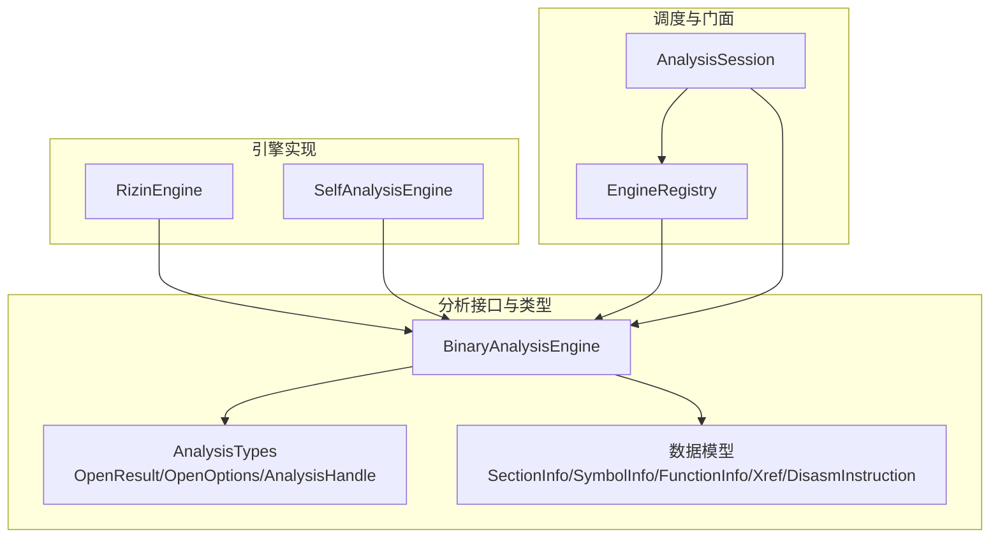
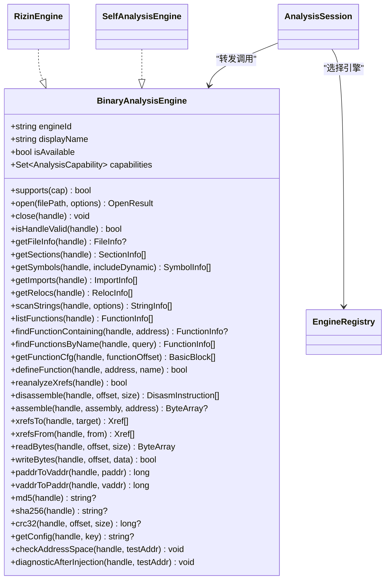
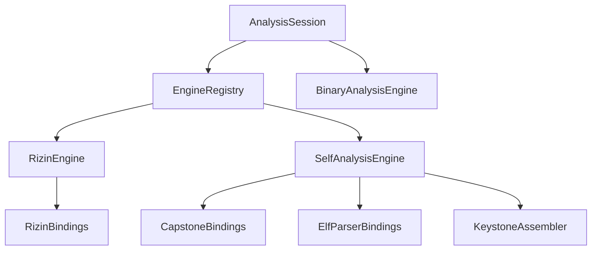

# 引擎接口设计

<cite>
**本文引用的文件**   
- [BinaryAnalysisEngine.kt](file://app/src/main/java/com/ai/fler/core/analysis/BinaryAnalysisEngine.kt)
- [AnalysisSession.kt](file://app/src/main/java/com/ai/fler/core/analysis/AnalysisSession.kt)
- [AnalysisTypes.kt](file://app/src/main/java/com/ai/fler/core/analysis/AnalysisTypes.kt)
- [RizinEngine.kt](file://app/src/main/java/com/ai/fler/core/analysis/engine/RizinEngine.kt)
- [SelfAnalysisEngine.kt](file://app/src/main/java/com/ai/fler/core/analysis/engine/SelfAnalysisEngine.kt)
- [EngineRegistry.kt](file://app/src/main/java/com/ai/fler/core/analysis/EngineRegistry.kt)
- [FunctionInfo.kt](file://app/src/main/java/com/ai/fler/core/analysis/FunctionInfo.kt)
- [SectionInfo.kt](file://app/src/main/java/com/ai/fler/core/analysis/SectionInfo.kt)
- [SymbolInfo.kt](file://app/src/main/java/com/ai/fler/core/analysis/SymbolInfo.kt)
- [DisasmInstruction.kt](file://app/src/main/java/com/ai/fler/core/analysis/DisasmInstruction.kt)
- [EmulationEngine.kt](file://app/src/main/java/com/ai/fler/core/analysis/EmulationEngine.kt)
- [PlaceholderEngines.kt](file://app/src/main/java/com/ai/fler/core/analysis/engine/PlaceholderEngines.kt)
</cite>

## 目录
1. [简介](#简介)
2. [项目结构](#项目结构)
3. [核心组件](#核心组件)
4. [架构总览](#架构总览)
5. [详细组件分析](#详细组件分析)
6. [依赖关系分析](#依赖关系分析)
7. [性能考量](#性能考量)
8. [故障排查指南](#故障排查指南)
9. [结论](#结论)
10. [附录：自定义引擎实现示例](#附录自定义引擎实现示例)

## 简介
本技术文档围绕 BinaryAnalysisEngine 接口设计展开，系统阐述能力枚举体系、生命周期管理、分析方法契约与错误处理策略，以及 AnalysisHandle 的作用域与会话隔离机制。同时给出基于 RizinEngine 与 SelfAnalysisEngine 的实现模式，并提供扩展自定义引擎的实践建议，帮助开发者在不改动上层 UI/MCP 的前提下接入新的二进制分析后端。

## 项目结构
- 接口与类型定义位于 core/analysis 包下，统一抽象了静态分析能力与数据模型。
- 具体引擎实现位于 engine 子包（RizinEngine、SelfAnalysisEngine），并通过 EngineRegistry 注册与选择。
- AnalysisSession 作为统一门面，封装会话管理与能力筛选，屏蔽底层引擎差异。
- EmulationEngine 为仿真引擎预留接口，当前以占位骨架存在。

图表来源
- [BinaryAnalysisEngine.kt:1-200](file://app/src/main/java/com/ai/fler/core/analysis/BinaryAnalysisEngine.kt#L1-L200)
- [AnalysisTypes.kt:1-63](file://app/src/main/java/com/ai/fler/core/analysis/AnalysisTypes.kt#L1-L63)
- [RizinEngine.kt:1-408](file://app/src/main/java/com/ai/fler/core/analysis/engine/RizinEngine.kt#L1-L408)
- [SelfAnalysisEngine.kt:1-244](file://app/src/main/java/com/ai/fler/core/analysis/engine/SelfAnalysisEngine.kt#L1-L244)
- [EngineRegistry.kt:1-112](file://app/src/main/java/com/ai/fler/core/analysis/EngineRegistry.kt#L1-L112)
- [AnalysisSession.kt:1-280](file://app/src/main/java/com/ai/fler/core/analysis/AnalysisSession.kt#L1-L280)

章节来源
- [BinaryAnalysisEngine.kt:1-200](file://app/src/main/java/com/ai/fler/core/analysis/BinaryAnalysisEngine.kt#L1-L200)
- [AnalysisTypes.kt:1-63](file://app/src/main/java/com/ai/fler/core/analysis/AnalysisTypes.kt#L1-L63)
- [EngineRegistry.kt:1-112](file://app/src/main/java/com/ai/fler/core/analysis/EngineRegistry.kt#L1-L112)
- [AnalysisSession.kt:1-280](file://app/src/main/java/com/ai/fler/core/analysis/AnalysisSession.kt#L1-L280)

## 核心组件
- BinaryAnalysisEngine：定义所有静态分析能力的抽象接口，方法均为 suspend，返回 null/empty 表示不可用或失败，避免抛异常。
- AnalysisTypes：能力枚举、打开选项、打开结果、句柄包装等基础类型。
- EngineRegistry：引擎注册中心，按能力与优先级挑选引擎。
- AnalysisSession：会话门面，维护 handle→engine 映射，提供统一的 open/close/查询转发，并集成字节编辑的撤销栈。
- 引擎实现：RizinEngine（完整能力）、SelfAnalysisEngine（兜底能力）。

章节来源
- [BinaryAnalysisEngine.kt:1-200](file://app/src/main/java/com/ai/fler/core/analysis/BinaryAnalysisEngine.kt#L1-L200)
- [AnalysisTypes.kt:1-63](file://app/src/main/java/com/ai/fler/core/analysis/AnalysisTypes.kt#L1-L63)
- [EngineRegistry.kt:1-112](file://app/src/main/java/com/ai/fler/core/analysis/EngineRegistry.kt#L1-L112)
- [AnalysisSession.kt:1-280](file://app/src/main/java/com/ai/fler/core/analysis/AnalysisSession.kt#L1-L280)
- [RizinEngine.kt:1-408](file://app/src/main/java/com/ai/fler/core/analysis/engine/RizinEngine.kt#L1-L408)
- [SelfAnalysisEngine.kt:1-244](file://app/src/main/java/com/ai/fler/core/analysis/engine/SelfAnalysisEngine.kt#L1-L244)

## 架构总览
BinaryAnalysisEngine 是核心抽象，RizinEngine 与 SelfAnalysisEngine 分别通过 JNI 调用 Rizin/Capstone/ElfParser/Keystone 等底层库。AnalysisSession 负责会话级路由与一致性，EngineRegistry 负责能力匹配与优先级选择。MCP 工具层依据 capabilities 自动生成工具暴露。

图表来源
- [BinaryAnalysisEngine.kt:1-200](file://app/src/main/java/com/ai/fler/core/analysis/BinaryAnalysisEngine.kt#L1-L200)
- [RizinEngine.kt:1-408](file://app/src/main/java/com/ai/fler/core/analysis/engine/RizinEngine.kt#L1-L408)
- [SelfAnalysisEngine.kt:1-244](file://app/src/main/java/com/ai/fler/core/analysis/engine/SelfAnalysisEngine.kt#L1-L244)
- [EngineRegistry.kt:1-112](file://app/src/main/java/com/ai/fler/core/analysis/EngineRegistry.kt#L1-L112)
- [AnalysisSession.kt:1-280](file://app/src/main/java/com/ai/fler/core/analysis/AnalysisSession.kt#L1-L280)

## 详细组件分析

### 能力枚举系统（ELF_PARSING、DISASSEMBLY、ASSEMBLY、FUNCTION_ANALYSIS、XREF、BYTE_EDIT、ADDRESS_TRANSLATION、BINARY_HASH）
- 设计原则：以能力为中心声明引擎支持范围，调用方按能力筛选引擎，避免硬编码特定后端判断。
- 使用场景：
  - ELF_PARSING：节区/符号/导入/重定位/字符串扫描。
  - DISASSEMBLY：反汇编指定偏移与长度。
  - ASSEMBLY：指令文本到机器码。
  - FUNCTION_ANALYSIS：函数识别、CFG、交叉引用重建。
  - XREF：axf/axt 查询。
  - BYTE_EDIT：字节读/写（配合会话层撤销栈）。
  - ADDRESS_TRANSLATION：paddr↔vaddr 转换。
  - BINARY_HASH：MD5/SHA256/CRC32。
- 运行时检查：supports(cap) 默认结合 capabilities 与 isAvailable；引擎可覆盖做更细粒度判断。

章节来源
- [AnalysisTypes.kt:1-63](file://app/src/main/java/com/ai/fler/core/analysis/AnalysisTypes.kt#L1-L63)
- [BinaryAnalysisEngine.kt:1-200](file://app/src/main/java/com/ai/fler/core/analysis/BinaryAnalysisEngine.kt#L1-L200)
- [RizinEngine.kt:1-408](file://app/src/main/java/com/ai/fler/core/analysis/engine/RizinEngine.kt#L1-L408)
- [SelfAnalysisEngine.kt:1-244](file://app/src/main/java/com/ai/fler/core/analysis/engine/SelfAnalysisEngine.kt#L1-L244)

### 生命周期管理（open、close、isHandleValid）
- open：校验文件存在性，创建内部句柄（指针/路径映射），按需执行自动分析（如 aaa），返回 OpenResult.Success(handle, filePath, engineId)。
- close：释放句柄资源，清理内部映射。
- isHandleValid：验证句柄是否仍属于本引擎且未关闭。
- 最佳实践：
  - 所有方法均 suspend，便于在 IO 线程执行。
  - 失败时返回 OpenResult.Failure(reason)，不抛异常。
  - 同一路径多次 open 会获得不同 handle，利于会话隔离与 patch 栈独立。

章节来源
- [BinaryAnalysisEngine.kt:1-200](file://app/src/main/java/com/ai/fler/core/analysis/BinaryAnalysisEngine.kt#L1-L200)
- [RizinEngine.kt:1-408](file://app/src/main/java/com/ai/fler/core/analysis/engine/RizinEngine.kt#L1-L408)
- [SelfAnalysisEngine.kt:1-244](file://app/src/main/java/com/ai/fler/core/analysis/engine/SelfAnalysisEngine.kt#L1-L244)

### 分析方法参数、返回值与错误处理
- 参数约定：
  - handle：由 open 返回的 AnalysisHandle，用于会话内唯一标识。
  - offset/size：以文件偏移为主语义；若引擎内部使用 vaddr，需自行转换。
  - options：如 OpenOptions、StringScanOptions，控制行为。
- 返回值约定：
  - 列表为空表示无结果或不可用。
  - 对象为 null 表示不可用或失败。
  - 布尔值表示操作成功与否（如 writeBytes、defineFunction、reanalyzeXrefs）。
- 错误处理：
  - 不抛异常，统一以 null/empty/false 表达失败。
  - 诊断方法（getConfig/checkAddressSpace/diagnosticAfterInjection）用于辅助排错。

章节来源
- [BinaryAnalysisEngine.kt:1-200](file://app/src/main/java/com/ai/fler/core/analysis/BinaryAnalysisEngine.kt#L1-L200)
- [AnalysisTypes.kt:1-63](file://app/src/main/java/com/ai/fler/core/analysis/AnalysisTypes.kt#L1-L63)

### AnalysisHandle 作用域与会话隔离
- AnalysisHandle 是对 Long 的内联包装，避免裸 jlong 滥用。
- Session 层维护 handle→entry 映射，确保同一文件路径复用稳定 handle，并在失效时清理。
- 每个 handle 对应一个引擎实例内的资源，跨引擎不可混用。
- 字节写入通过 AnalysisSession.writeBytes 统一记录补丁，实现跨引擎一致的撤销行为。

章节来源
- [AnalysisTypes.kt:1-63](file://app/src/main/java/com/ai/fler/core/analysis/AnalysisTypes.kt#L1-L63)
- [AnalysisSession.kt:1-280](file://app/src/main/java/com/ai/fler/core/analysis/AnalysisSession.kt#L1-L280)

### RizinEngine 实现要点
- 能力全面：涵盖 ELF_PARSING、DISASSEMBLY、ASSEMBLY、FUNCTION_ANALYSIS、XREF、CFG、STRING_SCAN、DEMANGLE、BYTE_EDIT、ADDRESS_TRANSLATION、BINARY_HASH、SIGNATURE_MATCH。
- 生命周期：open 调用底层 rz_core_new/open/load，可选 aaa 自动分析；close 释放核心。
- 命令通道：通过 cmdStr 执行 Rizin 命令并解析 JSON。
- defineFunction：仅设置 flag 名，不调 af，避免破坏 xref；reanalyzeXrefs 优先 aar，回退 aac。
- 地址转换：通过 s/vp/v. 等命令完成 paddr↔vaddr。
- 哈希：ph md5/sha256/crc32。

章节来源
- [RizinEngine.kt:1-408](file://app/src/main/java/com/ai/fler/core/analysis/engine/RizinEngine.kt#L1-L408)

### SelfAnalysisEngine 实现要点
- 能力：ELF_PARSING、DISASSEMBLY、ASSEMBLY、BYTE_EDIT、ADDRESS_TRANSLATION、BINARY_HASH。
- 无状态：每次查询通过 ElfParserBindings.open/close 重新解析，保证与旧行为一致。
- 反汇编：Capstone 解码；汇编：Keystone。
- 函数分析：基于符号推断 FUNC，无 aaa。
- 地址转换：直接返回原值（不区分 vaddr/paddr）。
- 哈希：CRC32 计算，MD5/SHA256 暂不支持。

章节来源
- [SelfAnalysisEngine.kt:1-244](file://app/src/main/java/com/ai/fler/core/analysis/engine/SelfAnalysisEngine.kt#L1-L244)

### 数据模型与类型
- SectionInfo/SymbolInfo/FunctionInfo/Xref/DisasmInstruction：统一抽象层数据类，屏蔽底层 JNI 差异。
- SymbolType/SymbolBind/XrefType：枚举类型，兼容旧版字段。

章节来源
- [SectionInfo.kt:1-48](file://app/src/main/java/com/ai/fler/core/analysis/SectionInfo.kt#L1-L48)
- [SymbolInfo.kt:1-90](file://app/src/main/java/com/ai/fler/core/analysis/SymbolInfo.kt#L1-L90)
- [FunctionInfo.kt:1-64](file://app/src/main/java/com/ai/fler/core/analysis/FunctionInfo.kt#L1-L64)
- [DisasmInstruction.kt:1-49](file://app/src/main/java/com/ai/fler/core/analysis/DisasmInstruction.kt#L1-L49)

### 仿真引擎（预留）
- EmulationEngine：为 Unicorn/Unidbg 预留接口，包含内存/寄存器/断点/运行等能力。
- PlaceholderEngines：占位骨架，尚未实现，后续可直接替换方法体。

章节来源
- [EmulationEngine.kt:1-126](file://app/src/main/java/com/ai/fler/core/analysis/EmulationEngine.kt#L1-L126)
- [PlaceholderEngines.kt:1-78](file://app/src/main/java/com/ai/fler/core/analysis/engine/PlaceholderEngines.kt#L1-L78)

## 依赖关系分析
- BinaryAnalysisEngine 被 AnalysisSession 与 MCP 工具层依赖。
- RizinEngine/SelfAnalysisEngine 依赖各自 JNI 绑定（RizinBindings/CapstoneBindings/ElfParserBindings/KeystoneAssembler）。
- EngineRegistry 集中管理引擎注册与优先级排序。
- AnalysisSession 依赖 BackupManager 实现字节编辑的撤销栈。

图表来源
- [AnalysisSession.kt:1-280](file://app/src/main/java/com/ai/fler/core/analysis/AnalysisSession.kt#L1-L280)
- [EngineRegistry.kt:1-112](file://app/src/main/java/com/ai/fler/core/analysis/EngineRegistry.kt#L1-L112)
- [RizinEngine.kt:1-408](file://app/src/main/java/com/ai/fler/core/analysis/engine/RizinEngine.kt#L1-L408)
- [SelfAnalysisEngine.kt:1-244](file://app/src/main/java/com/ai/fler/core/analysis/engine/SelfAnalysisEngine.kt#L1-L244)

章节来源
- [AnalysisSession.kt:1-280](file://app/src/main/java/com/ai/fler/core/analysis/AnalysisSession.kt#L1-L280)
- [EngineRegistry.kt:1-112](file://app/src/main/java/com/ai/fler/core/analysis/EngineRegistry.kt#L1-L112)
- [RizinEngine.kt:1-408](file://app/src/main/java/com/ai/fler/core/analysis/engine/RizinEngine.kt#L1-L408)
- [SelfAnalysisEngine.kt:1-244](file://app/src/main/java/com/ai/fler/core/analysis/engine/SelfAnalysisEngine.kt#L1-L244)

## 性能考量
- 自动分析（aaa）：RizinEngine 在 open 时可触发，耗时较大；可通过 OpenOptions.analysisLevel 控制。
- 反汇编：RizinEngine 先尝试 pdj（按指令数），不足则回退 pDj（按字节），避免过大块导致超时。
- 交叉引用重建：reanalyzeXrefs 优先 aar（全量扫描），必要时回退 aac（函数边界扫描）。
- 自研引擎：每次查询重新解析，适合轻量场景；大数据量时注意 IO 开销。
- 并发：AnalysisSession 对 open/close 使用 Mutex 串行化，避免并发冲突。

[本节为通用指导，无需源码引用]

## 故障排查指南
- 地址空间不一致：使用 checkAddressSpace 打印 io.va、afo、vaddrToPaddr 对比结果。
- 注入后 xref 缺失：使用 diagnosticAfterInjection 检查 flag 设置、afij 结果与 axtj 数量。
- 能力不可用：确认 supports(cap) 与 isAvailable；检查 EngineRegistry 优先级与注册顺序。
- 打开失败：查看 OpenResult.Failure.reason，核对文件路径与权限。

章节来源
- [RizinEngine.kt:1-408](file://app/src/main/java/com/ai/fler/core/analysis/engine/RizinEngine.kt#L1-408)
- [AnalysisSession.kt:1-280](file://app/src/main/java/com/ai/fler/core/analysis/AnalysisSession.kt#L1-280)

## 结论
BinaryAnalysisEngine 以能力为中心的设计使多后端无缝切换成为可能；AnalysisSession 提供稳定的会话与一致性体验；EngineRegistry 保障能力匹配与优先级选择。RizinEngine 与 SelfAnalysisEngine 覆盖了从完整功能到兜底实现的梯度需求。遵循本文规范可实现高内聚、低耦合的可扩展分析框架。

[本节为总结，无需源码引用]

## 附录：自定义引擎实现示例
以下示例展示如何新增一个自定义分析引擎，包括能力声明、生命周期与方法实现、异常处理策略。请根据实际后端替换注释中的伪代码。

- 步骤一：声明能力与基本信息
  - 在引擎类中实现 engineId、displayName、isAvailable、capabilities。
  - 参考：[RizinEngine.kt:1-408](file://app/src/main/java/com/ai/fler/core/analysis/engine/RizinEngine.kt#L1-L408)、[SelfAnalysisEngine.kt:1-244](file://app/src/main/java/com/ai/fler/core/analysis/engine/SelfAnalysisEngine.kt#L1-L244)

- 步骤二：实现生命周期
  - open：校验文件、创建句柄、按需自动分析，返回 OpenResult.Success。
  - close：释放句柄资源。
  - isHandleValid：验证句柄有效性。
  - 参考：[BinaryAnalysisEngine.kt:1-200](file://app/src/main/java/com/ai/fler/core/analysis/BinaryAnalysisEngine.kt#L1-L200)

- 步骤三：实现分析方法
  - ELF_PARSING：getFileInfo/getSections/getSymbols/getImports/getRelocs/scanStrings。
  - DISASSEMBLY/ASSEMBLY：disassemble/assemble。
  - FUNCTION_ANALYSIS/XREF：listFunctions/findFunctionContaining/findFunctionsByName/getFunctionCfg/xrefsTo/xrefsFrom/reanalyzeXrefs。
  - BYTE_EDIT：readBytes/writeBytes。
  - ADDRESS_TRANSLATION：paddrToVaddr/vaddrToPaddr。
  - BINARY_HASH：md5/sha256/crc32。
  - 参考：[BinaryAnalysisEngine.kt:1-200](file://app/src/main/java/com/ai/fler/core/analysis/BinaryAnalysisEngine.kt#L1-L200)

- 步骤四：错误处理与诊断
  - 所有方法返回 null/empty/false 表示失败，不抛异常。
  - 使用 getConfig/checkAddressSpace/diagnosticAfterInjection 辅助排错。
  - 参考：[RizinEngine.kt:1-408](file://app/src/main/java/com/ai/fler/core/analysis/engine/RizinEngine.kt#L1-L408)

- 步骤五：注册引擎
  - 在模块初始化时通过 EngineRegistry.registerAnalysis(engine, priority) 注册。
  - 参考：[EngineRegistry.kt:1-112](file://app/src/main/java/com/ai/fler/core/analysis/EngineRegistry.kt#L1-L112)

- 步骤六：会话与能力筛选
  - 调用 AnalysisSession.open(requireCaps=...) 按能力选择引擎。
  - 参考：[AnalysisSession.kt:1-280](file://app/src/main/java/com/ai/fler/core/analysis/AnalysisSession.kt#L1-L280)

章节来源
- [BinaryAnalysisEngine.kt:1-200](file://app/src/main/java/com/ai/fler/core/analysis/BinaryAnalysisEngine.kt#L1-L200)
- [EngineRegistry.kt:1-112](file://app/src/main/java/com/ai/fler/core/analysis/EngineRegistry.kt#L1-L112)
- [AnalysisSession.kt:1-280](file://app/src/main/java/com/ai/fler/core/analysis/AnalysisSession.kt#L1-L280)
- [RizinEngine.kt:1-408](file://app/src/main/java/com/ai/fler/core/analysis/engine/RizinEngine.kt#L1-L408)
- [SelfAnalysisEngine.kt:1-244](file://app/src/main/java/com/ai/fler/core/analysis/engine/SelfAnalysisEngine.kt#L1-L244)