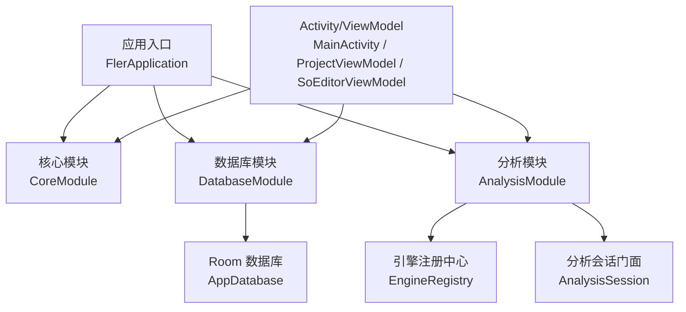
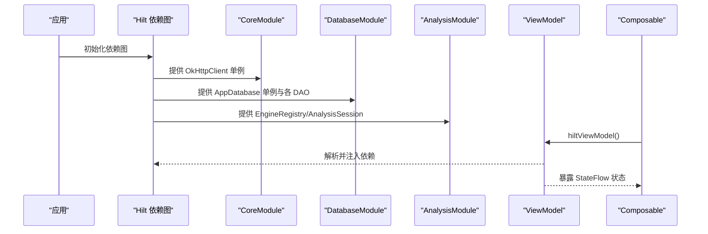
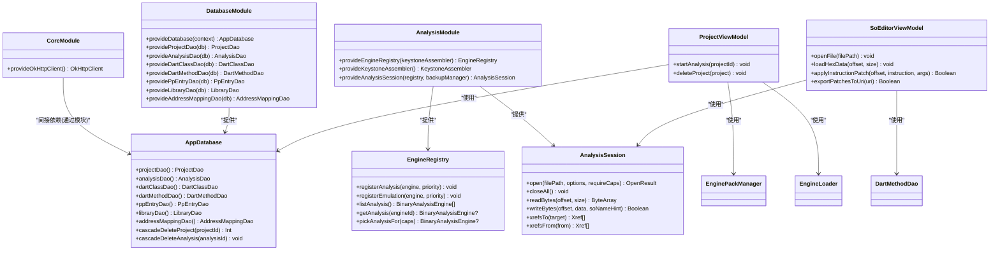
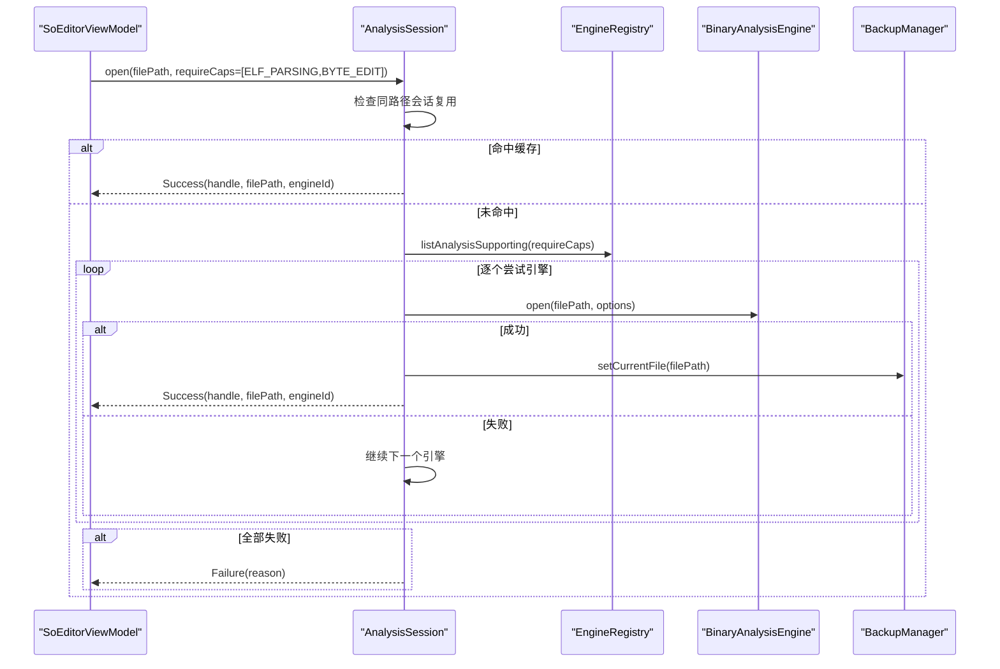
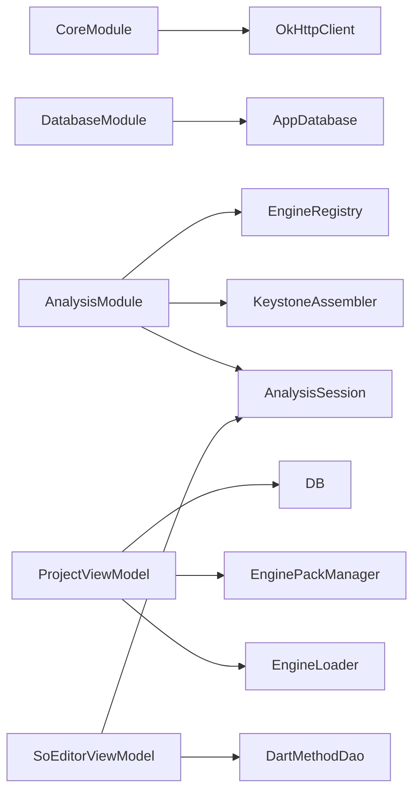

# 依赖注入

<cite>
**本文引用的文件**   
- [FlerApplication.kt](file://app/src/main/java/com/ai/fler/FlerApplication.kt)
- [CoreModule.kt](file://app/src/main/java/com/ai/fler/core/di/CoreModule.kt)
- [DatabaseModule.kt](file://app/src/main/java/com/ai/fler/core/di/DatabaseModule.kt)
- [AnalysisModule.kt](file://app/src/main/java/com/ai/fler/core/di/AnalysisModule.kt)
- [AppDatabase.kt](file://app/src/main/java/com/ai/fler/data/AppDatabase.kt)
- [MainActivity.kt](file://app/src/main/java/com/ai/fler/MainActivity.kt)
- [ProjectViewModel.kt](file://app/src/main/java/com/ai/fler/feature/project/ProjectViewModel.kt)
- [SoEditorViewModel.kt](file://app/src/main/java/com/ai/fler/features/so_editor/SoEditorViewModel.kt)
- [EngineRegistry.kt](file://app/src/main/java/com/ai/fler/core/analysis/EngineRegistry.kt)
- [AnalysisSession.kt](file://app/src/main/java/com/ai/fler/core/analysis/AnalysisSession.kt)
</cite>

## 目录
1. [简介](#简介)
2. [项目结构](#项目结构)
3. [核心组件](#核心组件)
4. [架构总览](#架构总览)
5. [详细组件分析](#详细组件分析)
6. [依赖关系分析](#依赖关系分析)
7. [性能考量](#性能考量)
8. [故障排查指南](#故障排查指南)
9. [结论](#结论)
10. [附录](#附录)

## 简介
本技术文档围绕 Fler 的 Hilt 依赖注入系统，系统性阐述模块职责、依赖配置与生命周期管理，以及 Compose/ViewModel 中的使用方式。重点覆盖：
- CoreModule（OkHttpClient 单例）
- DatabaseModule（Room 数据库与 DAO 提供）
- AnalysisModule（分析引擎注册中心、会话门面等）
- @Provides/@Singleton 的使用与构造函数注入模式
- ViewModel 与 Composable 中通过 hiltViewModel 获取实例的方式
- 依赖图构建过程与生命周期管理
- 最佳实践与常见问题诊断

## 项目结构
Hilt 相关代码集中在 core/di 包下，按领域划分模块；数据层在 data 包；UI 与业务逻辑在 feature/features 包；应用入口在根包。

图表来源 
- [FlerApplication.kt:1-22](file://app/src/main/java/com/ai/fler/FlerApplication.kt#L1-L22)
- [CoreModule.kt:1-31](file://app/src/main/java/com/ai/fler/core/di/CoreModule.kt#L1-L31)
- [DatabaseModule.kt:1-64](file://app/src/main/java/com/ai/fler/core/di/DatabaseModule.kt#L1-L64)
- [AnalysisModule.kt:1-70](file://app/src/main/java/com/ai/fler/core/di/AnalysisModule.kt#L1-L70)
- [AppDatabase.kt:1-120](file://app/src/main/java/com/ai/fler/data/AppDatabase.kt#L1-L120)
- [EngineRegistry.kt:1-112](file://app/src/main/java/com/ai/fler/core/analysis/EngineRegistry.kt#L1-L112)
- [AnalysisSession.kt:1-280](file://app/src/main/java/com/ai/fler/core/analysis/AnalysisSession.kt#L1-L280)
- [MainActivity.kt:1-49](file://app/src/main/java/com/ai/fler/MainActivity.kt#L1-L49)
- [ProjectViewModel.kt:1-544](file://app/src/main/java/com/ai/fler/feature/project/ProjectViewModel.kt#L1-L544)
- [SoEditorViewModel.kt:1-800](file://app/src/main/java/com/ai/fler/features/so_editor/SoEditorViewModel.kt#L1-L800)

章节来源
- [FlerApplication.kt:1-22](file://app/src/main/java/com/ai/fler/FlerApplication.kt#L1-L22)
- [CoreModule.kt:1-31](file://app/src/main/java/com/ai/fler/core/di/CoreModule.kt#L1-L31)
- [DatabaseModule.kt:1-64](file://app/src/main/java/com/ai/fler/core/di/DatabaseModule.kt#L1-L64)
- [AnalysisModule.kt:1-70](file://app/src/main/java/com/ai/fler/core/di/AnalysisModule.kt#L1-L70)
- [AppDatabase.kt:1-120](file://app/src/main/java/com/ai/fler/data/AppDatabase.kt#L1-L120)

## 核心组件
- CoreModule：提供 OkHttpClient 单例，供网络请求共享连接池与超时策略。
- DatabaseModule：提供 AppDatabase 单例及所有 DAO 实例，统一由 Hilt 管理生命周期。
- AnalysisModule：提供 EngineRegistry、KeystoneAssembler、AnalysisSession 等分析相关依赖，完成引擎注册与会话门面构造。
- AppDatabase：Room 数据库定义与级联删除方法，保证数据一致性。
- EngineRegistry：分析/仿真引擎的注册与查询中心，支持能力匹配与优先级选择。
- AnalysisSession：面向 UI/MCP 的统一分析会话门面，封装引擎调用、会话管理与补丁记录。

章节来源
- [CoreModule.kt:1-31](file://app/src/main/java/com/ai/fler/core/di/CoreModule.kt#L1-L31)
- [DatabaseModule.kt:1-64](file://app/src/main/java/com/ai/fler/core/di/DatabaseModule.kt#L1-L64)
- [AnalysisModule.kt:1-70](file://app/src/main/java/com/ai/fler/core/di/AnalysisModule.kt#L1-L70)
- [AppDatabase.kt:1-120](file://app/src/main/java/com/ai/fler/data/AppDatabase.kt#L1-L120)
- [EngineRegistry.kt:1-112](file://app/src/main/java/com/ai/fler/core/analysis/EngineRegistry.kt#L1-L112)
- [AnalysisSession.kt:1-280](file://app/src/main/java/com/ai/fler/core/analysis/AnalysisSession.kt#L1-L280)

## 架构总览
Hilt 在 Application 启动时生成依赖图，@InstallIn(SingletonComponent::class) 的模块在进程生命周期内提供单例对象。ViewModel 通过 @HiltViewModel 与 hiltViewModel() 获取实例，Compose 中通过 hiltViewModel() 直接注入。

图表来源 
- [FlerApplication.kt:1-22](file://app/src/main/java/com/ai/fler/FlerApplication.kt#L1-L22)
- [CoreModule.kt:1-31](file://app/src/main/java/com/ai/fler/core/di/CoreModule.kt#L1-L31)
- [DatabaseModule.kt:1-64](file://app/src/main/java/com/ai/fler/core/di/DatabaseModule.kt#L1-L64)
- [AnalysisModule.kt:1-70](file://app/src/main/java/com/ai/fler/core/di/AnalysisModule.kt#L1-L70)
- [MainActivity.kt:1-49](file://app/src/main/java/com/ai/fler/MainActivity.kt#L1-L49)
- [ProjectViewModel.kt:1-544](file://app/src/main/java/com/ai/fler/feature/project/ProjectViewModel.kt#L1-L544)
- [SoEditorViewModel.kt:1-800](file://app/src/main/java/com/ai/fler/features/so_editor/SoEditorViewModel.kt#L1-L800)

## 详细组件分析

### CoreModule（OkHttpClient 单例）
- 职责：提供全局共享的 OkHttpClient 实例，设置连接/读写超时与重定向策略。
- 作用域：@Singleton，进程内唯一。
- 使用场景：网络下载引擎包、远程资源访问等。

章节来源
- [CoreModule.kt:1-31](file://app/src/main/java/com/ai/fler/core/di/CoreModule.kt#L1-L31)

### DatabaseModule（Room 数据库与 DAO 提供）
- 职责：提供 AppDatabase 单例与多个 DAO（ProjectDao、AnalysisDao、DartClassDao、DartMethodDao、PpEntryDao、LibraryDao、AddressMappingDao）。
- 作用域：@Singleton，确保数据库连接与 DAO 复用。
- 迁移策略：fallbackToDestructiveMigration，便于开发期快速迭代。

章节来源
- [DatabaseModule.kt:1-64](file://app/src/main/java/com/ai/fler/core/di/DatabaseModule.kt#L1-L64)
- [AppDatabase.kt:1-120](file://app/src/main/java/com/ai/fler/data/AppDatabase.kt#L1-L120)

### AnalysisModule（分析引擎相关依赖）
- 职责：
  - 提供 EngineRegistry，注册分析/仿真引擎并按优先级排序。
  - 提供 KeystoneAssembler 用于指令汇编。
  - 提供 AnalysisSession 作为 UI/MCP 的统一入口，封装引擎选择、会话管理与补丁记录。
- 作用域：@Singleton，保证引擎注册与会话全局一致。

章节来源
- [AnalysisModule.kt:1-70](file://app/src/main/java/com/ai/fler/core/di/AnalysisModule.kt#L1-L70)
- [EngineRegistry.kt:1-112](file://app/src/main/java/com/ai/fler/core/analysis/EngineRegistry.kt#L1-L112)
- [AnalysisSession.kt:1-280](file://app/src/main/java/com/ai/fler/core/analysis/AnalysisSession.kt#L1-L280)

### AppDatabase（Room 数据库与级联删除）
- 职责：定义实体集合与 DAO 接口，提供级联删除方法 cascadeDeleteProject/cascadeDeleteAnalysis，保证 SQLite 外键未开启时的数据一致性。
- 事务性：使用 @Transaction 保证原子性。

章节来源
- [AppDatabase.kt:1-120](file://app/src/main/java/com/ai/fler/data/AppDatabase.kt#L1-L120)

### EngineRegistry（引擎注册中心）
- 职责：维护分析/仿真引擎映射与优先级，提供按能力筛选与按 engineId 查询的方法。
- 设计要点：默认 fallback 策略优先高优先级引擎，保证 UI/MCP 始终获得最合适的实现。

章节来源
- [EngineRegistry.kt:1-112](file://app/src/main/java/com/ai/fler/core/analysis/EngineRegistry.kt#L1-L112)

### AnalysisSession（分析会话门面）
- 职责：
  - 统一 open/close 流程，按能力挑选引擎，复用同路径会话 handle。
  - 集中注入 BackupManager，实现 ByteEdit 级别的 patch 栈，使多引擎共享撤销行为。
  - 转发各类分析操作（符号、函数、交叉引用、反汇编、字节读写等）。
- 线程安全：使用 Mutex 串行化 open/close 与内部 map 访问。

章节来源
- [AnalysisSession.kt:1-280](file://app/src/main/java/com/ai/fler/core/analysis/AnalysisSession.kt#L1-L280)

### ViewModel 与 Composable 中的依赖注入
- MainActivity：通过 @AndroidEntryPoint 启用 Hilt，Compose 中通过 hiltViewModel() 获取 ViewModel。
- ProjectViewModel：@HiltViewModel，构造函数注入 AppDatabase、各 DAO、ApkExtractor、EnginePackManager、EngineLoader、AnalysisImporter、AddressTranslator 等。
- SoEditorViewModel：@HiltViewModel，注入 AnalysisSession、BackupManager、KeystoneAssembler、PatchExporter、DartMethodDao、SoEditorCache。

章节来源
- [MainActivity.kt:1-49](file://app/src/main/java/com/ai/fler/MainActivity.kt#L1-L49)
- [ProjectViewModel.kt:1-544](file://app/src/main/java/com/ai/fler/feature/project/ProjectViewModel.kt#L1-L544)
- [SoEditorViewModel.kt:1-800](file://app/src/main/java/com/ai/fler/features/so_editor/SoEditorViewModel.kt#L1-L800)

#### 类关系图（代码级）

图表来源 
- [CoreModule.kt:1-31](file://app/src/main/java/com/ai/fler/core/di/CoreModule.kt#L1-L31)
- [DatabaseModule.kt:1-64](file://app/src/main/java/com/ai/fler/core/di/DatabaseModule.kt#L1-L64)
- [AnalysisModule.kt:1-70](file://app/src/main/java/com/ai/fler/core/di/AnalysisModule.kt#L1-L70)
- [AppDatabase.kt:1-120](file://app/src/main/java/com/ai/fler/data/AppDatabase.kt#L1-L120)
- [EngineRegistry.kt:1-112](file://app/src/main/java/com/ai/fler/core/analysis/EngineRegistry.kt#L1-L112)
- [AnalysisSession.kt:1-280](file://app/src/main/java/com/ai/fler/core/analysis/AnalysisSession.kt#L1-L280)
- [ProjectViewModel.kt:1-544](file://app/src/main/java/com/ai/fler/feature/project/ProjectViewModel.kt#L1-L544)
- [SoEditorViewModel.kt:1-800](file://app/src/main/java/com/ai/fler/features/so_editor/SoEditorViewModel.kt#L1-L800)

#### 打开文件序列图（SoEditorViewModel -> AnalysisSession）

图表来源 
- [SoEditorViewModel.kt:157-240](file://app/src/main/java/com/ai/fler/features/so_editor/SoEditorViewModel.kt#L157-L240)
- [AnalysisSession.kt:59-115](file://app/src/main/java/com/ai/fler/core/analysis/AnalysisSession.kt#L59-L115)
- [EngineRegistry.kt:95-99](file://app/src/main/java/com/ai/fler/core/analysis/EngineRegistry.kt#L95-L99)

## 依赖关系分析
- 模块耦合度：
  - CoreModule 仅依赖 OkHttp，低耦合。
  - DatabaseModule 依赖 Room 与 Context，职责清晰。
  - AnalysisModule 依赖 EngineRegistry、KeystoneAssembler、BackupManager，形成分析子系统边界。
- 直接/间接依赖：
  - ViewModel 直接依赖 DAO、Service、EngineLoader 等，通过 Hilt 解耦具体实现。
  - AnalysisSession 通过 EngineRegistry 间接依赖具体引擎实现。
- 外部集成点：
  - Room（AppDatabase）、OkHttp（CoreModule）、JNI（NativeLoader、Capstone/Rizin/Blutter 等）。

图表来源 
- [CoreModule.kt:1-31](file://app/src/main/java/com/ai/fler/core/di/CoreModule.kt#L1-L31)
- [DatabaseModule.kt:1-64](file://app/src/main/java/com/ai/fler/core/di/DatabaseModule.kt#L1-L64)
- [AnalysisModule.kt:1-70](file://app/src/main/java/com/ai/fler/core/di/AnalysisModule.kt#L1-L70)
- [ProjectViewModel.kt:1-544](file://app/src/main/java/com/ai/fler/feature/project/ProjectViewModel.kt#L1-L544)
- [SoEditorViewModel.kt:1-800](file://app/src/main/java/com/ai/fler/features/so_editor/SoEditorViewModel.kt#L1-L800)

章节来源
- [CoreModule.kt:1-31](file://app/src/main/java/com/ai/fler/core/di/CoreModule.kt#L1-L31)
- [DatabaseModule.kt:1-64](file://app/src/main/java/com/ai/fler/core/di/DatabaseModule.kt#L1-L64)
- [AnalysisModule.kt:1-70](file://app/src/main/java/com/ai/fler/core/di/AnalysisModule.kt#L1-L70)
- [ProjectViewModel.kt:1-544](file://app/src/main/java/com/ai/fler/feature/project/ProjectViewModel.kt#L1-L544)
- [SoEditorViewModel.kt:1-800](file://app/src/main/java/com/ai/fler/features/so_editor/SoEditorViewModel.kt#L1-L800)

## 性能考量
- 单例复用：OkHttpClient、AppDatabase、DAO、EngineRegistry、AnalysisSession 均为 @Singleton，避免重复创建开销。
- 会话复用：AnalysisSession 对同路径文件复用 handle，减少重复 aaa 分析。
- 缓存策略：SoEditorCache 缓存元数据与 Dart 标签，跨 ViewModel 复用，降低 DAO 查询与引擎调用。
- 异步执行：ViewModel 中使用 viewModelScope 与 Dispatchers.IO，避免阻塞主线程。
- 事务与批量：AppDatabase 的级联删除使用 @Transaction 保证原子性，减少多次 IO。

[本节为通用指导，不直接分析具体文件]

## 故障排查指南
- 引擎加载失败（UnsatisfiedLinkError）：
  - 确认阶段 3 已正确 System.load dartvm_<version>.so。
  - 检查 EnginePackManager 是否安装对应版本。
- 分析失败或卡住：
  - 查看日志 TAG=ProjectViewModel，定位失败阶段。
  - 检查 Blutter JNI 输出（TAG=FlerBlutterJNI）。
- Rizin 地址空间不一致：
  - 使用 AnalysisSession.checkAddressSpace(testAddr) 诊断。
- xref 重建问题：
  - 调用 session.reanalyzeXrefs() 补充交叉引用。
- 数据一致性：
  - 使用 AppDatabase.cascadeDeleteProject/cascadeDeleteAnalysis 进行级联删除。

章节来源
- [ProjectViewModel.kt:193-359](file://app/src/main/java/com/ai/fler/feature/project/ProjectViewModel.kt#L193-L359)
- [AnalysisSession.kt:265-274](file://app/src/main/java/com/ai/fler/core/analysis/AnalysisSession.kt#L265-L274)
- [AppDatabase.kt:67-114](file://app/src/main/java/com/ai/fler/data/AppDatabase.kt#L67-L114)

## 结论
Fler 的 Hilt 依赖注入体系以模块化为核心，将网络、数据库与分析子系统清晰分离，并通过 @Singleton 与构造函数注入实现高效、可测试的依赖管理。ViewModel 与 Composable 通过 hiltViewModel 无缝接入，AnalysisSession 作为统一门面屏蔽引擎差异，提升可维护性与扩展性。遵循本文的最佳实践与排查建议，可进一步提升稳定性与性能。

[本节为总结，不直接分析具体文件]

## 附录
- 依赖注入最佳实践
  - 模块化设计：按领域拆分 Module，职责单一。
  - 作用域管理：合理使用 @Singleton，避免过度共享。
  - 构造函数注入：优先使用构造函数，便于测试与验证。
  - 测试友好：通过 Hilt Test 替换模块，隔离外部依赖。
  - 性能优化：复用单例、缓存热点数据、异步执行耗时任务。

[本节为通用指导，不直接分析具体文件]