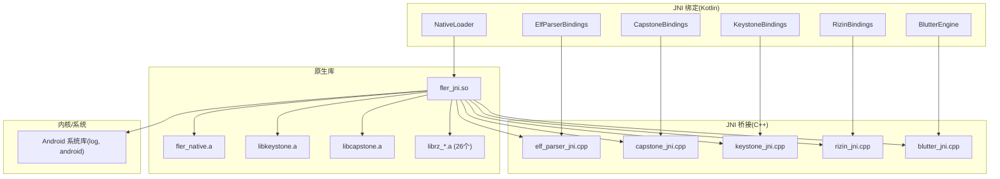
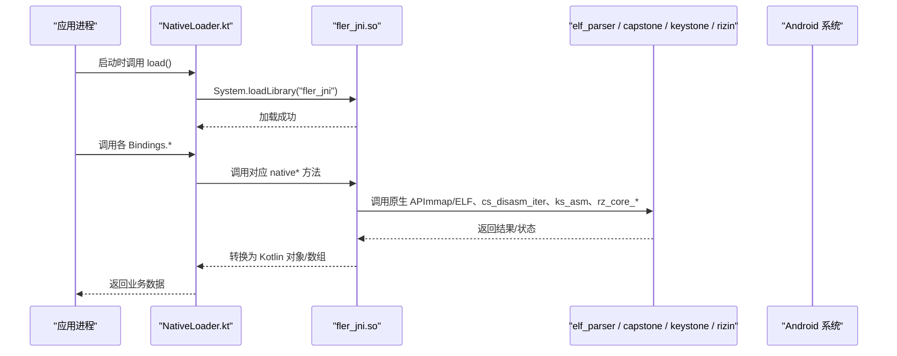
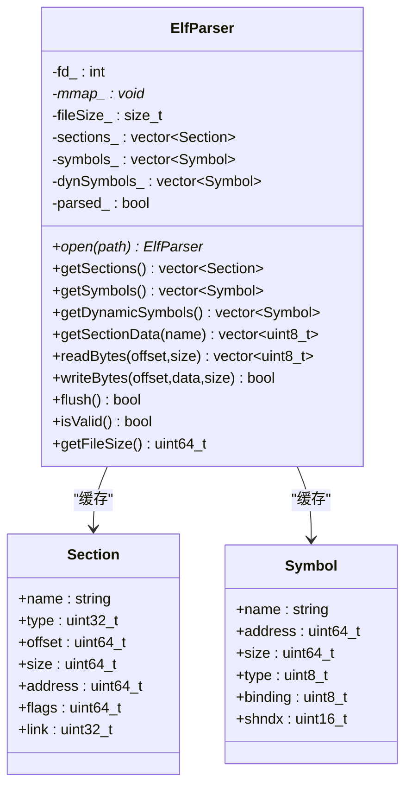
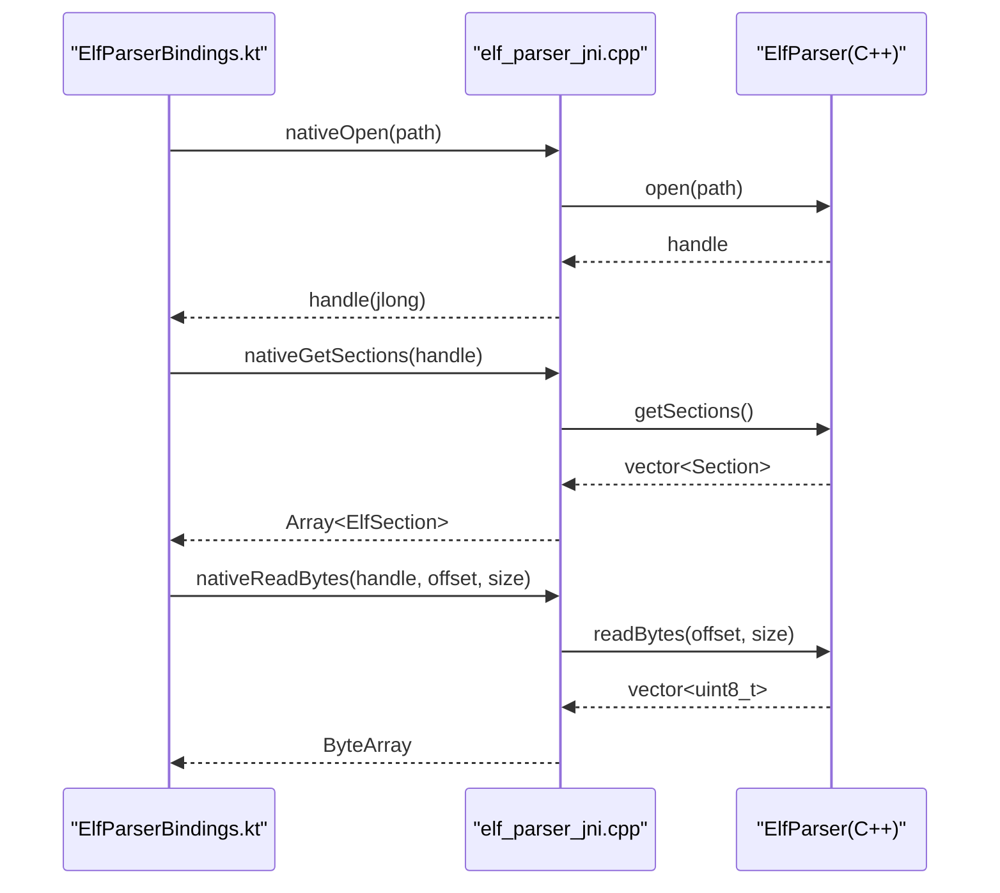
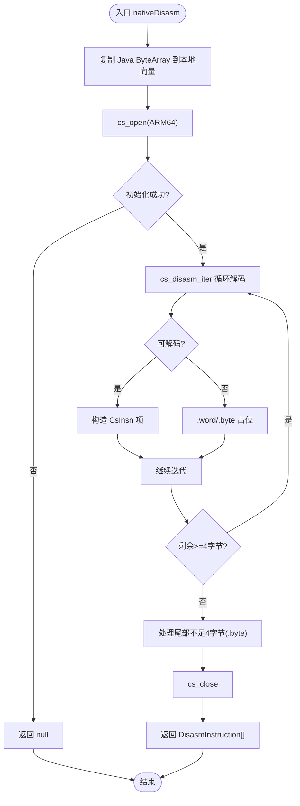
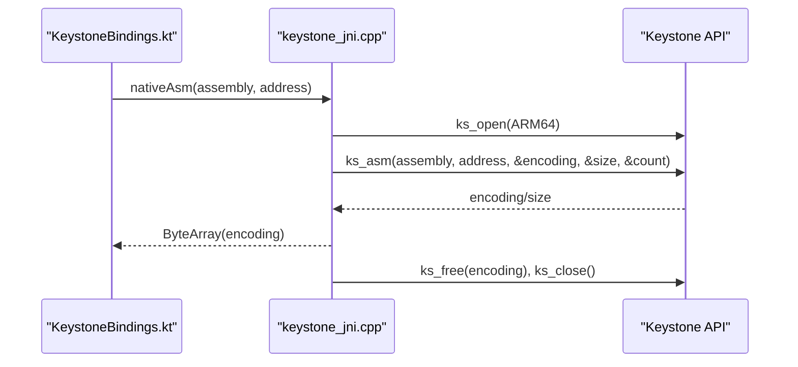
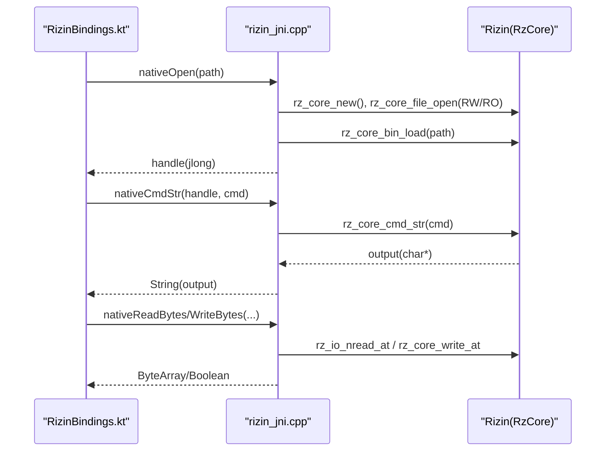
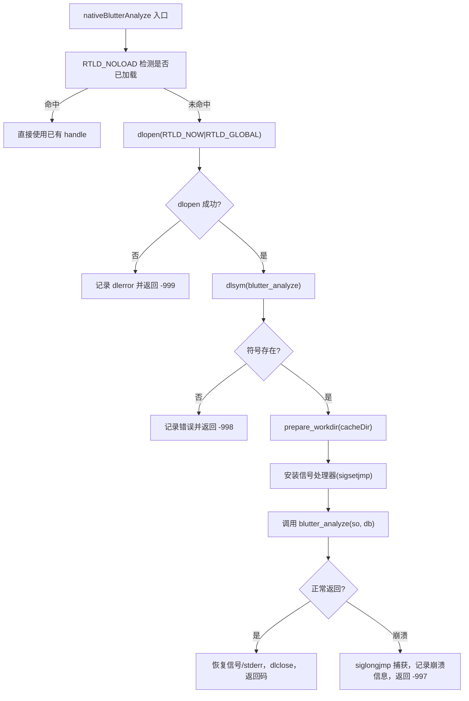
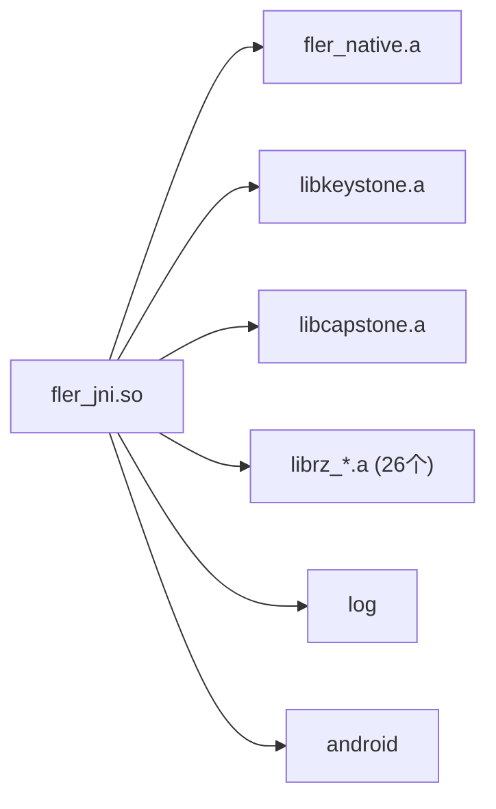

# 原生层架构

<cite>
**本文引用的文件**   
- [CMakeLists.txt](file://app/src/main/cpp/CMakeLists.txt)
- [elf_parser.h](file://app/src/main/cpp/elf_parser/elf_parser.h)
- [elf_parser.cpp](file://app/src/main/cpp/elf_parser/elf_parser.cpp)
- [elf_parser_jni.cpp](file://app/src/main/cpp/jni_bridge/elf_parser_jni.cpp)
- [capstone_jni.cpp](file://app/src/main/cpp/jni_bridge/capstone_jni.cpp)
- [keystone_jni.cpp](file://app/src/main/cpp/jni_bridge/keystone_jni.cpp)
- [rizin_jni.cpp](file://app/src/main/cpp/jni_bridge/rizin_jni.cpp)
- [blutter_jni.cpp](file://app/src/main/cpp/jni_bridge/blutter_jni.cpp)
- [NativeLoader.kt](file://app/src/main/java/com/ai/fler/core/jni/NativeLoader.kt)
- [ElfParserBindings.kt](file://app/src/main/java/com/ai/fler/core/jni/ElfParserBindings.kt)
- [CapstoneBindings.kt](file://app/src/main/java/com/ai/fler/core/jni/CapstoneBindings.kt)
- [KeystoneBindings.kt](file://app/src/main/java/com/ai/fler/core/jni/KeystoneBindings.kt)
- [RizinBindings.kt](file://app/src/main/java/com/ai/fler/core/jni/RizinBindings.kt)
- [BlutterEngine.kt](file://app/src/main/java/com/ai/fler/core/jni/BlutterEngine.kt)
</cite>

## 目录
1. [简介](#简介)
2. [项目结构](#项目结构)
3. [核心组件](#核心组件)
4. [架构总览](#架构总览)
5. [详细组件分析](#详细组件分析)
6. [依赖关系分析](#依赖关系分析)
7. [性能考量](#性能考量)
8. [故障排查指南](#故障排查指南)
9. [结论](#结论)
10. [附录](#附录)

## 简介
本技术文档面向 Fler 的原生 C++ 层，系统性阐述 JNI 桥接设计、内存管理策略与各原生模块（elf_parser、capstone_jni、keystone_jni、rizin_jni）的实现要点。同时覆盖 CMake 构建配置（静态库链接与多架构支持）、C++20 特性使用、NDK r27 编译选项，以及 JNI 编程最佳实践、调试技巧与常见问题解决方案。

## 项目结构
原生代码位于 app/src/main/cpp，主要包含：
- elf_parser：自研 ELF 解析器（只读/写入、节区与符号解析）
- jni_bridge：JNI 桥接实现（elf_parser_jni、capstone_jni、keystone_jni、rizin_jni、blutter_jni）
- include：第三方头文件（capstone、rizin）
- keystone_include：Keystone 头文件
- CMakeLists.txt：构建脚本（C++20、静态库链接、目标可见性）

**图表来源** 
- [CMakeLists.txt:1-89](file://app/src/main/cpp/CMakeLists.txt#L1-L89)
- [NativeLoader.kt:1-35](file://app/src/main/java/com/ai/fler/core/jni/NativeLoader.kt#L1-L35)

**章节来源**
- [CMakeLists.txt:1-89](file://app/src/main/cpp/CMakeLists.txt#L1-L89)
- [NativeLoader.kt:1-35](file://app/src/main/java/com/ai/fler/core/jni/NativeLoader.kt#L1-L35)

## 核心组件
- ElfParser（elf_parser）：基于 mmap 的轻量 ELF 解析器，提供节区/符号读取与字节读写能力，析构时自动释放资源。
- Capstone 反汇编（capstone_jni）：静态链接 libcapstone.a，逐条解码 ARM64，不可解码字节以 .word/.byte 占位输出。
- Keystone 汇编（keystone_jni）：静态链接 libkeystone.a，对 ARM64 指令进行编码，返回机器码字节数组。
- Rizin 引擎（rizin_jni）：静态链接 26 个 librz_*.a + libcapstone.a，通过 rz_core_cmd_str 执行命令并返回字符串或 JSON。
- Blutter 动态加载（blutter_jni）：通过 dlopen/dlsym 调用 dartvm_*.so 导出的 blutter_analyze，具备工作目录准备、stderr 重定向与信号捕获保活。

**章节来源**
- [elf_parser.h:1-107](file://app/src/main/cpp/elf_parser/elf_parser.h#L1-L107)
- [elf_parser.cpp:1-283](file://app/src/main/cpp/elf_parser/elf_parser.cpp#L1-L283)
- [capstone_jni.cpp:1-139](file://app/src/main/cpp/jni_bridge/capstone_jni.cpp#L1-L139)
- [keystone_jni.cpp:1-59](file://app/src/main/cpp/jni_bridge/keystone_jni.cpp#L1-L59)
- [rizin_jni.cpp:1-207](file://app/src/main/cpp/jni_bridge/rizin_jni.cpp#L1-L207)
- [blutter_jni.cpp:1-397](file://app/src/main/cpp/jni_bridge/blutter_jni.cpp#L1-L397)

## 架构总览
整体采用“Kotlin 绑定 → JNI 桥接 → 原生库”的分层模式。Kotlin 侧通过 System.loadLibrary("fler_jni") 统一加载；JNI 层将 Kotlin 对象与 C++ 类型安全转换；原生库以静态方式链接，避免运行时依赖缺失。

**图表来源** 
- [NativeLoader.kt:1-35](file://app/src/main/java/com/ai/fler/core/jni/NativeLoader.kt#L1-L35)
- [elf_parser_jni.cpp:1-166](file://app/src/main/cpp/jni_bridge/elf_parser_jni.cpp#L1-L166)
- [capstone_jni.cpp:1-139](file://app/src/main/cpp/jni_bridge/capstone_jni.cpp#L1-L139)
- [keystone_jni.cpp:1-59](file://app/src/main/cpp/jni_bridge/keystone_jni.cpp#L1-L59)
- [rizin_jni.cpp:1-207](file://app/src/main/cpp/jni_bridge/rizin_jni.cpp#L1-L207)

## 详细组件分析

### ELF 解析器（elf_parser）
- 设计要点
  - 使用 open + mmap 映射整个文件，避免多次 I/O；析构中 munmap/close 确保资源释放。
  - 解析 ELF 头、节表、符号表（.symtab/.dynsym），按 sh_link 关联字符串表，防御越界。
  - 提供 readBytes/writeBytes/flush，写操作经 msync 落盘。
- 数据结构
  - Section/Symbol 仅保留必要字段，减少跨边界拷贝成本。
- 复杂度
  - 解析阶段 O(N) 遍历节表与符号表；查询为 O(1)/O(N) 取决于接口。
- 错误处理
  - 魔数校验、位数校验、偏移/长度边界检查；失败路径返回空集合或 nullptr。

**图表来源** 
- [elf_parser.h:1-107](file://app/src/main/cpp/elf_parser/elf_parser.h#L1-L107)
- [elf_parser.cpp:1-283](file://app/src/main/cpp/elf_parser/elf_parser.cpp#L1-L283)

**章节来源**
- [elf_parser.h:1-107](file://app/src/main/cpp/elf_parser/elf_parser.h#L1-L107)
- [elf_parser.cpp:1-283](file://app/src/main/cpp/elf_parser/elf_parser.cpp#L1-L283)

### ELF 解析器 JNI（elf_parser_jni）
- 职责：将 C++ Section/Symbol 转为 Kotlin 数据类；封装 open/close/getSections/getSymbols/readBytes/writeBytes 等。
- 内存管理：NewStringUTF/NewObjectArray/SetByteArrayRegion 后及时 DeleteLocalRef；handle 用 jlong 传递指针。
- 异常与错误：打开失败返回 0 句柄；读取为空返回 null；写入失败返回 false。

**图表来源** 
- [elf_parser_jni.cpp:1-166](file://app/src/main/cpp/jni_bridge/elf_parser_jni.cpp#L1-L166)
- [ElfParserBindings.kt:1-178](file://app/src/main/java/com/ai/fler/core/jni/ElfParserBindings.kt#L1-L178)

**章节来源**
- [elf_parser_jni.cpp:1-166](file://app/src/main/cpp/jni_bridge/elf_parser_jni.cpp#L1-L166)
- [ElfParserBindings.kt:1-178](file://app/src/main/java/com/ai/fler/core/jni/ElfParserBindings.kt#L1-L178)

### Capstone 反汇编（capstone_jni）
- 设计要点：静态链接 libcapstone.a；使用 cs_disasm_iter 循环解码，不可解码字节输出 .word/.byte，保证函数范围完整。
- 内存管理：cs_malloc/cs_free 成对使用；JNI 对象创建后 DeleteLocalRef；最终 cs_close。
- 性能：逐条迭代避免一次性分配大缓冲区；固定大小缓冲防止越界。

**图表来源** 
- [capstone_jni.cpp:1-139](file://app/src/main/cpp/jni_bridge/capstone_jni.cpp#L1-L139)

**章节来源**
- [capstone_jni.cpp:1-139](file://app/src/main/cpp/jni_bridge/capstone_jni.cpp#L1-L139)
- [CapstoneBindings.kt:1-35](file://app/src/main/java/com/ai/fler/core/jni/CapstoneBindings.kt#L1-L35)

### Keystone 汇编（keystone_jni）
- 设计要点：静态链接 libkeystone.a；调用 ks_asm 编码 ARM64 指令；以 encoding_size 判断成败（兼容旧版本返回值语义）。
- 内存管理：ks_free(encoding)、ks_close；JNI 字节数组直接拷贝。

**图表来源** 
- [keystone_jni.cpp:1-59](file://app/src/main/cpp/jni_bridge/keystone_jni.cpp#L1-L59)
- [KeystoneBindings.kt:1-27](file://app/src/main/java/com/ai/fler/core/jni/KeystoneBindings.kt#L1-L27)

**章节来源**
- [keystone_jni.cpp:1-59](file://app/src/main/cpp/jni_bridge/keystone_jni.cpp#L1-L59)
- [KeystoneBindings.kt:1-27](file://app/src/main/java/com/ai/fler/core/jni/KeystoneBindings.kt#L1-L27)

### Rizin 引擎（rizin_jni）
- 设计要点：最小化 JNI 暴露 open/close/analyze/cmdStr/readBytes/writeBytes；所有复杂解析在 Kotlin 层完成（JSON→模型）。
- 兼容性：Android NDK 无 backtrace，提供空实现以满足 librz_util 链接。
- 健壮性：文件打开先 RW 再 RO 降级；非致命加载失败仍允许基础 IO。

**图表来源** 
- [rizin_jni.cpp:1-207](file://app/src/main/cpp/jni_bridge/rizin_jni.cpp#L1-L207)
- [RizinBindings.kt:1-92](file://app/src/main/java/com/ai/fler/core/jni/RizinBindings.kt#L1-L92)

**章节来源**
- [rizin_jni.cpp:1-207](file://app/src/main/cpp/jni_bridge/rizin_jni.cpp#L1-L207)
- [RizinBindings.kt:1-92](file://app/src/main/java/com/ai/fler/core/jni/RizinBindings.kt#L1-L92)

### Blutter 动态加载（blutter_jni）
- 设计要点：优先 RTLD_NOLOAD 检测已加载 dartvm_*.so，否则 dlopen(RTLD_NOW|RTLD_GLOBAL)；dlsym 查找 blutter_analyze。
- 环境准备：chdir 到 cacheDir/blutter_tmp，设置 TMPDIR/TMP/TEMP，避免 Android 下 /tmp 无写权限。
- 崩溃保活：安装 SIGSEGV/SIGBUS/SIGFPE/SIGABRT/SIGILL 处理器，sigsetjmp/siglongjmp 捕获崩溃并返回特殊错误码，进程存活。
- stderr 重定向：管道捕获 fprintf(stderr) 输出，便于定位问题。

**图表来源** 
- [blutter_jni.cpp:1-397](file://app/src/main/cpp/jni_bridge/blutter_jni.cpp#L1-L397)
- [BlutterEngine.kt:1-114](file://app/src/main/java/com/ai/fler/core/jni/BlutterEngine.kt#L1-L114)

**章节来源**
- [blutter_jni.cpp:1-397](file://app/src/main/cpp/jni_bridge/blutter_jni.cpp#L1-L397)
- [BlutterEngine.kt:1-114](file://app/src/main/java/com/ai/fler/core/jni/BlutterEngine.kt#L1-L114)

## 依赖关系分析
- 构建产物
  - fler_jni.so：包含所有 JNI 桥接与对外导出符号（默认可见性）。
  - fler_native.a：elf_parser 静态库，供 fl er_jni 链接。
  - 外部静态库：libkeystone.a、libcapstone.a、26× librz_*.a。
- 头文件路径
  - include/capstone、include/rizin、include/rizin/rz_util、include/rizin/sdb、keystone_include/keystone。
- 系统库
  - log、android。

**图表来源** 
- [CMakeLists.txt:1-89](file://app/src/main/cpp/CMakeLists.txt#L1-L89)

**章节来源**
- [CMakeLists.txt:1-89](file://app/src/main/cpp/CMakeLists.txt#L1-L89)

## 性能考量
- 内存映射与零拷贝
  - ELF 解析使用 mmap，避免重复 I/O；读取节区数据尽量引用映射内存，必要时才拷贝。
- 反汇编与汇编
  - Capstone 逐条迭代解码，避免一次性大缓冲；Keystone 直接编码，注意分支地址传入以减少重定位开销。
- 命令式 Rizin
  - 通过 rz_io_nread_at 直接读取字节，比 pxj 更高效；JSON 解析下沉至 Kotlin 层，降低 JNI 负担。
- 构建优化
  - Release 开启 -O2，Debug 关闭优化并带 -g；fvisibility=hidden 减小符号体积。

[本节为通用指导，不直接分析具体文件]

## 故障排查指南
- JNI 加载失败
  - 确认 NativeLoader.load() 被调用且路径正确；查看 UnsatisfiedLinkError 日志。
- Capstone 反汇编返回空
  - 检查 cs_open 错误码；确认输入 code 非空且 baseAddress 合理。
- Keystone 汇编失败
  - 关注 ks_errno 与 encoding_size；某些版本 stat_count==0 但编码有效，需以 encoding_size 为准。
- Rizin 命令无输出
  - 确认命令后缀 j 获取 JSON；检查 rz_core_cmd_str 返回值是否为空。
- Blutter 分析崩溃
  - 观察日志中的信号捕获信息（SIGSEGV/SIGBUS/SIGFPE/SIGABRT/SIGILL）；检查 dartvm_*.so 与 libapp.so 版本匹配；确认 tmp 目录可写。

**章节来源**
- [NativeLoader.kt:1-35](file://app/src/main/java/com/ai/fler/core/jni/NativeLoader.kt#L1-L35)
- [capstone_jni.cpp:1-139](file://app/src/main/cpp/jni_bridge/capstone_jni.cpp#L1-L139)
- [keystone_jni.cpp:1-59](file://app/src/main/cpp/jni_bridge/keystone_jni.cpp#L1-L59)
- [rizin_jni.cpp:1-207](file://app/src/main/cpp/jni_bridge/rizin_jni.cpp#L1-L207)
- [blutter_jni.cpp:1-397](file://app/src/main/cpp/jni_bridge/blutter_jni.cpp#L1-L397)

## 结论
Fler 的原生层通过清晰的 JNI 分层与静态库集成，实现了高内聚、低耦合的 ELF 解析、反汇编、汇编与 Rizin 分析能力。CMake 构建配置确保了多架构支持与零运行时依赖；C++20 与 NDK r27 提供了现代编译体验。遵循本文的最佳实践与排障建议，可显著提升稳定性与性能。

[本节为总结性内容，不直接分析具体文件]

## 附录

### CMake 构建与 C++20/NDK r27 要点
- 语言标准：-std=c++20
- 可见性与警告：-fvisibility=hidden、-Wall、-Wextra、-fPIC
- 优化级别：Debug(-O0 -g)、Release(-O2)
- 头文件路径：include/capstone、include/rizin、include/rizin/rz_util、include/rizin/sdb、keystone_include/keystone
- 静态库导入：keystone、capstone、${RIZIN_STATIC_LIBS}
- 目标可见性：CXX_VISIBILITY_PRESET default，VISIBILITY_INLINES_HIDDEN ON

**章节来源**
- [CMakeLists.txt:1-89](file://app/src/main/cpp/CMakeLists.txt#L1-L89)

### JNI 编程最佳实践
- 异常处理
  - 所有 JNI 入口检查参数有效性；失败路径返回 null/false 或特定错误码，并在日志中记录原因。
- 内存泄漏防护
  - NewStringUTF/NewObjectArray/GetByteArrayRegion 后及时 DeleteLocalRef；成对调用 cs_malloc/cs_free、ks_free/ks_close、rz_core_free。
- 性能优化
  - 批量数据尽量一次拷贝；避免频繁 JNI 往返；使用迭代器（如 cs_disasm_iter）减少中间对象。
- 线程安全
  - 每个 JNI 实例持有独立句柄（handle），避免共享可变状态；必要时加锁。

**章节来源**
- [elf_parser_jni.cpp:1-166](file://app/src/main/cpp/jni_bridge/elf_parser_jni.cpp#L1-L166)
- [capstone_jni.cpp:1-139](file://app/src/main/cpp/jni_bridge/capstone_jni.cpp#L1-L139)
- [keystone_jni.cpp:1-59](file://app/src/main/cpp/jni_bridge/keystone_jni.cpp#L1-L59)
- [rizin_jni.cpp:1-207](file://app/src/main/cpp/jni_bridge/rizin_jni.cpp#L1-L207)
- [blutter_jni.cpp:1-397](file://app/src/main/cpp/jni_bridge/blutter_jni.cpp#L1-L397)