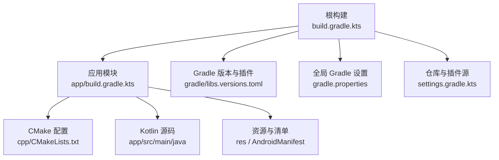
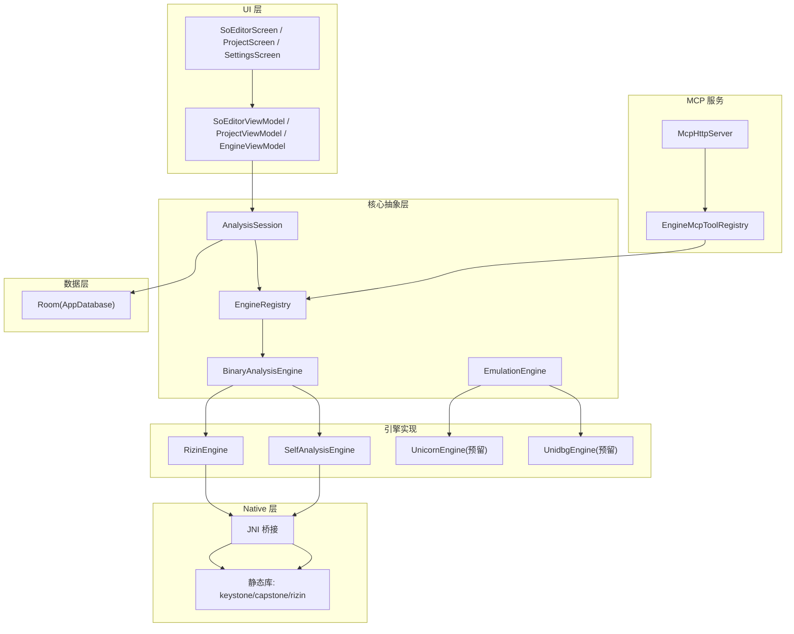
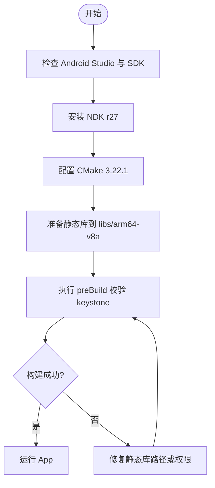
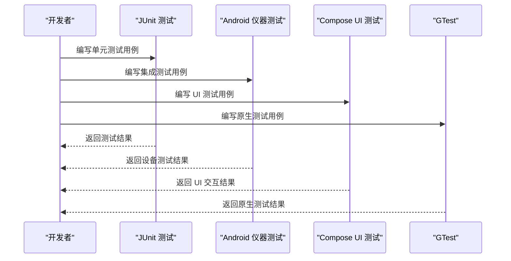
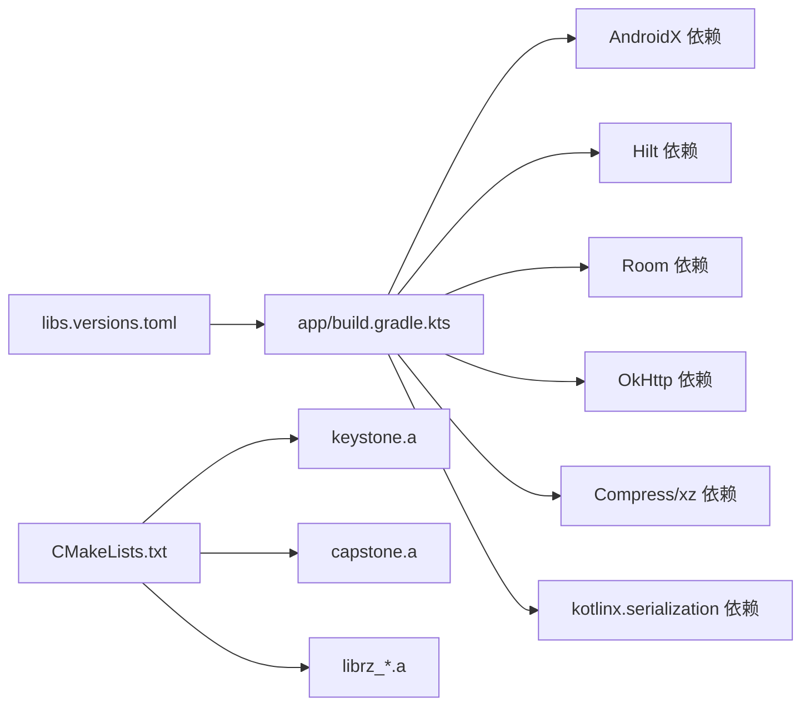

# 开发者指南

<cite>
**本文引用的文件**
- [build.gradle.kts](file://build.gradle.kts)
- [app/build.gradle.kts](file://app/build.gradle.kts)
- [settings.gradle.kts](file://settings.gradle.kts)
- [gradle.properties](file://gradle.properties)
- [gradle/libs.versions.toml](file://gradle/libs.versions.toml)
- [CMakeLists.txt](file://app/src/main/cpp/CMakeLists.txt)
- [FlerApplication.kt](file://app/src/main/java/com/ai/fler/FlerApplication.kt)
- [MainActivity.kt](file://app/src/main/java/com/ai/fler/MainActivity.kt)
- [CODE_WIKI.md](file://CODE_WIKI.md)
- [rizin-integration-plan.md](file://rizin-integration-plan.md)
- [dev-plan.md](file://dev-plan.md)
- [ExampleUnitTest.kt](file://app/src/test/java/com/ai/fler/ExampleUnitTest.kt)
- [ExampleInstrumentedTest.kt](file://app/src/androidTest/java/com/ai/fler/ExampleInstrumentedTest.kt)
</cite>

## 目录
1. [简介](#简介)
2. [项目结构](#项目结构)
3. [核心组件](#核心组件)
4. [架构总览](#架构总览)
5. [详细组件分析](#详细组件分析)
6. [依赖关系分析](#依赖关系分析)
7. [性能考量](#性能考量)
8. [故障排除指南](#故障排除指南)
9. [结论](#结论)
10. [附录](#附录)

## 简介
本指南面向 Fler 项目的开发者，覆盖环境搭建、代码规范、调试技巧、开发工作流、测试策略与贡献流程。Fler 是一款 Android 平台的 Flutter 应用逆向分析工具，聚焦 libapp.so 的静态分析、反汇编、汇编与字节级编辑，并通过 MCP 服务暴露能力给 AI 工具链。

## 项目结构
- 顶层构建脚本与插件版本集中管理：根 build.gradle.kts、settings.gradle.kts、gradle.properties、gradle/libs.versions.toml。
- app 模块为 Android 应用模块，包含 Kotlin Compose UI、Hilt DI、Room 数据层、core 核心抽象层与 features UI 功能模块。
- cpp 目录包含 C++ 原生源码与 CMake 配置，静态链接 Rizin、Capstone、Keystone 等库。
- CODE_WIKI.md 提供包结构与关键设计决策说明；dev-plan.md 与 rizin-integration-plan.md 提供工程化与集成方案参考。

**图表来源**
- [build.gradle.kts:1-9](file://build.gradle.kts#L1-L9)
- [app/build.gradle.kts:1-129](file://app/build.gradle.kts#L1-L129)
- [CMakeLists.txt:1-89](file://app/src/main/cpp/CMakeLists.txt#L1-L89)
- [gradle/libs.versions.toml:1-61](file://gradle/libs.versions.toml#L1-L61)
- [gradle.properties:1-22](file://gradle.properties#L1-L22)
- [settings.gradle.kts:1-32](file://settings.gradle.kts#L1-L32)

**章节来源**
- [build.gradle.kts:1-9](file://build.gradle.kts#L1-L9)
- [app/build.gradle.kts:1-129](file://app/build.gradle.kts#L1-L129)
- [settings.gradle.kts:1-32](file://settings.gradle.kts#L1-L32)
- [gradle.properties:1-22](file://gradle.properties#L1-L22)
- [gradle/libs.versions.toml:1-61](file://gradle/libs.versions.toml#L1-L61)
- [CMakeLists.txt:1-89](file://app/src/main/cpp/CMakeLists.txt#L1-L89)

## 核心组件
- 应用入口与主题导航：FlerApplication（Hilt + JNI 加载）、MainActivity（Compose 主题与根导航）。
- 核心抽象层：BinaryAnalysisEngine、EmulationEngine、EngineRegistry、AnalysisSession、SoEditorCache。
- 引擎实现：RizinEngine（主引擎）、SelfAnalysisEngine（fallback）、占位引擎（Unicorn/Unidbg 预留）。
- 数据持久化：AppDatabase（Room）+ 实体与 DAO。
- 服务层：EngineLoader、BackupManager、EngineExtractor、EnginePackManager、DualSourceDownloader、AddressTranslator、ApkExtractor、AnalysisImporter、DartVersionDetector、PatchExporter。
- MCP 服务：McpHttpServer、EngineMcpToolRegistry、McpConfig、McpLogger、McpSessions、McpErrors、McpResource、McpProtocol。
- UI 功能模块：project、so_editor、mcp、onboarding、settings 等 Screen 与 ViewModel。

**章节来源**
- [CODE_WIKI.md:1-800](file://CODE_WIKI.md#L1-L800)
- [rizin-integration-plan.md:1-800](file://rizin-integration-plan.md#L1-L800)

## 架构总览
分层架构清晰：UI → ViewModel → AnalysisSession → Engine 抽象层 → Native（JNI + 静态库）。MCP 通过 EngineMcpToolRegistry 自动暴露引擎能力。

**图表来源**
- [CODE_WIKI.md:1-800](file://CODE_WIKI.md#L1-L800)
- [rizin-integration-plan.md:1-800](file://rizin-integration-plan.md#L1-L800)

## 详细组件分析

### 环境搭建与依赖准备
- Android Studio 配置
  - 使用 AGP 9.3.1、Kotlin 2.0.21、Compose BOM 2024.09.00、Hilt 2.60.1、Room 2.7.1。
  - compileSdk/targetSdk/minSdk 分别为 36/36/26，Java 17 兼容。
- NDK r27 安装
  - 通过 SDK Manager 安装 NDK r27，确保 ABI 过滤 arm64-v8a。
- CMake 设置
  - CMake 3.22.1，启用 C++20、隐藏符号可见性、fPIC。
  - 静态链接 keystone.a、capstone.a、librz_*.a。
- 依赖库准备
  - 本地 libs/arm64-v8a 放置 libkeystone.a、libcapstone.a 与 Rizin 静态库。
  - Gradle preBuild 任务校验 keystone 静态库存在。

**图表来源**
- [app/build.gradle.kts:1-129](file://app/build.gradle.kts#L1-L129)
- [CMakeLists.txt:1-89](file://app/src/main/cpp/CMakeLists.txt#L1-L89)

**章节来源**
- [app/build.gradle.kts:1-129](file://app/build.gradle.kts#L1-L129)
- [CMakeLists.txt:1-89](file://app/src/main/cpp/CMakeLists.txt#L1-L89)
- [gradle/libs.versions.toml:1-61](file://gradle/libs.versions.toml#L1-L61)

### 代码规范与开发约定
- Kotlin 编码风格
  - 使用官方 Kotlin 代码风格（kotlin.code.style=official）。
  - 命名采用驼峰式，类名大驼峰，函数与变量小驼峰，常量全大写。
- 注释规范
  - 公共 API 需添加 KDoc 注释，说明职责、参数与返回值。
  - 复杂逻辑在关键分支处添加行内注释解释意图。
- 依赖注入
  - 使用 Hilt 注解 @Module、@Provides、@InstallIn(SingletonComponent::class)。
  - ViewModel 使用 @AndroidEntryPoint，避免直接 new。
- 数据层
  - Room Entity 定义表名与字段约束，DAO 方法使用 suspend/Flow。
- 错误处理
  - 统一 Result 封装与异常类型，避免吞掉异常。

**章节来源**
- [gradle.properties:1-22](file://gradle.properties#L1-L22)
- [CODE_WIKI.md:1-800](file://CODE_WIKI.md#L1-L800)

### 调试技巧
- 日志记录
  - 使用 Logcat 过滤 com.ai.fler 包名；MCP 服务通过 McpLogger 输出。
- 崩溃分析
  - 启用 ProGuard/R8 混淆映射；收集堆栈信息定位崩溃点。
- 性能监控
  - 使用 Android Profiler 观察 CPU/内存/网络；关注 SoEditorViewModel 状态更新频率。
- 原生调试
  - 使用 LLDB 调试 JNI 调用；CMake Debug 模式开启 -O0 -g。

**章节来源**
- [CODE_WIKI.md:1-800](file://CODE_WIKI.md#L1-L800)
- [CMakeLists.txt:1-89](file://app/src/main/cpp/CMakeLists.txt#L1-L89)

### 常见开发工作流程
- 新功能开发
  - 新增 Engine：实现 BinaryAnalysisEngine 接口，注册到 EngineRegistry，MCP 自动暴露。
  - 新增 UI：创建 Screen 与 ViewModel，通过 Hilt 注入依赖。
- Bug 修复
  - 复现问题 → 添加日志 → 定位根因 → 编写单元测试 → 提交 PR。
- 代码重构
  - 保持向后兼容，逐步迁移旧实现至新 Engine；保留 fallback 直到稳定。

**章节来源**
- [rizin-integration-plan.md:1-800](file://rizin-integration-plan.md#L1-L800)
- [CODE_WIKI.md:1-800](file://CODE_WIKI.md#L1-L800)

### 测试策略
- 单元测试
  - JUnit 测试示例位于 app/src/test/java；扩展 Parser、Translator、BackupManager 等逻辑。
- 集成测试
  - AndroidX Test 用于引擎下载流程、SO 编辑流程验证。
- UI 测试
  - Compose UI Test 覆盖关键页面交互路径。
- Native 测试
  - GTest 用于 ELF 解析器与 ARM64 编码器验证。

**图表来源**
- [ExampleUnitTest.kt:1-17](file://app/src/test/java/com/ai/fler/ExampleUnitTest.kt#L1-L17)
- [ExampleInstrumentedTest.kt:1-24](file://app/src/androidTest/java/com/ai/fler/ExampleInstrumentedTest.kt#L1-L24)

**章节来源**
- [ExampleUnitTest.kt:1-17](file://app/src/test/java/com/ai/fler/ExampleUnitTest.kt#L1-L17)
- [ExampleInstrumentedTest.kt:1-24](file://app/src/androidTest/java/com/ai/fler/ExampleInstrumentedTest.kt#L1-L24)

### 贡献指南
- 代码提交规范
  - 提交信息遵循语义化版本（feat/fix/docs/refactor/test/chore）。
  - 每次提交应包含最小变更集，附带必要注释。
- Pull Request 流程
  - Fork 仓库 → 创建特性分支 → 提交变更 → 发起 PR → 等待审查。
- 代码审查标准
  - 代码可读性、错误处理、性能影响、测试覆盖率、文档更新。

**章节来源**
- [CODE_WIKI.md:1-800](file://CODE_WIKI.md#L1-L800)

## 依赖关系分析
- Gradle 版本与插件集中管理于 gradle/libs.versions.toml。
- app 模块依赖 AndroidX、Hilt、Room、OkHttp、Compress、xz、DocumentFile、kotlinx.serialization。
- CMake 静态链接 keystone、capstone、rizin 库。

**图表来源**
- [gradle/libs.versions.toml:1-61](file://gradle/libs.versions.toml#L1-L61)
- [app/build.gradle.kts:1-129](file://app/build.gradle.kts#L1-L129)
- [CMakeLists.txt:1-89](file://app/src/main/cpp/CMakeLists.txt#L1-L89)

**章节来源**
- [gradle/libs.versions.toml:1-61](file://gradle/libs.versions.toml#L1-L61)
- [app/build.gradle.kts:1-129](file://app/build.gradle.kts#L1-L129)
- [CMakeLists.txt:1-89](file://app/src/main/cpp/CMakeLists.txt#L1-L89)

## 性能考量
- 避免在主线程执行 I/O 操作，使用协程与 Dispatchers.IO。
- 合理使用缓存（SoEditorCache）减少重复查询。
- 控制日志输出级别，避免频繁 IO。
- 优化 UI 渲染，避免过度重组。

[本节为通用指导，无需特定文件引用]

## 故障排除指南
- 构建失败
  - 检查 NDK 版本与 ABI 过滤；确认静态库路径正确。
  - 清理 Gradle 缓存并重新同步。
- 运行时崩溃
  - 查看 Logcat 堆栈；启用崩溃报告；检查 JNI 调用参数。
- MCP 服务不可用
  - 检查端口占用与 Token 配置；确认服务器启动日志。

**章节来源**
- [app/build.gradle.kts:1-129](file://app/build.gradle.kts#L1-L129)
- [CMakeLists.txt:1-89](file://app/src/main/cpp/CMakeLists.txt#L1-L89)

## 结论
本指南提供了 Fler 项目的完整开发视角，从环境搭建到代码规范、调试技巧、工作流、测试与贡献流程。遵循本文档可高效参与项目开发与维护。

[本节为总结，无需特定文件引用]

## 附录
- 参考文档
  - CODE_WIKI.md：包结构与核心设计。
  - dev-plan.md：AI 开发方案与阶段目标。
  - rizin-integration-plan.md：Rizin 静态库集成方案。

**章节来源**
- [CODE_WIKI.md:1-800](file://CODE_WIKI.md#L1-L800)
- [dev-plan.md:1-800](file://dev-plan.md#L1-L800)
- [rizin-integration-plan.md:1-800](file://rizin-integration-plan.md#L1-L800)