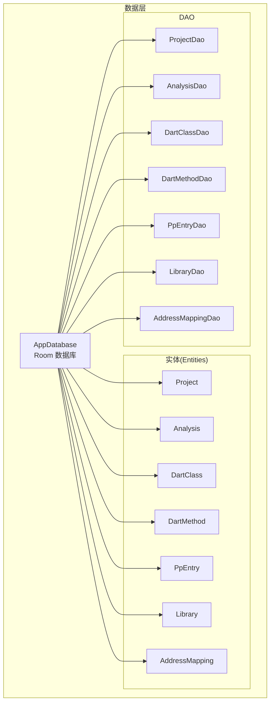
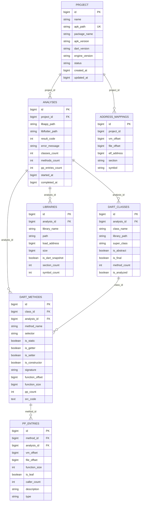
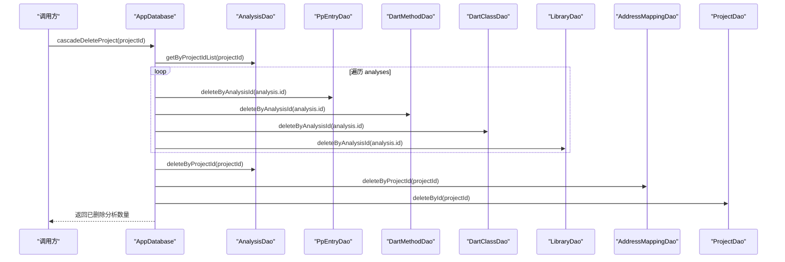
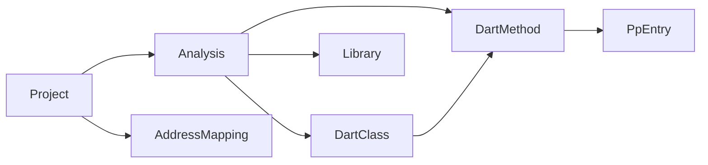

# 数据层设计

<cite>
**本文引用的文件**   
- [AppDatabase.kt](file://app/src/main/java/com/ai/fler/data/AppDatabase.kt)
- [Project.kt](file://app/src/main/java/com/ai/fler/data/entity/Project.kt)
- [Analysis.kt](file://app/src/main/java/com/ai/fler/data/entity/Analysis.kt)
- [DartClass.kt](file://app/src/main/java/com/ai/fler/data/entity/DartClass.kt)
- [DartMethod.kt](file://app/src/main/java/com/ai/fler/data/entity/DartMethod.kt)
- [PpEntry.kt](file://app/src/main/java/com/ai/fler/data/entity/PpEntry.kt)
- [Library.kt](file://app/src/main/java/com/ai/fler/data/entity/Library.kt)
- [AddressMapping.kt](file://app/src/main/java/com/ai/fler/data/entity/AddressMapping.kt)
- [ProjectDao.kt](file://app/src/main/java/com/ai/fler/data/dao/ProjectDao.kt)
- [AnalysisDao.kt](file://app/src/main/java/com/ai/fler/data/dao/AnalysisDao.kt)
- [DartClassDao.kt](file://app/src/main/java/com/ai/fler/data/dao/DartClassDao.kt)
- [DartMethodDao.kt](file://app/src/main/java/com/ai/fler/data/dao/DartMethodDao.kt)
- [PpEntryDao.kt](file://app/src/main/java/com/ai/fler/data/dao/PpEntryDao.kt)
- [LibraryDao.kt](file://app/src/main/java/com/ai/fler/data/dao/LibraryDao.kt)
- [AddressMappingDao.kt](file://app/src/main/java/com/ai/fler/data/dao/AddressMappingDao.kt)
</cite>

## 目录
1. [简介](#简介)
2. [项目结构](#项目结构)
3. [核心组件](#核心组件)
4. [架构总览](#架构总览)
5. [详细组件分析](#详细组件分析)
6. [依赖关系分析](#依赖关系分析)
7. [性能考量](#性能考量)
8. [故障排查指南](#故障排查指南)
9. [结论](#结论)
10. [附录](#附录)

## 简介
本文件面向 Fler 的数据持久化层，系统性梳理基于 Room 的 AppDatabase 数据库架构与数据模型。内容覆盖 7 个实体表（Project、Analysis、DartClass、DartMethod、PpEntry、Library、AddressMapping）的关系设计、字段定义、主键/外键约束、索引策略、DAO 接口设计（CRUD、复杂查询、事务）、级联删除机制、迁移策略、数据访问最佳实践（缓存、性能优化、一致性），以及数据安全与隐私要求。文档同时提供 Schema 图与示例数据说明，帮助读者快速理解并正确使用该数据层。

## 项目结构
数据层位于 data 包下，分为 entity（实体）与 dao（数据访问对象）两个子包，并由 AppDatabase 统一注册实体与 DAO。

图表来源 
- [AppDatabase.kt:27-48](file://app/src/main/java/com/ai/fler/data/AppDatabase.kt#L27-L48)

章节来源
- [AppDatabase.kt:1-120](file://app/src/main/java/com/ai/fler/data/AppDatabase.kt#L1-L120)

## 核心组件
- AppDatabase：Room 数据库入口，声明版本、导出 schema，暴露各 DAO；提供级联删除方法 cascadeDeleteProject 与 cascadeDeleteAnalysis，保证在 SQLite 未开启外键时的数据一致性。
- 实体（Entity）：定义 7 张表的结构、主键、外键与索引。
- DAO：为每个实体提供增删改查、批量插入、复杂查询（含 JOIN、分页、搜索）与 Flow 流式结果。

章节来源
- [AppDatabase.kt:27-119](file://app/src/main/java/com/ai/fler/data/AppDatabase.kt#L27-L119)
- [Project.kt:12-58](file://app/src/main/java/com/ai/fler/data/entity/Project.kt#L12-L58)
- [Analysis.kt:13-72](file://app/src/main/java/com/ai/fler/data/entity/Analysis.kt#L13-L72)
- [DartClass.kt:13-57](file://app/src/main/java/com/ai/fler/data/entity/DartClass.kt#L13-L57)
- [DartMethod.kt:13-81](file://app/src/main/java/com/ai/fler/data/entity/DartMethod.kt#L13-L81)
- [PpEntry.kt:13-68](file://app/src/main/java/com/ai/fler/data/entity/PpEntry.kt#L13-L68)
- [Library.kt:13-57](file://app/src/main/java/com/ai/fler/data/entity/Library.kt#L13-L57)
- [AddressMapping.kt:12-43](file://app/src/main/java/com/ai/fler/data/entity/AddressMapping.kt#L12-L43)

## 架构总览
下图展示实体间的外键关系与层级：Project → Analysis → (DartClass, Library, PpEntry, DartMethod)，其中 DartMethod 再关联 PpEntry；AddressMapping 独立按 project_id 关联。

图表来源 
- [Project.kt:12-58](file://app/src/main/java/com/ai/fler/data/entity/Project.kt#L12-L58)
- [Analysis.kt:13-72](file://app/src/main/java/com/ai/fler/data/entity/Analysis.kt#L13-L72)
- [DartClass.kt:13-57](file://app/src/main/java/com/ai/fler/data/entity/DartClass.kt#L13-L57)
- [DartMethod.kt:13-81](file://app/src/main/java/com/ai/fler/data/entity/DartMethod.kt#L13-L81)
- [PpEntry.kt:13-68](file://app/src/main/java/com/ai/fler/data/entity/PpEntry.kt#L13-L68)
- [Library.kt:13-57](file://app/src/main/java/com/ai/fler/data/entity/Library.kt#L13-L57)
- [AddressMapping.kt:12-43](file://app/src/main/java/com/ai/fler/data/entity/AddressMapping.kt#L12-L43)

## 详细组件分析

### 实体与表结构设计
- Project（projects）
  - 主键：id（自增）
  - 唯一索引：apk_path
  - 普通索引：created_at
  - 关键字段：name、apkPath、packageName、apkVersion、dartVersion、engineVersion、status、createdAt、updatedAt
  - 用途：存储用户创建的分析项目基本信息与状态

- Analysis（analyses）
  - 主键：id（自增）
  - 外键：project_id → projects.id（CASCADE）
  - 索引：project_id、started_at
  - 关键字段：libappPath、libflutterPath、resultCode、errorMessage、classesCount、methodsCount、ppEntriesCount、startedAt、completedAt
  - 用途：记录一次完整分析的执行信息与统计

- DartClass（dart_classes）
  - 主键：id（自增）
  - 外键：analysis_id → analyses.id（CASCADE）
  - 索引：analysis_id、class_name、library_path
  - 关键字段：className、libraryPath、superClass、isAbstract、isFinal、methodCount、isAnalyzed

- DartMethod（dart_methods）
  - 主键：id（自增）
  - 外键：class_id → dart_classes.id（CASCADE）、analysis_id → analyses.id（CASCADE）
  - 索引：class_id、analysis_id、method_name、selector
  - 关键字段：methodName、selector、isStatic、isGetter、isSetter、isConstructor、signature、functionOffset、functionSize、ppCount、srcCode

- PpEntry（pp_entries）
  - 主键：id（自增）
  - 外键：method_id → dart_methods.id（CASCADE）、analysis_id → analyses.id（CASCADE）
  - 索引：method_id、analysis_id、vm_offset、file_offset
  - 关键字段：vmOffset、fileOffset、functionSize、isLeaf、callerCount、description、type

- Library（libraries）
  - 主键：id（自增）
  - 外键：analysis_id → analyses.id（CASCADE）
  - 索引：analysis_id、library_name、path
  - 关键字段：libraryName、path、loadAddress、size、isDartSnapshot、sectionCount、symbolCount

- AddressMapping（address_mappings）
  - 主键：id（自增）
  - 无外键声明，通过逻辑字段 project_id 关联
  - 索引：project_id、vm_offset、file_offset、elf_address
  - 关键字段：projectId、vmOffset、fileOffset、elfAddress、section、symbol

章节来源
- [Project.kt:12-58](file://app/src/main/java/com/ai/fler/data/entity/Project.kt#L12-L58)
- [Analysis.kt:13-72](file://app/src/main/java/com/ai/fler/data/entity/Analysis.kt#L13-L72)
- [DartClass.kt:13-57](file://app/src/main/java/com/ai/fler/data/entity/DartClass.kt#L13-L57)
- [DartMethod.kt:13-81](file://app/src/main/java/com/ai/fler/data/entity/DartMethod.kt#L13-L81)
- [PpEntry.kt:13-68](file://app/src/main/java/com/ai/fler/data/entity/PpEntry.kt#L13-L68)
- [Library.kt:13-57](file://app/src/main/java/com/ai/fler/data/entity/Library.kt#L13-L57)
- [AddressMapping.kt:12-43](file://app/src/main/java/com/ai/fler/data/entity/AddressMapping.kt#L12-L43)

### DAO 接口设计与数据访问模式
- ProjectDao
  - 操作：insert(REPLACE)、update、deleteById、getAll(Flow)、getById、getByIdFlow(Flow)
  - 特点：支持实时流式监听项目列表与单条项目变化

- AnalysisDao
  - 操作：insert(REPLACE)、deleteById、deleteByProjectId、getById、getByProjectId(Flow)、getByProjectIdList（同步用于事务内）、completeAnalysis、updateResult、updateCounts、updateLibPaths、getRecentList
  - 特点：提供统计更新与最近分析列表查询

- DartClassDao
  - 操作：insert(REPLACE)、insertAll、deleteByAnalysisId、getByAnalysisIdList
  - 特点：批量插入与按分析 ID 获取类列表

- DartMethodDao
  - 操作：insert(REPLACE)、insertAll、deleteByAnalysisId、getById、getByAnalysisIdList
  - 复杂查询：getMethodWithClassById、getMethodWithClassByName、getMethodsByClassIdWithClass、searchMethodsWithClass（分页+过滤）、countMethodsWithClass、searchSrcWithClass、getMethodsWithClass、getMethodsBySoPath
  - 投影：MethodWithClass（嵌入 DartMethod + 类名）

- PpEntryDao
  - 操作：insertAll、deleteByAnalysisId、getByAnalysisId(Flow)、getByAnalysisIdList
  - 筛选与搜索：getStringsByAnalysisId(Flow/List)、searchStrings、getPpByVmOffset、getTopCallersByAnalysisId(Flow)、countByAnalysisId、countLeavesByAnalysisId

- LibraryDao
  - 操作：insert(REPLACE)、deleteByAnalysisId、getByAnalysisIdList

- AddressMappingDao
  - 操作：insertAll、deleteByProjectId、findByVmOffset、findByFileOffset、findByElfAddress

章节来源
- [ProjectDao.kt:15-35](file://app/src/main/java/com/ai/fler/data/dao/ProjectDao.kt#L15-L35)
- [AnalysisDao.kt:15-54](file://app/src/main/java/com/ai/fler/data/dao/AnalysisDao.kt#L15-L54)
- [DartClassDao.kt:14-27](file://app/src/main/java/com/ai/fler/data/dao/DartClassDao.kt#L14-L27)
- [DartMethodDao.kt:15-119](file://app/src/main/java/com/ai/fler/data/dao/DartMethodDao.kt#L15-L119)
- [PpEntryDao.kt:15-49](file://app/src/main/java/com/ai/fler/data/dao/PpEntryDao.kt#L15-L49)
- [LibraryDao.kt:14-24](file://app/src/main/java/com/ai/fler/data/dao/LibraryDao.kt#L14-L24)
- [AddressMappingDao.kt:14-30](file://app/src/main/java/com/ai/fler/data/dao/AddressMappingDao.kt#L14-L30)

### 级联删除机制与事务处理
- 由于 SQLite 默认不开启外键约束，即使实体上声明了 ForeignKey(onDelete = CASCADE) 也不会自动触发。因此 AppDatabase 提供应用层显式级联删除：
  - cascadeDeleteProject(projectId)：按顺序删除叶子表（pp_entries、dart_methods、dart_classes、libraries），再删除 analyses、address_mappings，最后删除 projects；使用 @Transaction 保证原子性。
  - cascadeDeleteAnalysis(analysisId)：删除某分析下的 pp_entries、dart_methods、dart_classes、libraries，再删除 analyses；不触碰 address_mappings。

图表来源 
- [AppDatabase.kt:67-90](file://app/src/main/java/com/ai/fler/data/AppDatabase.kt#L67-L90)

章节来源
- [AppDatabase.kt:50-114](file://app/src/main/java/com/ai/fler/data/AppDatabase.kt#L50-L114)

### 数据库迁移策略
- 当前数据库版本为 3，且启用 exportSchema=true，便于生成并校验 schema 变更。
- 建议迁移策略：
  - 新增表或列：添加 Migration 实现，确保旧数据兼容。
  - 重命名列：先复制新列，迁移数据，再删除旧列。
  - 索引调整：在迁移中重建索引，避免锁表时间过长。
  - 数据修复：必要时在迁移脚本中进行数据清洗或补全。
- 注意：若涉及外键行为变更，需在迁移中显式处理数据一致性。

章节来源
- [AppDatabase.kt:27-39](file://app/src/main/java/com/ai/fler/data/AppDatabase.kt#L27-L39)

### 数据验证规则与约束
- 主键与自增：所有实体均使用自增主键 id。
- 唯一约束：Project.apk_path 唯一，防止重复项目。
- 外键与级联：Analysis、DartClass、DartMethod、PpEntry、Library 对父表设置 CASCADE，便于清理；但实际由应用层显式级联删除。
- 索引策略：针对常用查询字段建立索引（如 project_id、analysis_id、class_name、method_name、vm_offset、file_offset、library_name、path、started_at、updated_at）。
- 非空与默认值：根据业务需要设置默认值（如布尔字段、计数字段）。

章节来源
- [Project.kt:12-58](file://app/src/main/java/com/ai/fler/data/entity/Project.kt#L12-L58)
- [Analysis.kt:13-72](file://app/src/main/java/com/ai/fler/data/entity/Analysis.kt#L13-L72)
- [DartClass.kt:13-57](file://app/src/main/java/com/ai/fler/data/entity/DartClass.kt#L13-L57)
- [DartMethod.kt:13-81](file://app/src/main/java/com/ai/fler/data/entity/DartMethod.kt#L13-L81)
- [PpEntry.kt:13-68](file://app/src/main/java/com/ai/fler/data/entity/PpEntry.kt#L13-L68)
- [Library.kt:13-57](file://app/src/main/java/com/ai/fler/data/entity/Library.kt#L13-L57)
- [AddressMapping.kt:12-43](file://app/src/main/java/com/ai/fler/data/entity/AddressMapping.kt#L12-L43)

## 依赖关系分析
- 实体依赖：Analysis 依赖 Project；DartClass、Library、DartMethod 依赖 Analysis；DartMethod 依赖 DartClass；PpEntry 依赖 DartMethod 与 Analysis；AddressMapping 逻辑依赖 Project。
- DAO 依赖：各 DAO 对应其实体，提供 CRUD 与复杂查询；AppDatabase 统一管理。
- 事务依赖：cascadeDeleteProject/cascadeDeleteAnalysis 在多 DAO 间协作，需保证事务边界。

图表来源 
- [Project.kt:12-58](file://app/src/main/java/com/ai/fler/data/entity/Project.kt#L12-L58)
- [Analysis.kt:13-72](file://app/src/main/java/com/ai/fler/data/entity/Analysis.kt#L13-L72)
- [DartClass.kt:13-57](file://app/src/main/java/com/ai/fler/data/entity/DartClass.kt#L13-L57)
- [DartMethod.kt:13-81](file://app/src/main/java/com/ai/fler/data/entity/DartMethod.kt#L13-L81)
- [PpEntry.kt:13-68](file://app/src/main/java/com/ai/fler/data/entity/PpEntry.kt#L13-L68)
- [Library.kt:13-57](file://app/src/main/java/com/ai/fler/data/entity/Library.kt#L13-L57)
- [AddressMapping.kt:12-43](file://app/src/main/java/com/ai/fler/data/entity/AddressMapping.kt#L12-L43)

章节来源
- [AppDatabase.kt:27-48](file://app/src/main/java/com/ai/fler/data/AppDatabase.kt#L27-L48)

## 性能考量
- 索引优化：
  - 高频查询字段均已建索引（如 project_id、analysis_id、class_name、method_name、vm_offset、file_offset、library_name、path、started_at、updated_at）。
  - 复合索引可根据实际查询模式补充（例如按 analysis_id + method_name 组合查询）。
- 批量操作：
  - 使用 insertAll 批量插入减少事务开销（DartClassDao、DartMethodDao、PpEntryDao、AddressMappingDao）。
- 流式数据：
  - 使用 Flow 进行实时监听（ProjectDao.getAll、AnalysisDao.getByProjectId、PpEntryDao.getStringsByAnalysisId、PpEntryDao.getTopCallersByAnalysisId）。
- 分页与搜索：
  - DartMethodDao.searchMethodsWithClass 支持 LIMIT/OFFSET 与可选过滤条件，减少内存占用。
- 事务边界：
  - 级联删除使用 @Transaction 保证原子性，避免部分失败导致数据不一致。
- 避免 N+1 查询：
  - 通过 JOIN 与投影（MethodWithClass）一次性获取所需数据，减少往返次数。

[本节为通用指导，无需引用具体文件]

## 故障排查指南
- 级联删除无效：
  - 检查是否调用了 AppDatabase 提供的 cascadeDeleteProject/cascadeDeleteAnalysis；SQLite 默认不开启外键约束，仅靠实体注解不会生效。
- 查询性能问题：
  - 确认相关字段是否有索引；检查 SQL 是否命中索引；避免全表扫描。
- 数据不一致：
  - 检查事务是否正确包裹多步写入；确保在事务内完成所有必要更新。
- Flow 未更新：
  - 确认 DAO 方法返回 Flow；确保上游有写入操作触发更新。

章节来源
- [AppDatabase.kt:50-114](file://app/src/main/java/com/ai/fler/data/AppDatabase.kt#L50-L114)
- [DartMethodDao.kt:57-93](file://app/src/main/java/com/ai/fler/data/dao/DartMethodDao.kt#L57-L93)
- [PpEntryDao.kt:23-42](file://app/src/main/java/com/ai/fler/data/dao/PpEntryDao.kt#L23-L42)

## 结论
Fler 的数据层以 Room 为核心，采用清晰的实体分层与 DAO 抽象，结合合理的索引与事务管理，满足分析数据的持久化需求。通过应用层显式级联删除弥补 SQLite 外键限制，保障数据一致性。建议在后续迭代中持续优化索引与查询，完善迁移策略，并加强数据安全与隐私保护。

[本节为总结，无需引用具体文件]

## 附录

### 数据访问模式最佳实践
- 缓存策略：
  - 使用 Flow 订阅实时数据，避免频繁轮询。
  - 对热点数据（如项目列表、分析方法列表）可在 ViewModel 层做短期缓存。
- 性能优化：
  - 优先使用批量插入与分页查询。
  - 利用 JOIN 与投影减少多次查询。
- 数据一致性：
  - 关键路径使用 @Transaction 包裹多步操作。
  - 对外部依赖（如文件系统 so 文件）与数据库状态保持一致。

[本节为通用指导，无需引用具体文件]

### 数据安全、隐私与访问控制
- 本地存储安全：
  - 敏感信息（如 APK 路径、库路径）应避免明文存储或加密存储。
  - 日志输出时脱敏处理。
- 访问控制：
  - 在应用层对数据访问进行权限校验（如项目归属、用户角色）。
- 备份与恢复：
  - 使用 Android Backup 规则配置可备份字段，避免泄露敏感数据。

[本节为通用指导，无需引用具体文件]

### 示例数据（概念性）
- Project：名称“SampleProject”，apkPath“/data/app/sample.apk”，状态“completed”
- Analysis：project_id=1，libappPath“/data/app/libapp.so”，result_code=0，started_at 与 completed_at 记录时间戳
- DartClass：analysis_id=1，className“MyClass”，libraryPath“libapp.so”，method_count=5
- DartMethod：class_id=1，analysis_id=1，methodName“doWork”，selector“doWork”，function_offset=0x1000，function_size=128
- PpEntry：method_id=1，analysis_id=1，vm_offset=0x2000，file_offset=0x3000，type=“String”，caller_count=3
- Library：analysis_id=1，libraryName“libflutter.so”，path“/data/app/libflutter.so”，load_address=0x40000000
- AddressMapping：project_id=1，vm_offset=0x2000，file_offset=0x3000，elf_address=0x4002000，section=".text"

[本节为概念性示例，无需引用具体文件]