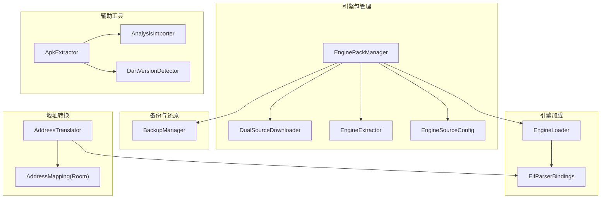
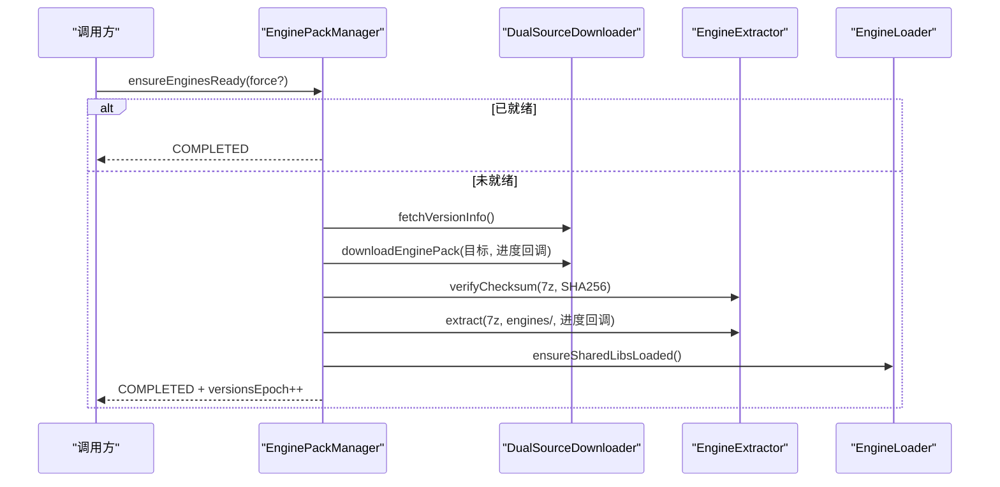
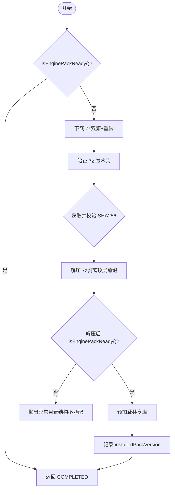
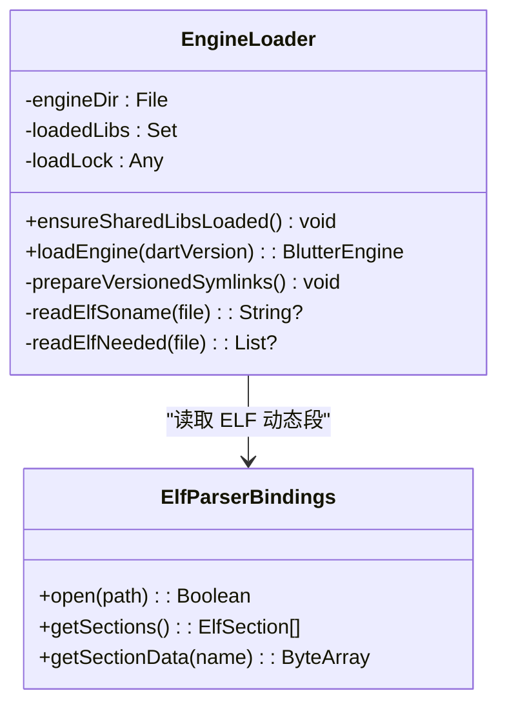
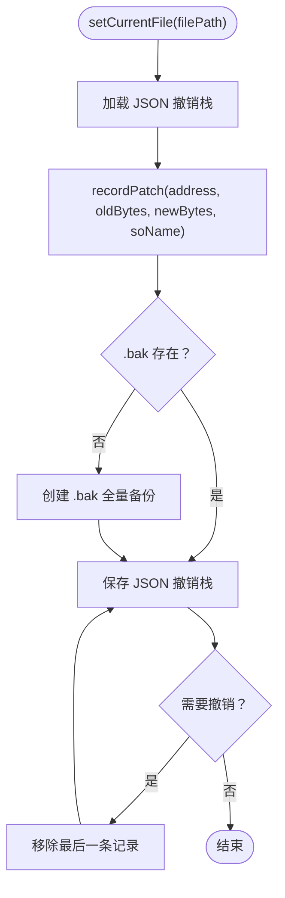
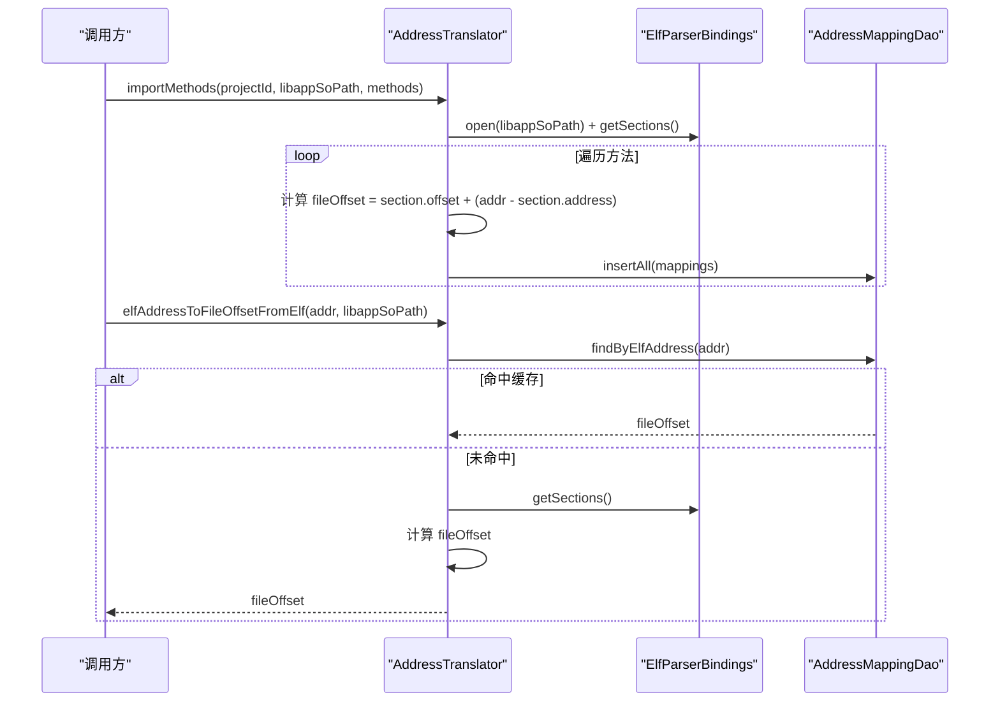
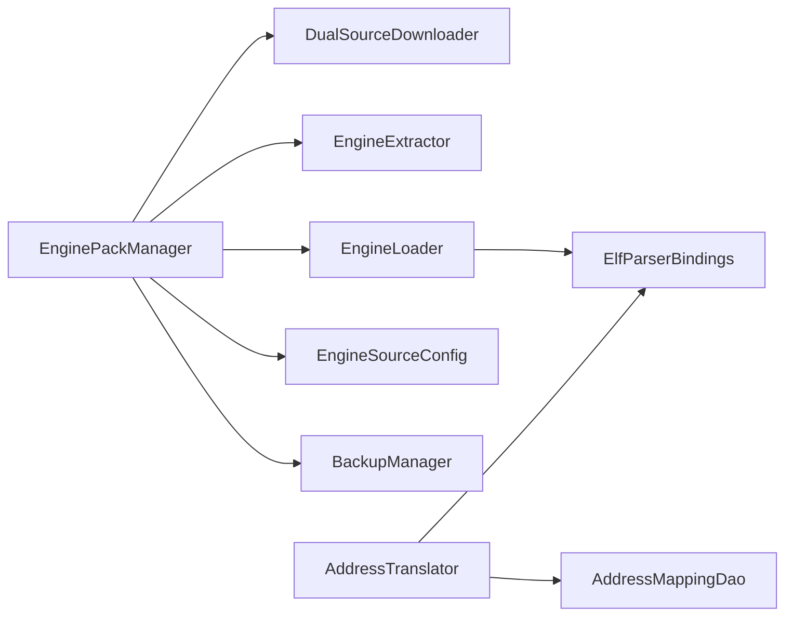

# 服务层功能

<cite>
**本文引用的文件**   
- [EnginePackManager.kt](file://app/src/main/java/com/ai/fler/core/service/EnginePackManager.kt)
- [EngineLoader.kt](file://app/src/main/java/com/ai/fler/core/service/EngineLoader.kt)
- [BackupManager.kt](file://app/src/main/java/com/ai/fler/core/service/BackupManager.kt)
- [AddressTranslator.kt](file://app/src/main/java/com/ai/fler/core/service/AddressTranslator.kt)
- [ApkExtractor.kt](file://app/src/main/java/com/ai/fler/core/service/ApkExtractor.kt)
- [AnalysisImporter.kt](file://app/src/main/java/com/ai/fler/core/service/AnalysisImporter.kt)
- [DartVersionDetector.kt](file://app/src/main/java/com/ai/fler/core/service/DartVersionDetector.kt)
- [DualSourceDownloader.kt](file://app/src/main/java/com/ai/fler/core/service/DualSourceDownloader.kt)
- [EngineExtractor.kt](file://app/src/main/java/com/ai/fler/core/service/EngineExtractor.kt)
- [EngineSourceConfig.kt](file://app/src/main/java/com/ai/fler/core/service/EngineSourceConfig.kt)
- [ElfParserBindings.kt](file://app/src/main/java/com/ai/fler/core/jni/ElfParserBindings.kt)
- [AddressMapping.kt](file://app/src/main/java/com/ai/fler/data/entity/AddressMapping.kt)
</cite>

## 目录
1. [简介](#简介)
2. [项目结构](#项目结构)
3. [核心组件](#核心组件)
4. [架构总览](#架构总览)
5. [详细组件分析](#详细组件分析)
6. [依赖关系分析](#依赖关系分析)
7. [性能考量](#性能考量)
8. [故障排查指南](#故障排查指南)
9. [结论](#结论)

## 简介
本技术文档聚焦 Fler 的服务层能力，围绕引擎包管理、动态引擎加载、撤销备份、地址转换与辅助工具（APK 提取、分析导入、版本检测）进行系统化说明。重点覆盖：
- EnginePackManager：下载、SHA256 校验、7z 解压、就绪检查与版本控制
- EngineLoader：共享库依赖顺序加载（libc++_shared → ICU）、SONAME 符号链接处理、线程安全加载
- BackupManager：按文件的 undoStack、JSON 持久化、.bak 全量备份策略
- AddressTranslator：ELF 节头表解析、虚拟地址到文件偏移换算
- ApkExtractor、AnalysisImporter、DartVersionDetector：关键实现细节与边界处理

## 项目结构
服务层位于 core.service 包，采用 Hilt 单例注入，职责清晰、耦合低：
- 引擎生命周期：EnginePackManager + DualSourceDownloader + EngineExtractor + EngineSourceConfig
- 运行时加载：EngineLoader（含 ELF 元数据解析与 SONAME 链接准备）
- 数据与还原：BackupManager（JSON 持久化 + .bak 备份）
- 地址映射：AddressTranslator + ElfParserBindings + Room 实体 AddressMapping
- 辅助工具：ApkExtractor、AnalysisImporter、DartVersionDetector

**图表来源** 
- [EnginePackManager.kt:1-120](file://app/src/main/java/com/ai/fler/core/service/EnginePackManager.kt#L1-L120)
- [EngineLoader.kt:1-120](file://app/src/main/java/com/ai/fler/core/service/EngineLoader.kt#L1-L120)
- [BackupManager.kt:1-120](file://app/src/main/java/com/ai/fler/core/service/BackupManager.kt#L1-L120)
- [AddressTranslator.kt:1-120](file://app/src/main/java/com/ai/fler/core/service/AddressTranslator.kt#L1-L120)
- [ApkExtractor.kt:1-120](file://app/src/main/java/com/ai/fler/core/service/ApkExtractor.kt#L1-L120)
- [AnalysisImporter.kt:1-120](file://app/src/main/java/com/ai/fler/core/service/AnalysisImporter.kt#L1-L120)
- [DartVersionDetector.kt:1-120](file://app/src/main/java/com/ai/fler/core/service/DartVersionDetector.kt#L1-L120)
- [ElfParserBindings.kt:1-120](file://app/src/main/java/com/ai/fler/core/jni/ElfParserBindings.kt#L1-L120)
- [AddressMapping.kt:1-44](file://app/src/main/java/com/ai/fler/data/entity/AddressMapping.kt#L1-L44)

**章节来源**
- [EnginePackManager.kt:1-120](file://app/src/main/java/com/ai/fler/core/service/EnginePackManager.kt#L1-L120)
- [EngineLoader.kt:1-120](file://app/src/main/java/com/ai/fler/core/service/EngineLoader.kt#L1-L120)
- [BackupManager.kt:1-120](file://app/src/main/java/com/ai/fler/core/service/BackupManager.kt#L1-L120)
- [AddressTranslator.kt:1-120](file://app/src/main/java/com/ai/fler/core/service/AddressTranslator.kt#L1-L120)
- [ApkExtractor.kt:1-120](file://app/src/main/java/com/ai/fler/core/service/ApkExtractor.kt#L1-L120)
- [AnalysisImporter.kt:1-120](file://app/src/main/java/com/ai/fler/core/service/AnalysisImporter.kt#L1-L120)
- [DartVersionDetector.kt:1-120](file://app/src/main/java/com/ai/fler/core/service/DartVersionDetector.kt#L1-L120)
- [ElfParserBindings.kt:1-120](file://app/src/main/java/com/ai/fler/core/jni/ElfParserBindings.kt#L1-L120)
- [AddressMapping.kt:1-44](file://app/src/main/java/com/ai/fler/data/entity/AddressMapping.kt#L1-L44)

## 核心组件
- EnginePackManager：协调“下载→校验→解压→就绪检查→预加载”全流程，提供进度流与更新检查
- EngineLoader：按依赖顺序加载共享库并创建 BlutterEngine；自动准备 SONAME 符号链接
- BackupManager：为每个 SO 文件维护独立撤销栈，JSON 持久化，首次编辑生成 .bak
- AddressTranslator：基于 ELF 节头表将 Dart VM 偏移/ELF 虚拟地址转换为文件偏移，支持 DB 缓存与回退
- ApkExtractor：从 APK 提取 libapp.so 与 libflutter.so，支持 ABI 探测与 Flutter 应用识别
- AnalysisImporter：将 Blutter SQLite 结果防御式导入 Room，统计计数回写
- DartVersionDetector：从 libflutter.so 多策略检测 Dart SDK 版本

**章节来源**
- [EnginePackManager.kt:1-120](file://app/src/main/java/com/ai/fler/core/service/EnginePackManager.kt#L1-L120)
- [EngineLoader.kt:1-120](file://app/src/main/java/com/ai/fler/core/service/EngineLoader.kt#L1-L120)
- [BackupManager.kt:1-120](file://app/src/main/java/com/ai/fler/core/service/BackupManager.kt#L1-L120)
- [AddressTranslator.kt:1-120](file://app/src/main/java/com/ai/fler/core/service/AddressTranslator.kt#L1-L120)
- [ApkExtractor.kt:1-120](file://app/src/main/java/com/ai/fler/core/service/ApkExtractor.kt#L1-L120)
- [AnalysisImporter.kt:1-120](file://app/src/main/java/com/ai/fler/core/service/AnalysisImporter.kt#L1-L120)
- [DartVersionDetector.kt:1-120](file://app/src/main/java/com/ai/fler/core/service/DartVersionDetector.kt#L1-L120)

## 架构总览
服务层通过 Hilt 注入单例协作，形成清晰的流水线：
- 下载阶段：DualSourceDownloader 支持主备源切换与代理前缀
- 校验阶段：EngineExtractor.computeSha256 + 7z 魔术头验证
- 解压阶段：EngineExtractor.extract 剥离顶层目录前缀，增量进度回调
- 加载阶段：EngineLoader.ensureSharedLibsLoaded 先于引擎 so 加载依赖
- 地址转换：AddressTranslator 使用 ElfParserBindings 读取节头表，Room 缓存映射

**图表来源** 
- [EnginePackManager.kt:150-303](file://app/src/main/java/com/ai/fler/core/service/EnginePackManager.kt#L150-L303)
- [DualSourceDownloader.kt:38-120](file://app/src/main/java/com/ai/fler/core/service/DualSourceDownloader.kt#L38-L120)
- [EngineExtractor.kt:36-121](file://app/src/main/java/com/ai/fler/core/service/EngineExtractor.kt#L36-L121)
- [EngineLoader.kt:58-108](file://app/src/main/java/com/ai/fler/core/service/EngineLoader.kt#L58-L108)

## 详细组件分析

### EnginePackManager：引擎包管理
- 下载与重试：最多 MAX_DOWNLOAD_ATTEMPTS=3 次，失败清理临时文件并重试
- 完整性校验：7z 魔术头验证 + SHA256 校验（可缺省）
- 解压与就绪：清理目标目录、剥离公共顶层目录前缀，解压后严格 isEnginePackReady()
- 预加载：ensureSharedLibsLoaded() 在加载引擎前完成依赖库装载
- 版本控制：记录 installedPackVersion，避免重复提示更新；支持 listInstalledVersions()
- 清理：clearEngines() 与 cleanProjectCaches() 释放磁盘与内存态资源

**图表来源** 
- [EnginePackManager.kt:162-303](file://app/src/main/java/com/ai/fler/core/service/EnginePackManager.kt#L162-L303)
- [EngineExtractor.kt:36-121](file://app/src/main/java/com/ai/fler/core/service/EngineExtractor.kt#L36-L121)
- [EngineLoader.kt:58-108](file://app/src/main/java/com/ai/fler/core/service/EngineLoader.kt#L58-L108)

**章节来源**
- [EnginePackManager.kt:1-431](file://app/src/main/java/com/ai/fler/core/service/EnginePackManager.kt#L1-L431)
- [EngineExtractor.kt:1-202](file://app/src/main/java/com/ai/fler/core/service/EngineExtractor.kt#L1-L202)
- [EngineLoader.kt:1-120](file://app/src/main/java/com/ai/fler/core/service/EngineLoader.kt#L1-L120)

### EngineLoader：动态引擎加载
- 依赖顺序：libc++_shared.so → libicudata.so → libicuuc.so → dartvm_*.so
- 线程安全：synchronized(loadLock) 保证幂等加载
- SONAME 符号链接：prepareVersionedSymlinks() 自动创建 DT_SONAME 与 DT_NEEDED 的链接
- 加载方式：System.load(absolutePath)，非 System.loadLibrary()
- JNI 集成：BlutterEngine 持有 so 绝对路径，JNI 端用 RTLD_NOLOAD 查找符号

**图表来源** 
- [EngineLoader.kt:58-166](file://app/src/main/java/com/ai/fler/core/service/EngineLoader.kt#L58-L166)
- [ElfParserBindings.kt:72-120](file://app/src/main/java/com/ai/fler/core/jni/ElfParserBindings.kt#L72-L120)

**章节来源**
- [EngineLoader.kt:1-301](file://app/src/main/java/com/ai/fler/core/service/EngineLoader.kt#L1-L301)
- [ElfParserBindings.kt:1-178](file://app/src/main/java/com/ai/fler/core/jni/ElfParserBindings.kt#L1-L178)

### BackupManager：撤销管理器
- 按文件管理：fileStacks[filePath] = ArrayDeque<PatchRecord>
- 持久化：每次 recordPatch/undo 写入 JSON（MD5 文件名），重启后可恢复
- 全量备份：首次编辑创建 .bak 副本
- 撤销限制：MAX_UNDO=50，超出时移除最早记录
- 一致性保护：应用补丁前 CRC32 校验原字节，写入后验证

**图表来源** 
- [BackupManager.kt:67-156](file://app/src/main/java/com/ai/fler/core/service/BackupManager.kt#L67-L156)
- [BackupManager.kt:189-234](file://app/src/main/java/com/ai/fler/core/service/BackupManager.kt#L189-L234)

**章节来源**
- [BackupManager.kt:1-283](file://app/src/main/java/com/ai/fler/core/service/BackupManager.kt#L1-L283)

### AddressTranslator：地址转换
- 构建映射：importMethods(projectId, libappSoPath, methods) 基于 ELF 节头表计算 fileOffset
- 查询优化：elfAddressToFileOffsetFromElf() 先查 Room 缓存，再回退 ELF 解析
- 上下文信息：getContext(address) 支持 vmOffset/fileOffset/elfAddress 三向查找

**图表来源** 
- [AddressTranslator.kt:39-160](file://app/src/main/java/com/ai/fler/core/service/AddressTranslator.kt#L39-L160)
- [ElfParserBindings.kt:111-150](file://app/src/main/java/com/ai/fler/core/jni/ElfParserBindings.kt#L111-L150)
- [AddressMapping.kt:1-44](file://app/src/main/java/com/ai/fler/data/entity/AddressMapping.kt#L1-L44)

**章节来源**
- [AddressTranslator.kt:1-204](file://app/src/main/java/com/ai/fler/core/service/AddressTranslator.kt#L1-L204)
- [ElfParserBindings.kt:1-178](file://app/src/main/java/com/ai/fler/core/jni/ElfParserBindings.kt#L1-L178)
- [AddressMapping.kt:1-44](file://app/src/main/java/com/ai/fler/data/entity/AddressMapping.kt#L1-L44)

### ApkExtractor：APK 提取
- 输入校验：路径合法性、ZIP 魔数验证、文件大小检查
- 提取策略：优先 arm64-v8a，其次 x86_64；提取 libapp.so 与 libflutter.so
- 结果封装：ExtractResult 包含库信息与错误信息
- 辅助能力：getSupportedAbis() 与 isFlutterApp()

**章节来源**
- [ApkExtractor.kt:1-251](file://app/src/main/java/com/ai/fler/core/service/ApkExtractor.kt#L1-L251)

### AnalysisImporter：分析结果导入
- 防御式读取：sqlite_master 枚举表，PRAGMA table_info 列名驱动
- 导入范围：classes/methods/pp_entries/strings，缺失表跳过
- 兜底实体：unknown class/method 用于孤立 pp_entry 或字符串
- 统计回写：updateCounts(analysisId, classes, methods, pp)

**章节来源**
- [AnalysisImporter.kt:1-342](file://app/src/main/java/com/ai/fler/core/service/AnalysisImporter.kt#L1-L342)

### DartVersionDetector：Dart 版本检测
- 多策略优先级：
  1) 整文件扫描 "(stable)/(dev)" 强特征
  2) 带前缀的版本串（Dart SDK version:/Dart VM version: 等）
  3) "dart" 关键字附近 X.Y.Z
  4) .rodata 备选扫描
- 输出：稳定版版本号字符串，失败返回 null

**章节来源**
- [DartVersionDetector.kt:1-189](file://app/src/main/java/com/ai/fler/core/service/DartVersionDetector.kt#L1-L189)

## 依赖关系分析
- EnginePackManager 依赖：DualSourceDownloader、EngineExtractor、EngineLoader、EngineSourceConfig、BackupManager
- EngineLoader 依赖：ElfParserBindings（ELF 动态段解析）
- AddressTranslator 依赖：ElfParserBindings、AddressMappingDao（Room）
- 辅助工具相互独立，但常由上层编排使用

**图表来源** 
- [EnginePackManager.kt:37-46](file://app/src/main/java/com/ai/fler/core/service/EnginePackManager.kt#L37-L46)
- [EngineLoader.kt:26-31](file://app/src/main/java/com/ai/fler/core/service/EngineLoader.kt#L26-L31)
- [AddressTranslator.kt:20-22](file://app/src/main/java/com/ai/fler/core/service/AddressTranslator.kt#L20-L22)

**章节来源**
- [EnginePackManager.kt:1-120](file://app/src/main/java/com/ai/fler/core/service/EnginePackManager.kt#L1-L120)
- [EngineLoader.kt:1-120](file://app/src/main/java/com/ai/fler/core/service/EngineLoader.kt#L1-L120)
- [AddressTranslator.kt:1-120](file://app/src/main/java/com/ai/fler/core/service/AddressTranslator.kt#L1-L120)

## 性能考量
- 下载与解压：分阶段进度回调，避免阻塞 UI；7z 两次打开（扫描+解压）因 SevenZFile 限制
- 校验开销：SHA256 计算在大文件上耗时，建议仅在必要时执行
- 加载顺序：确保依赖库先于引擎 so 加载，减少 dlopen 失败重试
- 地址转换：优先 Room 缓存，避免频繁 ELF 解析
- 备份持久化：JSON 写入频率高，注意 I/O 合并与异步化

[本节为通用指导，无需源码引用]

## 故障排查指南
- 下载失败：检查 DualSourceDownloader 的主备源与代理前缀配置；查看日志中的 HTTP 状态码
- 校验失败：确认 checksumUrl 可达且格式正确；对比实际 SHA256 与期望值
- 解压失败：确认 7z 归档完整且无顶层目录前缀残留；检查目标目录权限
- 加载失败：确认 sharedLibs 顺序与 SONAME 链接存在；查看 UnsatisfiedLinkError 详情
- 地址转换失败：检查 ELF 节头表是否包含目标地址；确认 Room 映射是否导入成功
- 备份异常：检查 .bak 文件是否被外部修改；确认 JSON 文件格式与字段完整性

**章节来源**
- [DualSourceDownloader.kt:171-231](file://app/src/main/java/com/ai/fler/core/service/DualSourceDownloader.kt#L171-L231)
- [EngineExtractor.kt:177-201](file://app/src/main/java/com/ai/fler/core/service/EngineExtractor.kt#L177-L201)
- [EngineLoader.kt:58-108](file://app/src/main/java/com/ai/fler/core/service/EngineLoader.kt#L58-L108)
- [AddressTranslator.kt:124-160](file://app/src/main/java/com/ai/fler/core/service/AddressTranslator.kt#L124-L160)
- [BackupManager.kt:189-234](file://app/src/main/java/com/ai/fler/core/service/BackupManager.kt#L189-L234)

## 结论
服务层以模块化、可观测、可恢复为核心设计原则：
- EnginePackManager 提供端到端的引擎包生命周期管理
- EngineLoader 确保依赖顺序与 SONAME 兼容，保障运行时稳定性
- BackupManager 以文件维度隔离撤销历史，兼顾性能与可靠性
- AddressTranslator 结合 ELF 解析与数据库缓存，提升跳转效率
- 辅助工具完善 APK 分析与版本检测能力，支撑上层功能闭环

[本节为总结性内容，无需源码引用]