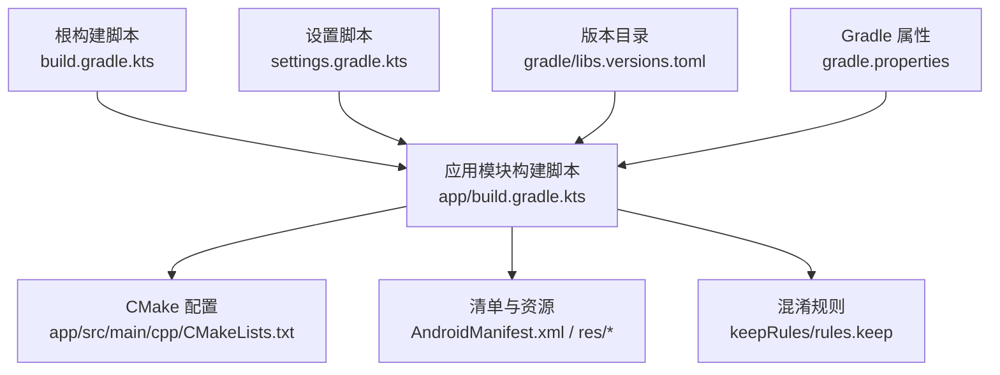
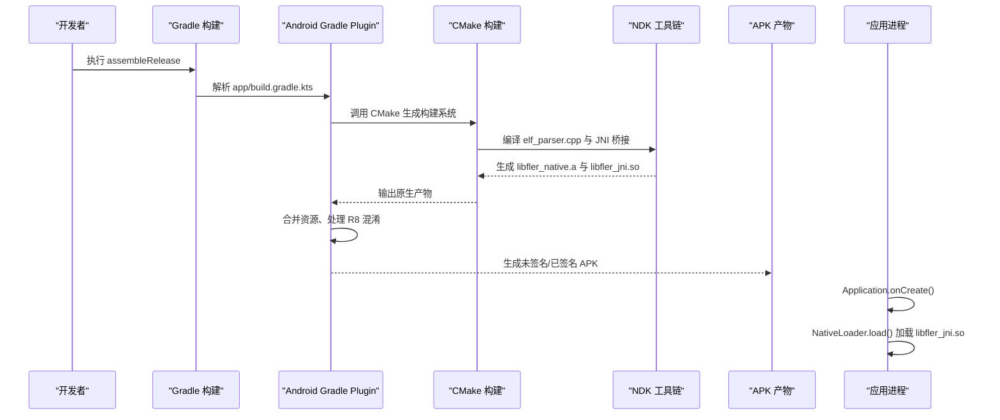
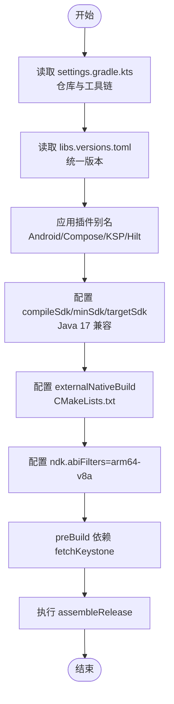
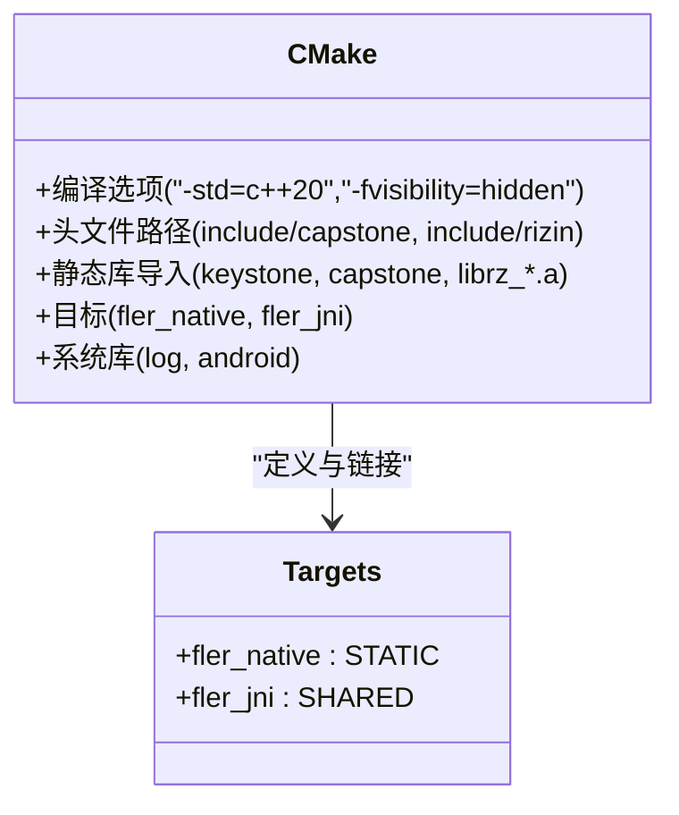
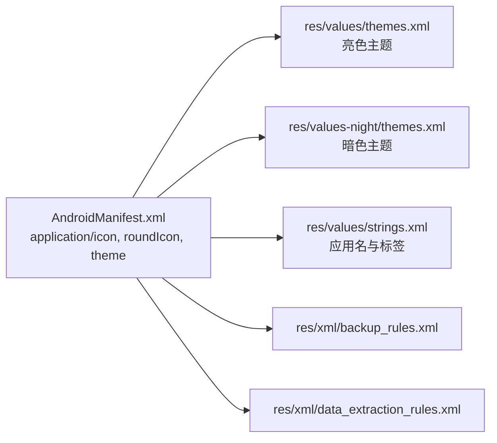
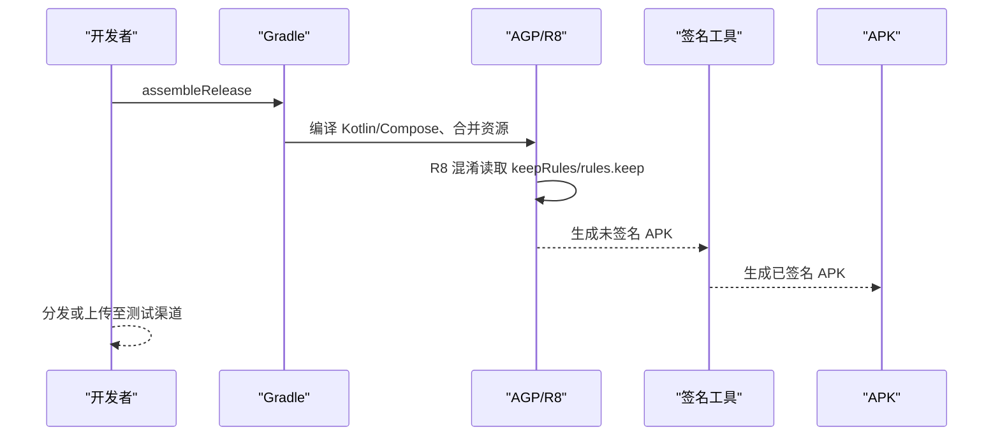
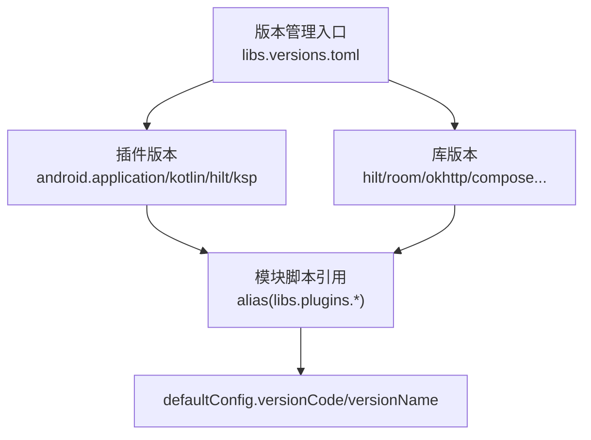
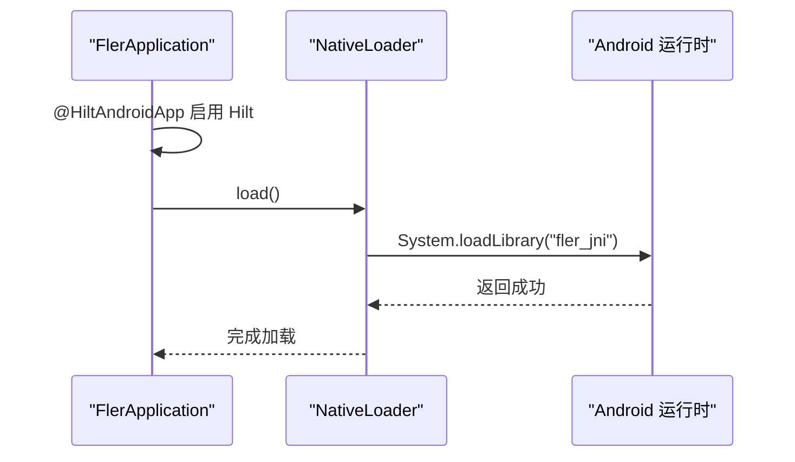
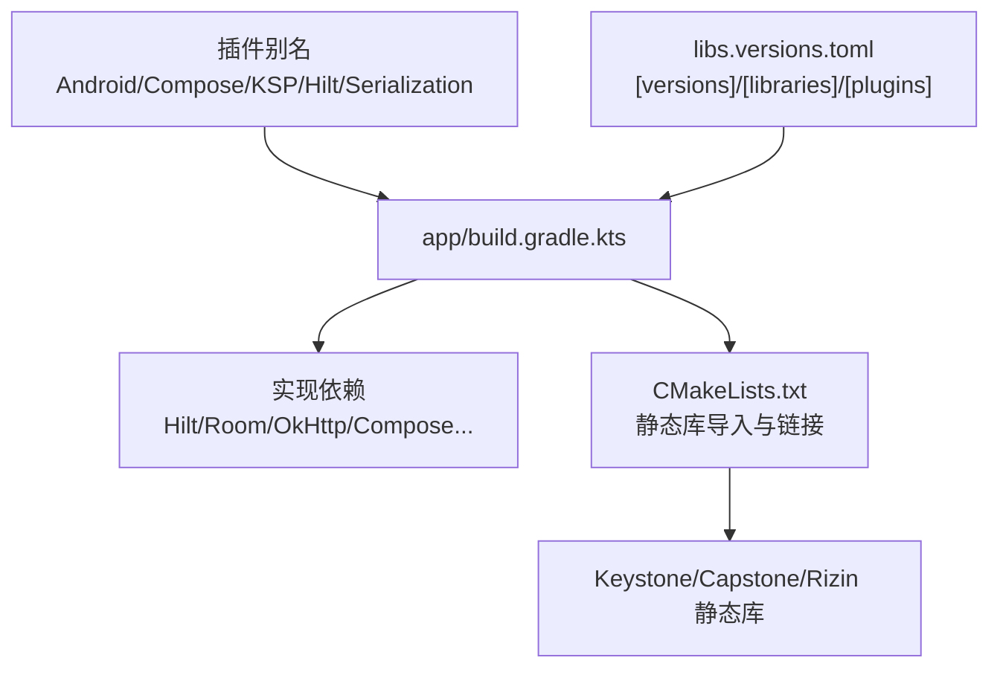

# 构建与部署

<cite>
**本文引用的文件**   
- [build.gradle.kts](file://build.gradle.kts)
- [app/build.gradle.kts](file://app/build.gradle.kts)
- [settings.gradle.kts](file://settings.gradle.kts)
- [gradle.properties](file://gradle.properties)
- [gradle/libs.versions.toml](file://gradle/libs.versions.toml)
- [app/src/main/cpp/CMakeLists.txt](file://app/src/main/cpp/CMakeLists.txt)
- [app/src/main/AndroidManifest.xml](file://app/src/main/AndroidManifest.xml)
- [app/src/main/res/values/strings.xml](file://app/src/main/res/values/strings.xml)
- [app/src/main/res/values/themes.xml](file://app/src/main/res/values/themes.xml)
- [app/src/main/res/values-night/themes.xml](file://app/src/main/res/values-night/themes.xml)
- [app/src/main/res/xml/backup_rules.xml](file://app/src/main/res/xml/backup_rules.xml)
- [app/src/main/res/xml/data_extraction_rules.xml](file://app/src/main/res/xml/data_extraction_rules.xml)
- [app/src/main/keepRules/rules.keep](file://app/src/main/keepRules/rules.keep)
- [app/src/main/java/com/ai/fler/FlerApplication.kt](file://app/src/main/java/com/ai/fler/FlerApplication.kt)
- [app/src/main/java/com/ai/fler/MainActivity.kt](file://app/src/main/java/com/ai/fler/MainActivity.kt)
</cite>

## 目录
1. [简介](#简介)
2. [项目结构](#项目结构)
3. [核心组件](#核心组件)
4. [架构总览](#架构总览)
5. [详细组件分析](#详细组件分析)
6. [依赖关系分析](#依赖关系分析)
7. [性能优化建议](#性能优化建议)
8. [故障排查指南](#故障排查指南)
9. [结论](#结论)
10. [附录](#附录)

## 简介
本文件面向 Fler 项目的构建与部署，系统性说明 Gradle KTS 构建配置、CMake 原生代码编译与链接策略、资源打包与主题配置、签名与发布流程、版本管理策略以及构建优化技巧。文档同时给出常见问题的诊断与解决方案，帮助开发者快速定位并解决构建与打包问题。

## 项目结构
Fler 采用单模块 Android 应用结构（:app），通过根级 build.gradle.kts 统一声明插件版本，使用 settings.gradle.kts 集中管理仓库源与工具链解析，使用 gradle/libs.versions.toml 进行依赖版本统一管理。原生代码位于 app/src/main/cpp，通过 CMake 构建静态库与 JNI 共享库。

图表来源 
- [build.gradle.kts:1-9](file://build.gradle.kts#L1-L9)
- [app/build.gradle.kts:1-129](file://app/build.gradle.kts#L1-L129)
- [settings.gradle.kts:1-32](file://settings.gradle.kts#L1-L32)
- [gradle/libs.versions.toml:1-61](file://gradle/libs.versions.toml#L1-L61)
- [gradle.properties:1-22](file://gradle.properties#L1-L22)
- [app/src/main/cpp/CMakeLists.txt:1-89](file://app/src/main/cpp/CMakeLists.txt#L1-L89)
- [app/src/main/AndroidManifest.xml:1-40](file://app/src/main/AndroidManifest.xml#L1-L40)

章节来源
- [build.gradle.kts:1-9](file://build.gradle.kts#L1-L9)
- [app/build.gradle.kts:1-129](file://app/build.gradle.kts#L1-L129)
- [settings.gradle.kts:1-32](file://settings.gradle.kts#L1-L32)
- [gradle/libs.versions.toml:1-61](file://gradle/libs.versions.toml#L1-L61)
- [gradle.properties:1-22](file://gradle.properties#L1-L22)

## 核心组件
- 构建系统与插件：AGP、Kotlin Compose、KSP、Hilt、Room、序列化等插件通过别名在根脚本中声明，并在模块脚本中启用。
- 依赖版本管理：所有第三方库与插件版本集中在 libs.versions.toml，便于统一升级与一致性检查。
- 原生构建：CMake 定义编译选项、头文件路径、静态库导入与链接目标，支持 arm64-v8a 架构。
- 资源与主题：字符串、主题（含夜间模式）、备份与数据提取规则集中管理。
- 启动与依赖注入：Application 类启用 Hilt，并在 onCreate 中加载 JNI 库；唯一 Activity 承载 Compose UI 与导航。

章节来源
- [app/build.gradle.kts:1-129](file://app/build.gradle.kts#L1-L129)
- [gradle/libs.versions.toml:1-61](file://gradle/libs.versions.toml#L1-L61)
- [app/src/main/cpp/CMakeLists.txt:1-89](file://app/src/main/cpp/CMakeLists.txt#L1-L89)
- [app/src/main/AndroidManifest.xml:1-40](file://app/src/main/AndroidManifest.xml#L1-L40)
- [app/src/main/java/com/ai/fler/FlerApplication.kt:1-22](file://app/src/main/java/com/ai/fler/FlerApplication.kt#L1-L22)
- [app/src/main/java/com/ai/fler/MainActivity.kt:1-49](file://app/src/main/java/com/ai/fler/MainActivity.kt#L1-L49)

## 架构总览
下图展示从 Gradle 到 CMake 再到运行时加载的完整链路，包括依赖版本管理、NDK 与 ABI 过滤、静态库导入与符号可见性控制。

图表来源 
- [app/build.gradle.kts:1-129](file://app/build.gradle.kts#L1-L129)
- [app/src/main/cpp/CMakeLists.txt:1-89](file://app/src/main/cpp/CMakeLists.txt#L1-L89)
- [app/src/main/java/com/ai/fler/FlerApplication.kt:1-22](file://app/src/main/java/com/ai/fler/FlerApplication.kt#L1-L22)

## 详细组件分析

### Gradle KTS 构建配置与版本管理
- 插件与模块启用：根脚本声明插件别名，模块脚本启用 Android、Compose、KSP、Hilt、序列化等插件。
- 编译与 SDK：compileSdk、minSdk、targetSdk 明确指定；Java/Kotlin 兼容版本设置为 17。
- 外部构建：externalNativeBuild 指向 CMakeLists.txt；ndk.abiFilters 限定 arm64-v8a。
- 构建类型：release 中关闭优化开关（由 AGP 默认行为决定，可按需开启）。
- 依赖管理：libs.versions.toml 集中管理 AGP、Kotlin、Hilt、Room、OkHttp、Composables 等版本。
- 预构建任务：fetchKeystone 校验本地静态库存在，preBuild 依赖该任务确保构建前准备就绪。

图表来源 
- [settings.gradle.kts:1-32](file://settings.gradle.kts#L1-L32)
- [gradle/libs.versions.toml:1-61](file://gradle/libs.versions.toml#L1-L61)
- [app/build.gradle.kts:1-129](file://app/build.gradle.kts#L1-L129)

章节来源
- [build.gradle.kts:1-9](file://build.gradle.kts#L1-L9)
- [app/build.gradle.kts:1-129](file://app/build.gradle.kts#L1-L129)
- [gradle/libs.versions.toml:1-61](file://gradle/libs.versions.toml#L1-L61)
- [settings.gradle.kts:1-32](file://settings.gradle.kts#L1-L32)

### CMake 构建配置与原生代码编译
- 编译选项：启用 C++20、隐藏符号可见性、警告级别、位置无关代码；Debug/Release 差异化优化。
- 头文件路径：包含 keystone_include、include/capstone、include/rizin 及其子目录，满足内部 #include 需求。
- 静态库导入：keystone 与 capstone 以 IMPORTED 方式引入本地 .a 文件；Rizin 静态库按通配符收集。
- 目标定义：fler_native（静态库）与 fler_jni（共享库）分别编译与链接。
- 系统库链接：log 与 android 系统库自动查找并链接。
- 符号可见性：fler_jni 导出符号可见性设为 default，内联隐藏。

图表来源 
- [app/src/main/cpp/CMakeLists.txt:1-89](file://app/src/main/cpp/CMakeLists.txt#L1-L89)

章节来源
- [app/src/main/cpp/CMakeLists.txt:1-89](file://app/src/main/cpp/CMakeLists.txt#L1-L89)

### 资源打包策略与主题配置
- 图标资源：应用图标与圆角图标通过 mipmap 引用，清单中指定 icon 与 roundIcon。
- 字符串资源：strings.xml 定义应用名与标签文本。
- 主题配置：values/themes.xml 与 values-night/themes.xml 分别提供亮色与暗色主题背景。
- 备份与数据提取：backup_rules.xml 与 data_extraction_rules.xml 定义备份策略占位，可按需细化。

图表来源 
- [app/src/main/AndroidManifest.xml:1-40](file://app/src/main/AndroidManifest.xml#L1-L40)
- [app/src/main/res/values/themes.xml:1-8](file://app/src/main/res/values/themes.xml#L1-L8)
- [app/src/main/res/values-night/themes.xml:1-7](file://app/src/main/res/values-night/themes.xml#L1-L7)
- [app/src/main/res/values/strings.xml:1-8](file://app/src/main/res/values/strings.xml#L1-L8)
- [app/src/main/res/xml/backup_rules.xml:1-13](file://app/src/main/res/xml/backup_rules.xml#L1-L13)
- [app/src/main/res/xml/data_extraction_rules.xml:1-19](file://app/src/main/res/xml/data_extraction_rules.xml#L1-L19)

章节来源
- [app/src/main/AndroidManifest.xml:1-40](file://app/src/main/AndroidManifest.xml#L1-L40)
- [app/src/main/res/values/strings.xml:1-8](file://app/src/main/res/values/strings.xml#L1-L8)
- [app/src/main/res/values/themes.xml:1-8](file://app/src/main/res/values/themes.xml#L1-L8)
- [app/src/main/res/values-night/themes.xml:1-7](file://app/src/main/res/values-night/themes.xml#L1-L7)
- [app/src/main/res/xml/backup_rules.xml:1-13](file://app/src/main/res/xml/backup_rules.xml#L1-L13)
- [app/src/main/res/xml/data_extraction_rules.xml:1-19](file://app/src/main/res/xml/data_extraction_rules.xml#L1-L19)

### 签名与打包流程（APK 生成、混淆与发布准备）
- 构建类型：当前 release 构建类型中优化开关关闭，可根据需要启用 AGP 的优化与 R8 混淆。
- 混淆规则：keepRules/rules.keep 为 R8 保留规则入口，可按需添加类成员保留规则。
- 清单与权限：INTERNET、ACCESS_NETWORK_STATE、FOREGROUND_SERVICE 等权限声明。
- 服务与前台类型：McpServerService 声明前台服务类型为 dataSync。
- 应用入口：FlerApplication 启用 Hilt 并加载 JNI；MainActivity 作为唯一入口承载 Compose UI。

图表来源 
- [app/build.gradle.kts:43-49](file://app/build.gradle.kts#L43-L49)
- [app/src/main/keepRules/rules.keep:1-12](file://app/src/main/keepRules/rules.keep#L1-L12)
- [app/src/main/AndroidManifest.xml:1-40](file://app/src/main/AndroidManifest.xml#L1-L40)

章节来源
- [app/build.gradle.kts:43-49](file://app/build.gradle.kts#L43-L49)
- [app/src/main/keepRules/rules.keep:1-12](file://app/src/main/keepRules/rules.keep#L1-L12)
- [app/src/main/AndroidManifest.xml:1-40](file://app/src/main/AndroidManifest.xml#L1-L40)

### 版本管理与更新机制
- 应用版本：defaultConfig.versionCode 与 versionName 定义版本号与版本名。
- 依赖版本：libs.versions.toml 中的 [versions] 段集中管理各库版本，[libraries] 与 [plugins] 段引用这些版本。
- 构建脚本：根脚本与模块脚本通过 alias(libs.plugins.*) 复用版本，避免硬编码。

图表来源 
- [gradle/libs.versions.toml:1-61](file://gradle/libs.versions.toml#L1-L61)
- [app/build.gradle.kts:17-23](file://app/build.gradle.kts#L17-L23)

章节来源
- [gradle/libs.versions.toml:1-61](file://gradle/libs.versions.toml#L1-L61)
- [app/build.gradle.kts:17-23](file://app/build.gradle.kts#L17-L23)

### 运行期 JNI 加载流程
- Application 初始化：@HiltAndroidApp 启用 Hilt，onCreate 中调用 NativeLoader.load() 加载 JNI 库。
- MainActivity：唯一 Activity 装载 Compose 主题与导航图。

图表来源 
- [app/src/main/java/com/ai/fler/FlerApplication.kt:1-22](file://app/src/main/java/com/ai/fler/FlerApplication.kt#L1-L22)
- [app/src/main/java/com/ai/fler/MainActivity.kt:1-49](file://app/src/main/java/com/ai/fler/MainActivity.kt#L1-L49)

章节来源
- [app/src/main/java/com/ai/fler/FlerApplication.kt:1-22](file://app/src/main/java/com/ai/fler/FlerApplication.kt#L1-L22)
- [app/src/main/java/com/ai/fler/MainActivity.kt:1-49](file://app/src/main/java/com/ai/fler/MainActivity.kt#L1-L49)

## 依赖关系分析
- 插件依赖：Android Application、Kotlin Compose、KSP、Hilt、Serialization 等插件通过别名统一版本。
- 库依赖：Hilt 与 Room 使用 KSP 注解处理器；Compose BOM 管理 Compose 相关库版本；OkHttp、压缩库、DocumentFile 等按需引入。
- 原生依赖：CMake 导入 Keystone、Capstone、Rizin 静态库，链接 log 与 android 系统库。

图表来源 
- [app/build.gradle.kts:1-129](file://app/build.gradle.kts#L1-L129)
- [gradle/libs.versions.toml:1-61](file://gradle/libs.versions.toml#L1-L61)
- [app/src/main/cpp/CMakeLists.txt:1-89](file://app/src/main/cpp/CMakeLists.txt#L1-L89)

章节来源
- [app/build.gradle.kts:1-129](file://app/build.gradle.kts#L1-L129)
- [gradle/libs.versions.toml:1-61](file://gradle/libs.versions.toml#L1-L61)
- [app/src/main/cpp/CMakeLists.txt:1-89](file://app/src/main/cpp/CMakeLists.txt#L1-L89)

## 性能优化建议
- 增量编译与并行构建：保持多模块解耦（当前单模块），启用 org.gradle.parallel=true 可加速多模块构建；当前 gradle.properties 中注释了并行开关，可按需启用。
- 配置缓存：已启用 org.gradle.configuration-cache=true，减少配置阶段耗时。
- JVM 参数：org.gradle.jvmargs 设置 -Xmx2048m，可根据机器内存调整。
- 依赖版本锁定：通过 libs.versions.toml 集中管理，避免重复下载与版本冲突。
- 原生构建优化：CMake 中 Release 模式使用 -O2，Debug 模式禁用优化并加入调试信息；ABI 过滤仅 arm64-v8a 可减少产物体积与构建时间。
- 资源与混淆：按需启用 R8 与资源压缩，减少 APK 体积。

章节来源
- [gradle.properties:1-22](file://gradle.properties#L1-L22)
- [app/src/main/cpp/CMakeLists.txt:14-19](file://app/src/main/cpp/CMakeLists.txt#L14-L19)
- [app/build.gradle.kts:32-34](file://app/build.gradle.kts#L32-L34)

## 故障排查指南
- 缺少 Keystone 静态库：
  - 现象：preBuild 阶段抛出异常提示 libkeystone.a 不存在。
  - 原因：fetchKeystone 任务校验本地静态库路径失败。
  - 解决：在本地交叉编译 Keystone 并将产物放置到 libs/arm64-v8a/libkeystone.a。
  - 参考路径：[app/build.gradle.kts:112-128](file://app/build.gradle.kts#L112-L128)

- NDK ABI 不匹配：
  - 现象：运行时找不到对应架构的 SO。
  - 原因：ndk.abiFilters 仅包含 arm64-v8a，若设备架构不同将失败。
  - 解决：确认设备 ABI 与过滤器一致，或扩展 abiFilters。
  - 参考路径：[app/build.gradle.kts:32-34](file://app/build.gradle.kts#L32-L34)

- CMake 头文件缺失或路径错误：
  - 现象：编译时报找不到 rz_types.h 等头文件。
  - 原因：include_directories 未正确暴露 rizin 内部目录。
  - 解决：确保 include/rizin 与 include/rizin/rz_util、include/rizin/sdb 等路径正确。
  - 参考路径：[app/src/main/cpp/CMakeLists.txt:22-29](file://app/src/main/cpp/CMakeLists.txt#L22-L29)

- 符号不可见导致链接失败：
  - 现象：链接器报 undefined symbol。
  - 原因：全局隐藏可见性与导出符号设置不当。
  - 解决：调整 target_link_libraries 与 set_target_properties 的 VISIBILITY_INLINES_HIDDEN 与 CXX_VISIBILITY_PRESET。
  - 参考路径：[app/src/main/cpp/CMakeLists.txt:85-88](file://app/src/main/cpp/CMakeLists.txt#L85-L88)

- 混淆误删类成员：
  - 现象：运行时反射或 JSON 解析失败。
  - 原因：R8 移除未保留的类成员。
  - 解决：在 keepRules/rules.keep 中添加相应保留规则。
  - 参考路径：[app/src/main/keepRules/rules.keep:1-12](file://app/src/main/keepRules/rules.keep#L1-L12)

章节来源
- [app/build.gradle.kts:112-128](file://app/build.gradle.kts#L112-L128)
- [app/build.gradle.kts:32-34](file://app/build.gradle.kts#L32-L34)
- [app/src/main/cpp/CMakeLists.txt:22-29](file://app/src/main/cpp/CMakeLists.txt#L22-L29)
- [app/src/main/cpp/CMakeLists.txt:85-88](file://app/src/main/cpp/CMakeLists.txt#L85-L88)
- [app/src/main/keepRules/rules.keep:1-12](file://app/src/main/keepRules/rules.keep#L1-L12)

## 结论
Fler 的构建体系以 Gradle KTS 为核心，结合 libs.versions.toml 实现依赖版本集中管理；CMake 负责原生代码编译与静态库链接，严格限定 arm64-v8a 架构以提升效率与稳定性。资源与主题配置清晰，清单权限与服务声明完备。通过合理的构建优化与清晰的故障排查指引，可显著提升开发体验与发布质量。

## 附录
- 常用命令：
  - 清理构建：./gradlew clean
  - 构建 Debug：./gradlew assembleDebug
  - 构建 Release：./gradlew assembleRelease
- 关键路径：
  - 版本目录：gradle/libs.versions.toml
  - 应用构建：app/build.gradle.kts
  - 原生构建：app/src/main/cpp/CMakeLists.txt
  - 清单与资源：app/src/main/AndroidManifest.xml 与 app/src/main/res/*