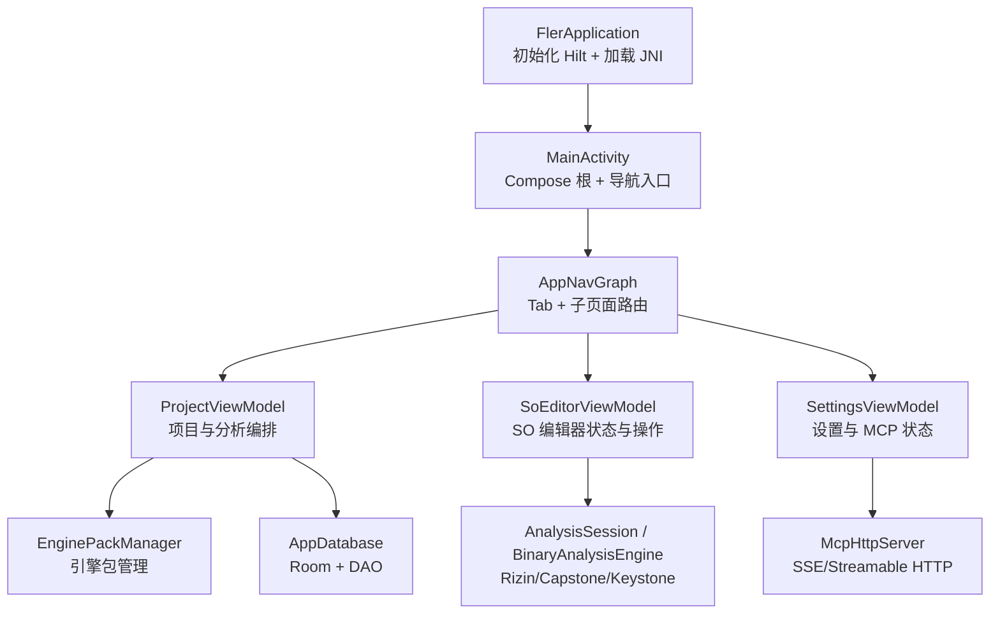
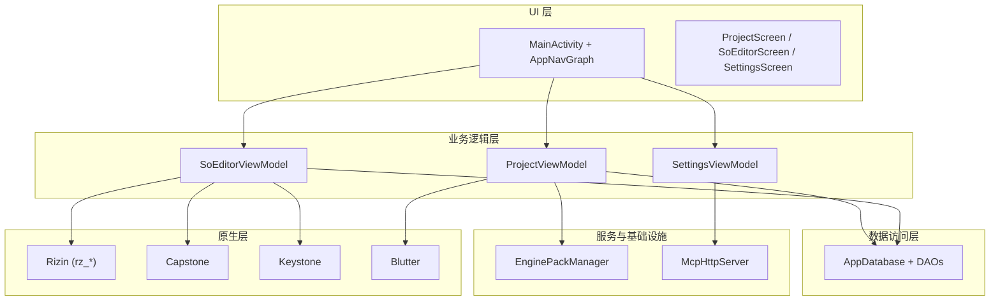
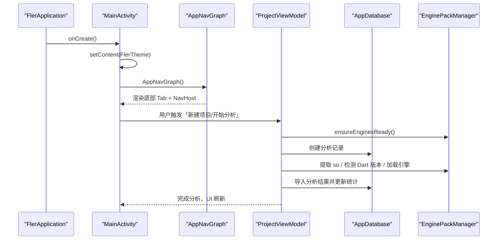
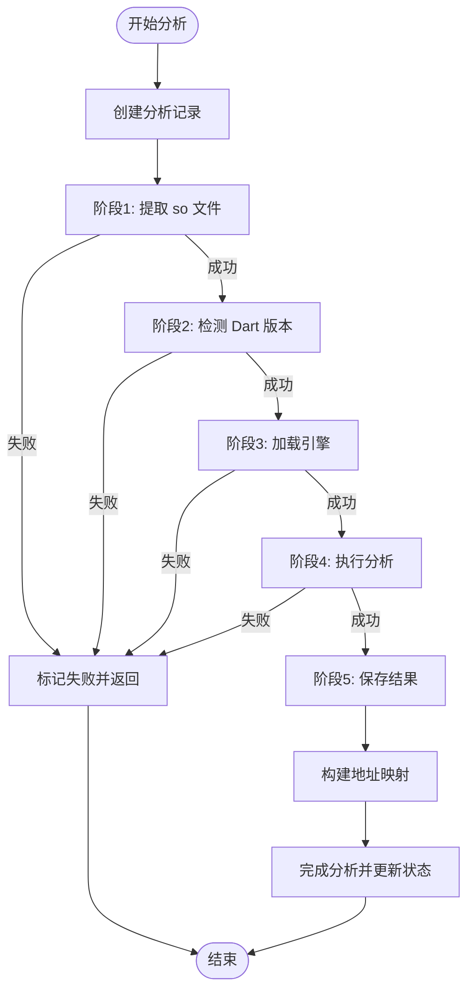
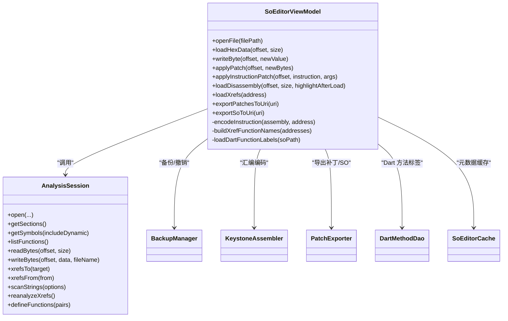
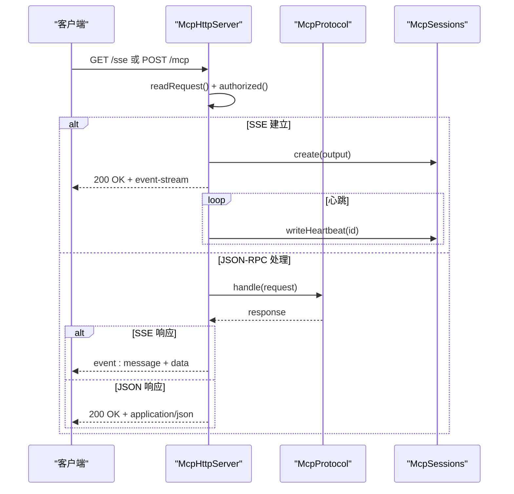
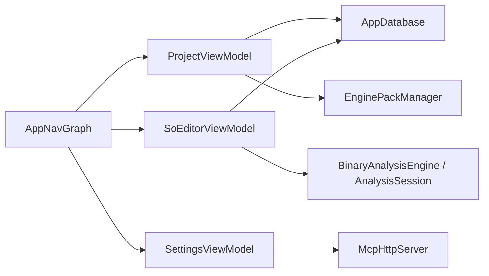

# 整体架构概览

<cite>
**本文引用的文件**   
- [FlerApplication.kt](file://app/src/main/java/com/ai/fler/FlerApplication.kt)
- [MainActivity.kt](file://app/src/main/java/com/ai/fler/MainActivity.kt)
- [AppNavGraph.kt](file://app/src/main/java/com/ai/fler/app/navigation/AppNavGraph.kt)
- [Screen.kt](file://app/src/main/java/com/ai/fler/app/navigation/Screen.kt)
- [CoreModule.kt](file://app/src/main/java/com/ai/fler/core/di/CoreModule.kt)
- [ProjectViewModel.kt](file://app/src/main/java/com/ai/fler/feature/project/ProjectViewModel.kt)
- [SettingsViewModel.kt](file://app/src/main/java/com/ai/fler/feature/settings/SettingsViewModel.kt)
- [SoEditorViewModel.kt](file://app/src/main/java/com/ai/fler/features/so_editor/SoEditorViewModel.kt)
- [BinaryAnalysisEngine.kt](file://app/src/main/java/com/ai/fler/core/analysis/BinaryAnalysisEngine.kt)
- [McpHttpServer.kt](file://app/src/main/java/com/ai/fler/core/mcp/McpHttpServer.kt)
- [AppDatabase.kt](file://app/src/main/java/com/ai/fler/data/AppDatabase.kt)
- [EnginePackManager.kt](file://app/src/main/java/com/ai/fler/core/service/EnginePackManager.kt)
</cite>

## 目录
1. [简介](#简介)
2. [项目结构](#项目结构)
3. [核心组件](#核心组件)
4. [架构总览](#架构总览)
5. [详细组件分析](#详细组件分析)
6. [依赖关系分析](#依赖关系分析)
7. [性能考量](#性能考量)
8. [故障排查指南](#故障排查指南)
9. [结论](#结论)
10. [附录](#附录)

## 简介
本文件为 Fler 项目的整体架构概览，面向不同技术背景的读者，系统化阐述应用的高层设计、四大核心模块职责与交互、MVVM 在 Android Compose 中的落地方式（StateFlow + ViewModel）、分层边界（UI、业务逻辑、数据访问、原生），以及外部依赖（Rizin、Capstone、Keystone）的集成方式。文档同时给出系统上下文图、启动流程、主要数据流向与关键决策点，帮助快速理解与扩展。

## 项目结构
- 入口与主题导航
  - Application 初始化并加载 JNI 库；单一 Activity 承载 Compose 根界面与导航图。
  - 导航图定义四个顶层 Tab（项目管理、SO 编辑器、MCP 日志、设置）及子页面路由。
- 核心能力
  - 二进制分析引擎抽象接口统一封装 ELF 解析、函数分析、反汇编、交叉引用、字节读写、地址转换等能力。
  - MCP HTTP 服务器提供本地 SSE/Streamable HTTP 协议，暴露工具调用与事件流。
  - 引擎包管理负责下载、校验、解压与就绪检查，支撑分析引擎按需加载。
- 数据层
  - Room 数据库持久化项目、分析记录、Dart 类/方法、PP 条目、库信息与地址映射。
  - DAO 提供结构化查询与级联删除。
- 业务层
  - ProjectViewModel 编排分析全流程（提取 so → 检测 Dart 版本 → 加载引擎 → 执行分析 → 导入结果）。
  - SoEditorViewModel 管理 SO 编辑器的状态、缓存、补丁与 xref 展示。
  - SettingsViewModel 聚合引擎更新、下载源配置与 MCP 服务器状态。

**图表来源** 
- [FlerApplication.kt:1-22](file://app/src/main/java/com/ai/fler/FlerApplication.kt#L1-L22)
- [MainActivity.kt:1-49](file://app/src/main/java/com/ai/fler/MainActivity.kt#L1-L49)
- [AppNavGraph.kt:1-339](file://app/src/main/java/com/ai/fler/app/navigation/AppNavGraph.kt#L1-L339)
- [ProjectViewModel.kt:1-544](file://app/src/main/java/com/ai/fler/feature/project/ProjectViewModel.kt#L1-L544)
- [SoEditorViewModel.kt:1-800](file://app/src/main/java/com/ai/fler/features/so_editor/SoEditorViewModel.kt#L1-L800)
- [SettingsViewModel.kt:1-297](file://app/src/main/java/com/ai/fler/feature/settings/SettingsViewModel.kt#L1-L297)
- [EnginePackManager.kt:1-431](file://app/src/main/java/com/ai/fler/core/service/EnginePackManager.kt#L1-L431)
- [AppDatabase.kt:1-120](file://app/src/main/java/com/ai/fler/data/AppDatabase.kt#L1-L120)
- [McpHttpServer.kt:1-286](file://app/src/main/java/com/ai/fler/core/mcp/McpHttpServer.kt#L1-L286)

**章节来源**
- [FlerApplication.kt:1-22](file://app/src/main/java/com/ai/fler/FlerApplication.kt#L1-L22)
- [MainActivity.kt:1-49](file://app/src/main/java/com/ai/fler/MainActivity.kt#L1-L49)
- [AppNavGraph.kt:1-339](file://app/src/main/java/com/ai/fler/app/navigation/AppNavGraph.kt#L1-L339)
- [Screen.kt:1-76](file://app/src/main/java/com/ai/fler/app/navigation/Screen.kt#L1-L76)

## 核心组件
- UI 层（Compose + Navigation）
  - 单 Activity + NavHost 管理四个顶层 Tab 与子页面；通过 StateFlow 驱动 UI 刷新。
- 业务逻辑层（ViewModel）
  - ProjectViewModel：协调 APK 提取、Dart 版本检测、引擎加载、Blutter 分析、结果导入与地址映射构建。
  - SoEditorViewModel：管理打开文件、Hex/Disassembly/Structure 三页状态、补丁写入、xref 展示、Dart 标签注入与缓存。
  - SettingsViewModel：聚合引擎更新、下载源配置、MCP 服务器启停与状态。
- 数据访问层（Room + DAO）
  - AppDatabase 声明实体与 DAO；提供级联删除保证一致性。
- 原生层（JNI + 第三方库）
  - Rizin：二进制分析与 xref 重建。
  - Capstone：指令反汇编。
  - Keystone：指令汇编编码。
  - Blutter：Flutter/Dart 分析产物生成 SQLite。
- 服务与基础设施
  - EnginePackManager：引擎包下载、校验、解压与就绪检查。
  - McpHttpServer：内嵌 HTTP/SSE 服务器，暴露 MCP 工具与事件流。

**章节来源**
- [ProjectViewModel.kt:1-544](file://app/src/main/java/com/ai/fler/feature/project/ProjectViewModel.kt#L1-L544)
- [SoEditorViewModel.kt:1-800](file://app/src/main/java/com/ai/fler/features/so_editor/SoEditorViewModel.kt#L1-L800)
- [SettingsViewModel.kt:1-297](file://app/src/main/java/com/ai/fler/feature/settings/SettingsViewModel.kt#L1-L297)
- [AppDatabase.kt:1-120](file://app/src/main/java/com/ai/fler/data/AppDatabase.kt#L1-L120)
- [EnginePackManager.kt:1-431](file://app/src/main/java/com/ai/fler/core/service/EnginePackManager.kt#L1-L431)
- [McpHttpServer.kt:1-286](file://app/src/main/java/com/ai/fler/core/mcp/McpHttpServer.kt#L1-L286)

## 架构总览
- MVVM + Compose
  - ViewModel 持有 StateFlow，UI 通过 collectAsState 订阅；生命周期由 Hilt 管理。
- 分层边界
  - UI 层：仅消费 StateFlow，不直接访问 DAO/JNI。
  - 业务层：编排流程、错误处理、并发控制（协程）。
  - 数据层：Room 持久化与事务性级联删除。
  - 原生层：Rizin/Capstone/Keystone/Blutter 通过 JNI 暴露 API。
- 外部依赖集成
  - Rizin：用于 ELF 解析、函数识别、xref 重建、地址转换。
  - Capstone：用于反汇编指令列表。
  - Keystone：用于将汇编文本编码为机器码。
  - Blutter：生成 Dart 方法与 PP 条目 SQLite，供导入阶段读取。

**图表来源** 
- [AppNavGraph.kt:1-339](file://app/src/main/java/com/ai/fler/app/navigation/AppNavGraph.kt#L1-L339)
- [ProjectViewModel.kt:1-544](file://app/src/main/java/com/ai/fler/feature/project/ProjectViewModel.kt#L1-L544)
- [SoEditorViewModel.kt:1-800](file://app/src/main/java/com/ai/fler/features/so_editor/SoEditorViewModel.kt#L1-L800)
- [SettingsViewModel.kt:1-297](file://app/src/main/java/com/ai/fler/feature/settings/SettingsViewModel.kt#L1-L297)
- [AppDatabase.kt:1-120](file://app/src/main/java/com/ai/fler/data/AppDatabase.kt#L1-L120)
- [EnginePackManager.kt:1-431](file://app/src/main/java/com/ai/fler/core/service/EnginePackManager.kt#L1-L431)
- [McpHttpServer.kt:1-286](file://app/src/main/java/com/ai/fler/core/mcp/McpHttpServer.kt#L1-L286)

## 详细组件分析

### 启动流程与导航
- 启动顺序
  - FlerApplication 启用 Hilt 并加载 JNI。
  - MainActivity 设置 Edge-to-Edge 与 Compose 主题，根据 OnboardingPreferences 决定新手引导或主导航。
  - AppNavGraph 注册四个顶层 Tab 与子页面路由，使用 EntryPoint 在 Composable 回调中获取 DAO 与 AddressTranslator。
- 关键决策点
  - 首次启动是否显示新手引导。
  - 从 ASM/PP 跳转 SO 编辑器时，优先用 ELF 节头表换算文件偏移，失败则降级到虚拟地址。

**图表来源** 
- [FlerApplication.kt:1-22](file://app/src/main/java/com/ai/fler/FlerApplication.kt#L1-L22)
- [MainActivity.kt:1-49](file://app/src/main/java/com/ai/fler/MainActivity.kt#L1-L49)
- [AppNavGraph.kt:1-339](file://app/src/main/java/com/ai/fler/app/navigation/AppNavGraph.kt#L1-L339)
- [ProjectViewModel.kt:1-544](file://app/src/main/java/com/ai/fler/feature/project/ProjectViewModel.kt#L1-L544)
- [EnginePackManager.kt:1-431](file://app/src/main/java/com/ai/fler/core/service/EnginePackManager.kt#L1-L431)
- [AppDatabase.kt:1-120](file://app/src/main/java/com/ai/fler/data/AppDatabase.kt#L1-L120)

**章节来源**
- [AppNavGraph.kt:1-339](file://app/src/main/java/com/ai/fler/app/navigation/AppNavGraph.kt#L1-L339)
- [Screen.kt:1-76](file://app/src/main/java/com/ai/fler/app/navigation/Screen.kt#L1-L76)

### 项目管理模块（ProjectViewModel）
- 职责
  - 项目 CRUD、分析进度状态、五阶段分析编排（提取 so、检测 Dart 版本、加载引擎、执行分析、保存结果）。
  - 失败路径统一 failAnalysis，确保 UI 对话框状态正确。
  - 完成后构建地址映射，支持 SO 编辑器与 ASM/PP 联动。
- 数据流
  - 通过 StateFlow 暴露 projectListState 与 analysisProgress。
  - 与 EnginePackManager、AppDatabase、DAOs 协作。
- 关键决策点
  - Dart 版本未检测到时明确报错并提示已安装引擎版本。
  - 引擎加载失败捕获 UnsatisfiedLinkError 并回退友好提示。

**图表来源** 
- [ProjectViewModel.kt:1-544](file://app/src/main/java/com/ai/fler/feature/project/ProjectViewModel.kt#L1-L544)

**章节来源**
- [ProjectViewModel.kt:1-544](file://app/src/main/java/com/ai/fler/feature/project/ProjectViewModel.kt#L1-L544)

### SO 编辑器模块（SoEditorViewModel）
- 职责
  - 打开文件、缓存元数据（sections/symbols/functions/fileInfo）、加载 Hex/Disassembly/Structure 三页数据。
  - 写入字节、应用补丁、撤销、导出补丁/修改后的 SO。
  - 加载 Dart 方法标签并注入 Rizin（defineFunction + reanalyzeXrefs），提升 xref 质量。
  - 维护最近文件、闪烁高亮、滚动位置持久化。
- 数据流
  - 多组 StateFlow（uiState、hexData、disassemblyData、xrefData、functionOverlay、dartFunctionLabels 等）。
  - 通过 AnalysisSession 调用底层引擎能力（ELF 解析、反汇编、xref、字节读写）。
- 关键决策点
  - 打开文件优先复用 SoEditorCache 元数据，避免重复 Rizin 查询。
  - 反汇编加载前对齐 4 字节边界，提高 ARM64 解码成功率。
  - 切换 Tab 时保持滚动位置与闪烁目标地址。

**图表来源** 
- [SoEditorViewModel.kt:1-800](file://app/src/main/java/com/ai/fler/features/so_editor/SoEditorViewModel.kt#L1-L800)

**章节来源**
- [SoEditorViewModel.kt:1-800](file://app/src/main/java/com/ai/fler/features/so_editor/SoEditorViewModel.kt#L1-L800)

### MCP 服务器模块（McpHttpServer）
- 职责
  - 自实现轻量 HTTP 服务器，支持 legacy SSE（/sse、/message）与 Streamable HTTP（/mcp GET/POST）。
  - Token 鉴权、请求解析、JSON-RPC 分发、心跳维持、会话管理。
- 数据流
  - 接收客户端请求 → 鉴权 → 路由处理 → JSON-RPC 分发 → 响应（SSE 或 JSON）。
- 关键决策点
  - 会话断开自动清理；异常静默处理避免阻塞 acceptLoop。
  - 支持 text/event-stream 与 application/json 两种响应模式。

**图表来源** 
- [McpHttpServer.kt:1-286](file://app/src/main/java/com/ai/fler/core/mcp/McpHttpServer.kt#L1-L286)

**章节来源**
- [McpHttpServer.kt:1-286](file://app/src/main/java/com/ai/fler/core/mcp/McpHttpServer.kt#L1-L286)

### 设置管理模块（SettingsViewModel）
- 职责
  - 引擎更新检查、下载源配置、项目缓存清理、MCP 服务器状态聚合。
  - 监听 EnginePackManager.versionsEpoch 实时刷新已安装版本。
- 数据流
  - 多个 StateFlow 组合（updateState、installedVersions、sourceState、cacheCleanResult、mcpState）。
  - combine(mcpConfig.*, mcpServerManager.status) 聚合 UI 所需状态。
- 关键决策点
  - LAN 模式前台服务保活；LOCAL 模式进程内运行。
  - 清理范围严格限定（不清理引擎、Room DB、MCP 配置）。

**章节来源**
- [SettingsViewModel.kt:1-297](file://app/src/main/java/com/ai/fler/feature/settings/SettingsViewModel.kt#L1-L297)

### 数据层（AppDatabase）
- 职责
  - Room 数据库声明实体与 DAO；提供级联删除方法保证一致性。
- 关键决策点
  - SQLite 默认不开外键约束，需应用层显式级联删除（cascadeDeleteProject/cascadeDeleteAnalysis）。

**章节来源**
- [AppDatabase.kt:1-120](file://app/src/main/java/com/ai/fler/data/AppDatabase.kt#L1-L120)

### 引擎包管理（EnginePackManager）
- 职责
  - 下载引擎包（SHA256 校验）、解压、就绪检查、共享库预加载、版本变更信号。
- 关键决策点
  - 下载失败自动重试（最多 3 次）；解压后严格 isEnginePackReady 检查。
  - 清理项目缓存包含磁盘与内存态（SoEditorCache、AnalysisSession、BackupManager）。

**章节来源**
- [EnginePackManager.kt:1-431](file://app/src/main/java/com/ai/fler/core/service/EnginePackManager.kt#L1-L431)

## 依赖关系分析
- 组件耦合与内聚
  - ViewModel 高内聚于各自功能域，低耦合通过 DAO、Service、Engine 接口解耦。
  - AppNavGraph 通过 EntryPoint 在 Composable 回调中获取 DAO，避免跨层强依赖。
- 外部依赖
  - Rizin/Capstone/Keystone 通过 JNI 暴露 API，被 SoEditorViewModel 与 ProjectViewModel 间接调用。
  - Blutter 产物 SQLite 被导入阶段读取，生成 Dart 方法与 PP 条目。
- 潜在循环依赖
  - 通过接口（BinaryAnalysisEngine）与 Session 抽象避免循环；Hilt 管理单例生命周期。

**图表来源** 
- [ProjectViewModel.kt:1-544](file://app/src/main/java/com/ai/fler/feature/project/ProjectViewModel.kt#L1-L544)
- [SoEditorViewModel.kt:1-800](file://app/src/main/java/com/ai/fler/features/so_editor/SoEditorViewModel.kt#L1-L800)
- [SettingsViewModel.kt:1-297](file://app/src/main/java/com/ai/fler/feature/settings/SettingsViewModel.kt#L1-L297)
- [AppNavGraph.kt:1-339](file://app/src/main/java/com/ai/fler/app/navigation/AppNavGraph.kt#L1-L339)
- [AppDatabase.kt:1-120](file://app/src/main/java/com/ai/fler/data/AppDatabase.kt#L1-L120)
- [EnginePackManager.kt:1-431](file://app/src/main/java/com/ai/fler/core/service/EnginePackManager.kt#L1-L431)
- [McpHttpServer.kt:1-286](file://app/src/main/java/com/ai/fler/core/mcp/McpHttpServer.kt#L1-L286)

**章节来源**
- [AppNavGraph.kt:1-339](file://app/src/main/java/com/ai/fler/app/navigation/AppNavGraph.kt#L1-L339)
- [CoreModule.kt:1-31](file://app/src/main/java/com/ai/fler/core/di/CoreModule.kt#L1-L31)

## 性能考量
- 状态管理
  - StateFlow 最小化重组，UI 仅订阅必要字段；分页加载（Hex/Disassembly）减少首屏压力。
- 缓存策略
  - SoEditorCache 缓存 sections/symbols/functions/Dart 标签/Rizin 注入标记，跨 ViewModel 复用。
  - 分析结果 SQLite 导入后统计计数同步，避免重复计算。
- 并发与 IO
  - 协程 + Dispatchers.IO 执行耗时任务（下载、解压、反汇编、xref 扫描）。
  - EnginePackManager 下载重试与 SHA256 校验保障稳定性。
- 资源释放
  - 清理项目缓存时清空内存态（AnalysisSession、SoEditorCache、BackupManager），避免内存泄漏。

[本节为通用指导，无需特定文件引用]

## 故障排查指南
- 分析失败定位
  - ProjectViewModel 各阶段 try-catch 输出详细日志（TAG=ProjectViewModel），failAnalysis 统一更新进度对话框状态。
  - 引擎加载失败捕获 UnsatisfiedLinkError，提示缺少对应 dartvm_*.so。
- 反汇编不可用
  - SoEditorViewModel 反汇编失败时记录 errorMessage，可尝试切换大小写汇编文本或检查 Capstone 可用性。
- MCP 连接问题
  - McpHttpServer 记录未授权与解析错误；确认 Authorization 头与 Token 配置。
- 数据库一致性
  - 使用 cascadeDeleteProject/cascadeDeleteAnalysis 保证级联删除；注意 SQLite 外键约束未开启。

**章节来源**
- [ProjectViewModel.kt:1-544](file://app/src/main/java/com/ai/fler/feature/project/ProjectViewModel.kt#L1-L544)
- [SoEditorViewModel.kt:1-800](file://app/src/main/java/com/ai/fler/features/so_editor/SoEditorViewModel.kt#L1-L800)
- [McpHttpServer.kt:1-286](file://app/src/main/java/com/ai/fler/core/mcp/McpHttpServer.kt#L1-L286)
- [AppDatabase.kt:1-120](file://app/src/main/java/com/ai/fler/data/AppDatabase.kt#L1-L120)

## 结论
Fler 采用清晰的 MVVM + Compose 架构，结合分层设计与 Hilt 依赖注入，实现了项目管理、SO 编辑器、MCP 服务器与设置管理的职责分离与高效协作。通过 StateFlow 与 ViewModel 生命周期管理，保证了 UI 响应性与数据一致性。外部依赖（Rizin、Capstone、Keystone、Blutter）通过 JNI 与抽象接口解耦，便于扩展与维护。建议继续强化缓存策略与错误诊断，提升大文件编辑与分析体验。

[本节为总结性内容，无需特定文件引用]

## 附录
- 术语说明
  - ELF：可执行与可链接文件格式。
  - xref：交叉引用，表示代码间调用/引用关系。
  - SSE：服务端推送事件流。
  - Streamable HTTP：基于 HTTP 的可流式传输协议。
- 扩展建议
  - 新增分析引擎只需实现 BinaryAnalysisEngine 接口，即可被 MCP 自动暴露。
  - 可在 SoEditorViewModel 中增加更多元数据缓存（如字符串哈希索引）以提升搜索性能。

[本节为概念性内容，无需特定文件引用]