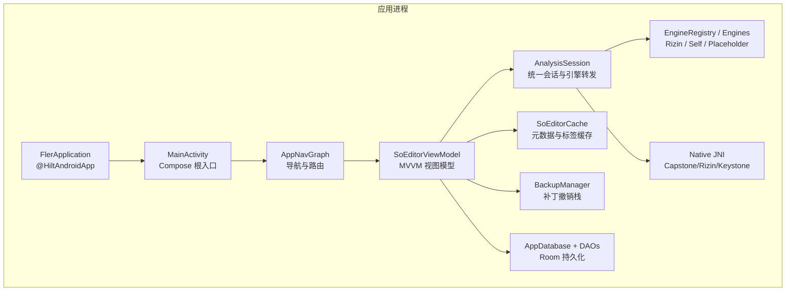
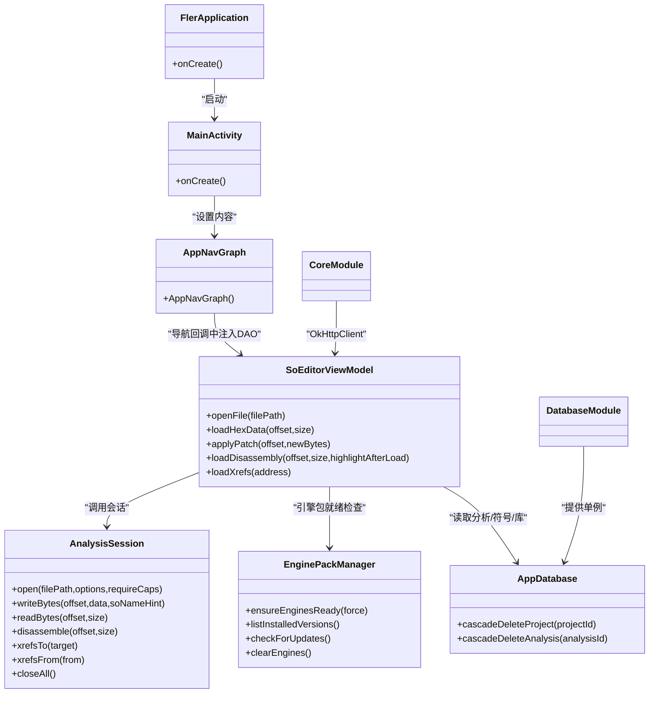
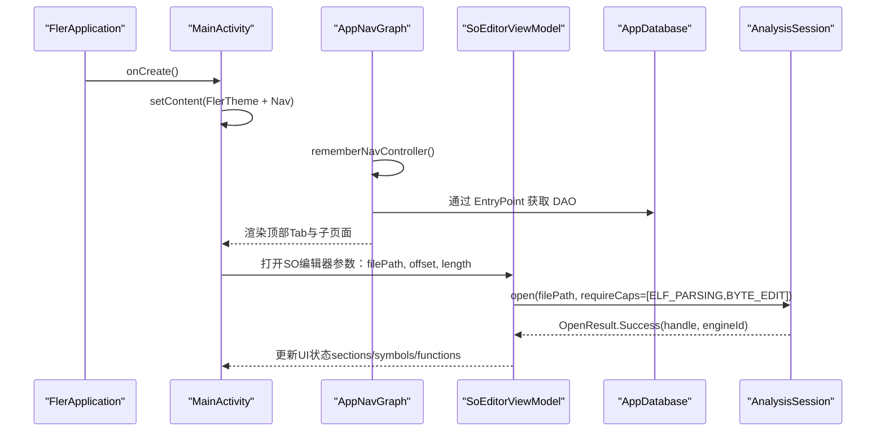
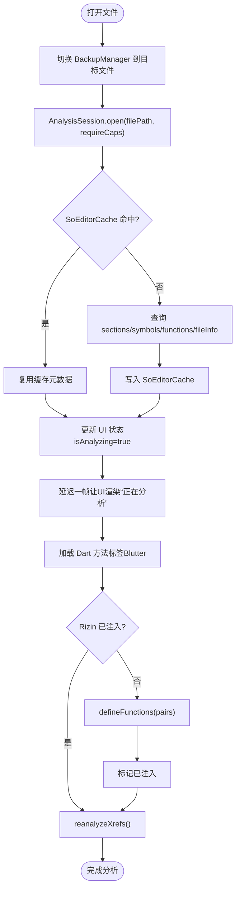
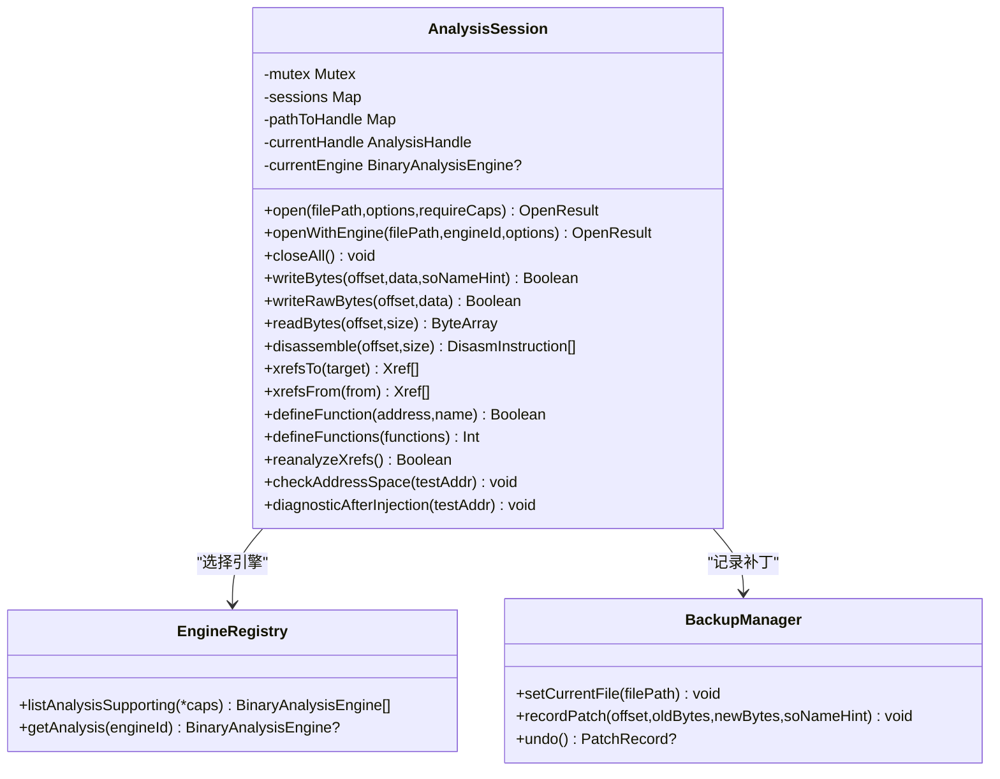
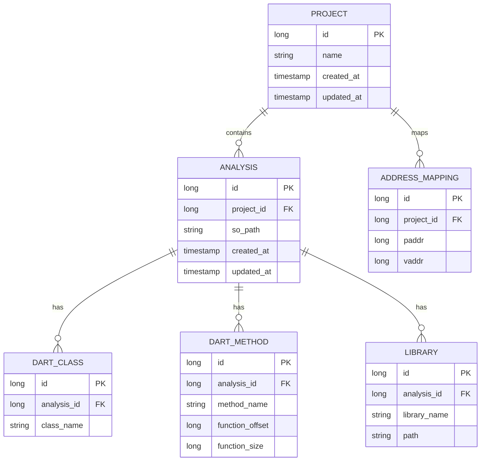
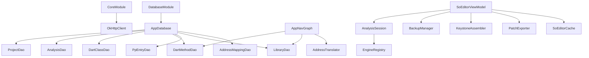

# 架构设计

<cite>
**本文引用的文件**   
- [FlerApplication.kt](file://app/src/main/java/com/ai/fler/FlerApplication.kt)
- [MainActivity.kt](file://app/src/main/java/com/ai/fler/MainActivity.kt)
- [AppNavGraph.kt](file://app/src/main/java/com/ai/fler/app/navigation/AppNavGraph.kt)
- [CoreModule.kt](file://app/src/main/java/com/ai/fler/core/di/CoreModule.kt)
- [DatabaseModule.kt](file://app/src/main/java/com/ai/fler/core/di/DatabaseModule.kt)
- [AppDatabase.kt](file://app/src/main/java/com/ai/fler/data/AppDatabase.kt)
- [EnginePackManager.kt](file://app/src/main/java/com/ai/fler/core/service/EnginePackManager.kt)
- [SoEditorViewModel.kt](file://app/src/main/java/com/ai/fler/features/so_editor/SoEditorViewModel.kt)
- [AnalysisSession.kt](file://app/src/main/java/com/ai/fler/core/analysis/AnalysisSession.kt)
- [build.gradle.kts](file://app/build.gradle.kts)
- [libs.versions.toml](file://gradle/libs.versions.toml)
</cite>

## 目录
1. [简介](#简介)
2. [项目结构](#项目结构)
3. [核心组件](#核心组件)
4. [架构总览](#架构总览)
5. [详细组件分析](#详细组件分析)
6. [依赖关系分析](#依赖关系分析)
7. [性能考量](#性能考量)
8. [故障排查指南](#故障排查指南)
9. [结论](#结论)
10. [附录](#附录)

## 简介
本文件为 Fler 项目的全面架构设计文档，围绕分层架构模式（UI 层、ViewModel 层、核心抽象层、数据层与原生层）展开，阐述 MVVM 与 Repository 模式的实践、Hilt 依赖注入的设计，以及多引擎架构、插件化设计与本地化策略。文档包含系统边界图、组件分解图、跨领域关注点（安全、监控、灾难恢复），并记录技术栈选择、第三方依赖与版本兼容性要求。

## 项目结构
- UI 层：基于 Jetpack Compose 的单一 Activity 入口与导航图，负责界面渲染与用户交互。
- ViewModel 层：以 SoEditorViewModel 为代表，封装 UI 状态与业务编排，协调会话与缓存。
- 核心抽象层：AnalysisSession 统一封装引擎调用、会话管理与补丁撤销；EnginePackManager 管理引擎包生命周期。
- 数据层：Room + DAO 提供持久化能力，涵盖项目、分析、符号、库等实体。
- 原生层：JNI 桥接 Capstone/Rizin/Keystone 等引擎，CMake 构建与 ABI 过滤。

**图表来源** 
- [FlerApplication.kt:1-22](file://app/src/main/java/com/ai/fler/FlerApplication.kt#L1-L22)
- [MainActivity.kt:1-49](file://app/src/main/java/com/ai/fler/MainActivity.kt#L1-L49)
- [AppNavGraph.kt:1-339](file://app/src/main/java/com/ai/fler/app/navigation/AppNavGraph.kt#L1-L339)
- [SoEditorViewModel.kt:1-800](file://app/src/main/java/com/ai/fler/features/so_editor/SoEditorViewModel.kt#L1-L800)
- [AnalysisSession.kt:1-280](file://app/src/main/java/com/ai/fler/core/analysis/AnalysisSession.kt#L1-L280)

**章节来源**
- [FlerApplication.kt:1-22](file://app/src/main/java/com/ai/fler/FlerApplication.kt#L1-L22)
- [MainActivity.kt:1-49](file://app/src/main/java/com/ai/fler/MainActivity.kt#L1-L49)
- [AppNavGraph.kt:1-339](file://app/src/main/java/com/ai/fler/app/navigation/AppNavGraph.kt#L1-L339)

## 核心组件
- FlerApplication：启用 Hilt，初始化 NativeLoader 加载 JNI 库。
- MainActivity：唯一 Activity，装载主题与 AppNavGraph，处理新手引导。
- AppNavGraph：顶层导航图，定义 Tab 与子页面路由，通过 EntryPoint 获取 DAO 与地址转换器。
- CoreModule：提供 OkHttpClient 单例，支撑下载与网络请求。
- DatabaseModule：提供 AppDatabase 与各 DAO 单例，配置 Room 数据库。
- AppDatabase：Room 数据库定义，级联删除方法保证数据一致性。
- EnginePackManager：引擎包下载、校验、解压、加载与更新检查，暴露进度流。
- SoEditorViewModel：SO 编辑器视图模型，管理 Hex/Disassembly/Structure 三页状态、补丁、xref、Dart 标签注入等。
- AnalysisSession：统一分析会话，封装引擎选择、会话复用、读写字节与补丁记录、诊断工具。

**章节来源**
- [CoreModule.kt:1-31](file://app/src/main/java/com/ai/fler/core/di/CoreModule.kt#L1-L31)
- [DatabaseModule.kt:1-64](file://app/src/main/java/com/ai/fler/core/di/DatabaseModule.kt#L1-L64)
- [AppDatabase.kt:1-120](file://app/src/main/java/com/ai/fler/data/AppDatabase.kt#L1-L120)
- [EnginePackManager.kt:1-431](file://app/src/main/java/com/ai/fler/core/service/EnginePackManager.kt#L1-L431)
- [SoEditorViewModel.kt:1-800](file://app/src/main/java/com/ai/fler/features/so_editor/SoEditorViewModel.kt#L1-L800)
- [AnalysisSession.kt:1-280](file://app/src/main/java/com/ai/fler/core/analysis/AnalysisSession.kt#L1-L280)

## 架构总览
Fler 采用 MVVM + Repository 的分层架构：
- UI 层（Compose）：声明式界面，事件驱动，通过 Navigation 组织页面。
- ViewModel 层：持有 StateFlow 状态，编排业务逻辑，调用核心抽象层。
- 核心抽象层：AnalysisSession 屏蔽具体引擎差异，统一接口；EnginePackManager 管理引擎包生命周期。
- 数据层：Room + DAO 提供结构化存储；SoEditorCache 提供内存态缓存。
- 原生层：JNI 桥接 Capstone/Rizin/Keystone，CMake 构建产物按 ABI 过滤。

**图表来源** 
- [FlerApplication.kt:1-22](file://app/src/main/java/com/ai/fler/FlerApplication.kt#L1-L22)
- [MainActivity.kt:1-49](file://app/src/main/java/com/ai/fler/MainActivity.kt#L1-L49)
- [AppNavGraph.kt:1-339](file://app/src/main/java/com/ai/fler/app/navigation/AppNavGraph.kt#L1-L339)
- [SoEditorViewModel.kt:1-800](file://app/src/main/java/com/ai/fler/features/so_editor/SoEditorViewModel.kt#L1-L800)
- [AnalysisSession.kt:1-280](file://app/src/main/java/com/ai/fler/core/analysis/AnalysisSession.kt#L1-L280)
- [EnginePackManager.kt:1-431](file://app/src/main/java/com/ai/fler/core/service/EnginePackManager.kt#L1-L431)
- [AppDatabase.kt:1-120](file://app/src/main/java/com/ai/fler/data/AppDatabase.kt#L1-L120)
- [CoreModule.kt:1-31](file://app/src/main/java/com/ai/fler/core/di/CoreModule.kt#L1-L31)
- [DatabaseModule.kt:1-64](file://app/src/main/java/com/ai/fler/core/di/DatabaseModule.kt#L1-L64)

## 详细组件分析

### UI 层与导航（Jetpack Compose）
- 单一 Activity 作为 Compose 根，使用 Scaffold + NavigationBar 组织四个顶层 Tab。
- AppNavGraph 定义路由与参数传递，支持从 ASM 浏览跳转到 SO 编辑器详情，并通过 EntryPoint 访问 DAO 与地址转换器。
- 首次启动显示新手引导，完成后进入主导航。

**图表来源** 
- [MainActivity.kt:1-49](file://app/src/main/java/com/ai/fler/MainActivity.kt#L1-L49)
- [AppNavGraph.kt:1-339](file://app/src/main/java/com/ai/fler/app/navigation/AppNavGraph.kt#L1-L339)
- [SoEditorViewModel.kt:1-800](file://app/src/main/java/com/ai/fler/features/so_editor/SoEditorViewModel.kt#L1-L800)
- [AnalysisSession.kt:1-280](file://app/src/main/java/com/ai/fler/core/analysis/AnalysisSession.kt#L1-L280)

**章节来源**
- [AppNavGraph.kt:1-339](file://app/src/main/java/com/ai/fler/app/navigation/AppNavGraph.kt#L1-L339)
- [MainActivity.kt:1-49](file://app/src/main/java/com/ai/fler/MainActivity.kt#L1-L49)

### ViewModel 层（SoEditorViewModel）
- 维护多个 StateFlow：UI 状态、Hex 数据、反汇编数据、当前 Tab、选中偏移、补丁高亮、闪烁触发器、交叉引用、函数覆盖标注、Dart 方法标签、滚动位置等。
- 打开文件流程：切换 BackupManager → 调用 AnalysisSession.open → 检查缓存（SoEditorCache）→ 加载元数据 → 延迟一帧后加载 Dart 标签 → 完成分析状态。
- 写入字节与指令补丁：先创建备份 → 调用 session.writeBytes → 刷新补丁高亮 → 重载 Hex/Disassembly。
- 反汇编加载：优先 Capstone 解码，失败回退错误提示；支持向前追加加载与函数边界标注。
- 交叉引用：加载 xrefsTo/xrefsFrom，计算函数名（优先 Dart 标签，再 Rizin 函数包含关系，最后最近函数）。
- 撤销与导出：通过 BackupManager 实现 undo，导出补丁或完整 SO。

**图表来源** 
- [SoEditorViewModel.kt:1-800](file://app/src/main/java/com/ai/fler/features/so_editor/SoEditorViewModel.kt#L1-800)
- [AnalysisSession.kt:1-280](file://app/src/main/java/com/ai/fler/core/analysis/AnalysisSession.kt#L1-L280)

**章节来源**
- [SoEditorViewModel.kt:1-800](file://app/src/main/java/com/ai/fler/features/so_editor/SoEditorViewModel.kt#L1-L800)

### 核心抽象层（AnalysisSession）
- 统一入口：所有 UI/MCP 调用必须通过 AnalysisSession，屏蔽引擎差异。
- 会话管理：路径到 handle 映射，避免重复 open；Mutex 串行化 open/close。
- 引擎选择：按能力组合筛选引擎，逐个尝试直到成功。
- 写操作：writeBytes 自动记录补丁（old/new bytes），writeRawBytes 用于撤销本身避免循环。
- 诊断工具：checkAddressSpace、diagnosticAfterInjection 辅助定位问题。

**图表来源** 
- [AnalysisSession.kt:1-280](file://app/src/main/java/com/ai/fler/core/analysis/AnalysisSession.kt#L1-L280)

**章节来源**
- [AnalysisSession.kt:1-280](file://app/src/main/java/com/ai/fler/core/analysis/AnalysisSession.kt#L1-L280)

### 数据层（Room + DAO）
- AppDatabase 定义实体与 DAO，提供级联删除方法确保数据一致性。
- DatabaseModule 提供 AppDatabase 与各 DAO 的单例，便于 Hilt 注入。

**图表来源** 
- [AppDatabase.kt:1-120](file://app/src/main/java/com/ai/fler/data/AppDatabase.kt#L1-L120)

**章节来源**
- [AppDatabase.kt:1-120](file://app/src/main/java/com/ai/fler/data/AppDatabase.kt#L1-L120)
- [DatabaseModule.kt:1-64](file://app/src/main/java/com/ai/fler/core/di/DatabaseModule.kt#L1-L64)

### 原生层（JNI 与 CMake）
- CMakeLists.txt 指定外部构建与 ABI 过滤（arm64-v8a），启用 c++_shared STL。
- JNI 桥接 Capstone/Rizin/Keystone，提供反汇编、符号解析、汇编等功能。
- build.gradle.kts 配置 Kotlin/Compose/Hilt/Room/OkHttp 等依赖与 KSP 编译。

**章节来源**
- [build.gradle.kts:1-129](file://app/build.gradle.kts#L1-L129)

## 依赖关系分析
- Hilt 模块：CoreModule 提供 OkHttpClient，DatabaseModule 提供 AppDatabase 与 DAOs。
- 导航层通过 EntryPoint 在 Composable 回调中获取 DAO 与 AddressTranslator。
- SoEditorViewModel 依赖 AnalysisSession、BackupManager、KeystoneAssembler、PatchExporter、DartMethodDao、SoEditorCache。
- AnalysisSession 依赖 EngineRegistry 与 BackupManager。

**图表来源** 
- [CoreModule.kt:1-31](file://app/src/main/java/com/ai/fler/core/di/CoreModule.kt#L1-L31)
- [DatabaseModule.kt:1-64](file://app/src/main/java/com/ai/fler/core/di/DatabaseModule.kt#L1-L64)
- [AppNavGraph.kt:1-339](file://app/src/main/java/com/ai/fler/app/navigation/AppNavGraph.kt#L1-L339)
- [SoEditorViewModel.kt:1-800](file://app/src/main/java/com/ai/fler/features/so_editor/SoEditorViewModel.kt#L1-L800)
- [AnalysisSession.kt:1-280](file://app/src/main/java/com/ai/fler/core/analysis/AnalysisSession.kt#L1-L280)

**章节来源**
- [CoreModule.kt:1-31](file://app/src/main/java/com/ai/fler/core/di/CoreModule.kt#L1-L31)
- [DatabaseModule.kt:1-64](file://app/src/main/java/com/ai/fler/core/di/DatabaseModule.kt#L1-L64)
- [AppNavGraph.kt:1-339](file://app/src/main/java/com/ai/fler/app/navigation/AppNavGraph.kt#L1-L339)

## 性能考量
- 会话复用：AnalysisSession 对同路径文件复用 handle，避免重复 aaa 分析。
- 元数据缓存：SoEditorCache 缓存 sections/symbols/functions/Dart 标签，减少重复查询。
- 增量加载：Disassembly 支持向前追加加载，LazyColumn 滚动优化。
- 引擎包就绪检查：EnginePackManager 快速判断是否就绪，跳过不必要下载。
- 线程调度：IO 操作使用 Dispatchers.IO，避免阻塞主线程。

[本节为通用指导，不直接分析具体文件]

## 故障排查指南
- 引擎包就绪失败：检查 engines/ 目录结构与 libc++_shared.so 是否存在；查看 EnginePackManager 日志。
- SHA256 校验失败：确认远程校验和与本地计算一致；重置自定义下载源。
- 反汇编不可用：检查 Capstone 是否可用；查看 SoEditorViewModel 的错误消息。
- 地址空间不一致：使用 AnalysisSession.checkAddressSpace 诊断 Blutter vaddr 与 Rizin 地址空间。
- 数据一致性：删除项目时使用 cascadeDeleteProject/cascadeDeleteAnalysis，避免孤儿记录。

**章节来源**
- [EnginePackManager.kt:1-431](file://app/src/main/java/com/ai/fler/core/service/EnginePackManager.kt#L1-L431)
- [SoEditorViewModel.kt:1-800](file://app/src/main/java/com/ai/fler/features/so_editor/SoEditorViewModel.kt#L1-L800)
- [AnalysisSession.kt:1-280](file://app/src/main/java/com/ai/fler/core/analysis/AnalysisSession.kt#L1-L280)
- [AppDatabase.kt:1-120](file://app/src/main/java/com/ai/fler/data/AppDatabase.kt#L1-L120)

## 结论
Fler 采用清晰的分层架构与 MVVM 模式，通过 AnalysisSession 统一引擎调用，SoEditorViewModel 编排 UI 状态与业务逻辑，Room + DAO 提供持久化，JNI 桥接原生引擎。Hilt 依赖注入简化组件装配，EnginePackManager 保障引擎包可用性。整体设计兼顾性能、可维护性与可扩展性，适合复杂二进制分析场景。

[本节为总结，不直接分析具体文件]

## 附录

### 技术栈与依赖版本
- Android SDK：compileSdk 36，minSdk 26，targetSdk 36。
- Kotlin：2.0.21，KSP：2.0.21-1.0.27。
- Compose：BOM 2024.09.00，Navigation Compose 2.7.7。
- Hilt：2.60.1，Hilt Navigation Compose：1.2.0。
- Room：2.7.1。
- OkHttp：4.12.0。
- 压缩库：commons-compress 1.26.1，xz 1.10。
- 序列化：kotlinx-serialization-json 1.7.3。

**章节来源**
- [build.gradle.kts:1-129](file://app/build.gradle.kts#L1-L129)
- [libs.versions.toml:1-61](file://gradle/libs.versions.toml#L1-L61)