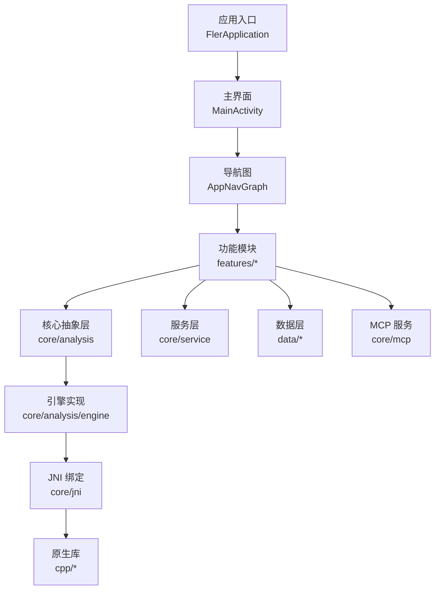
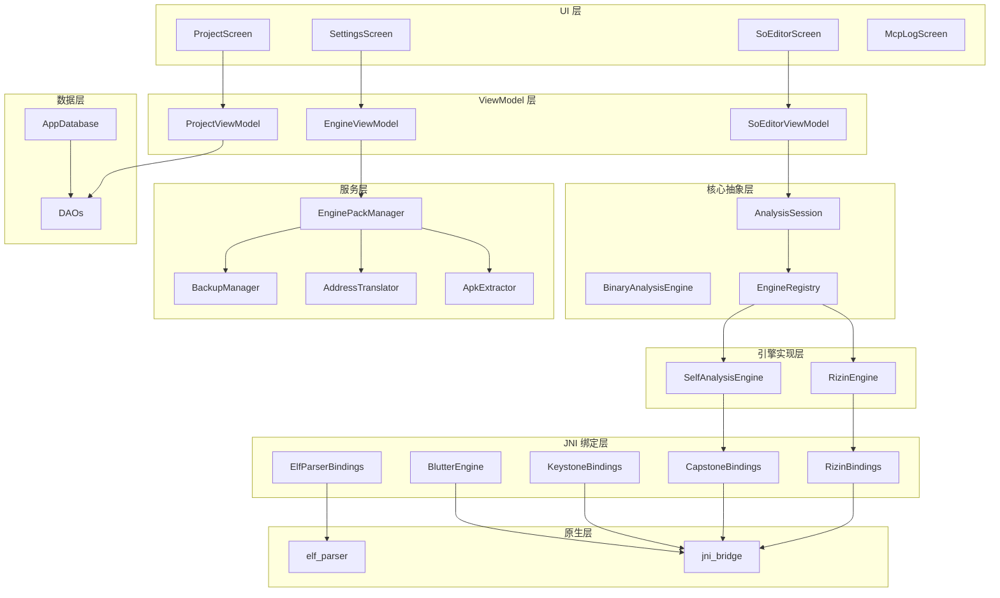
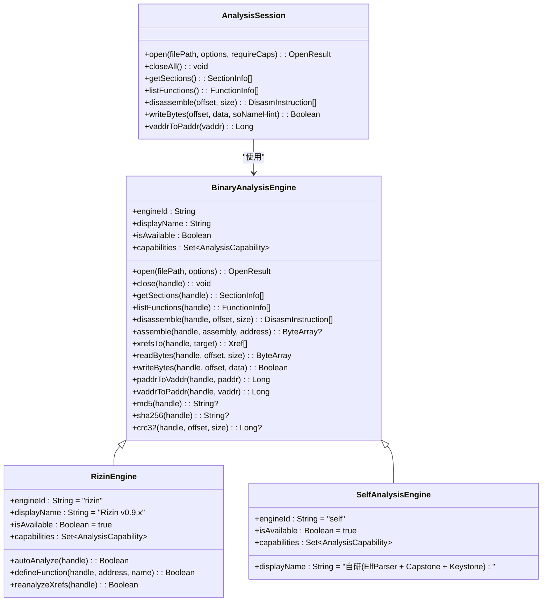
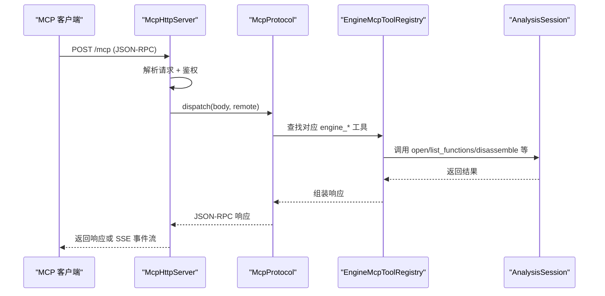
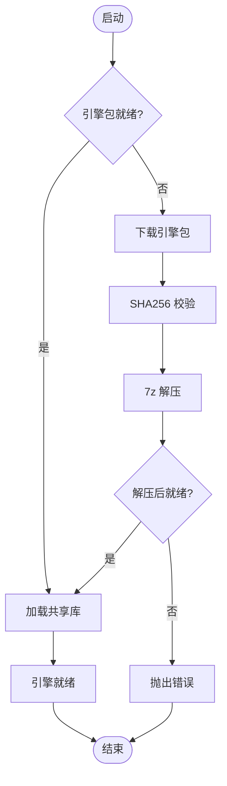
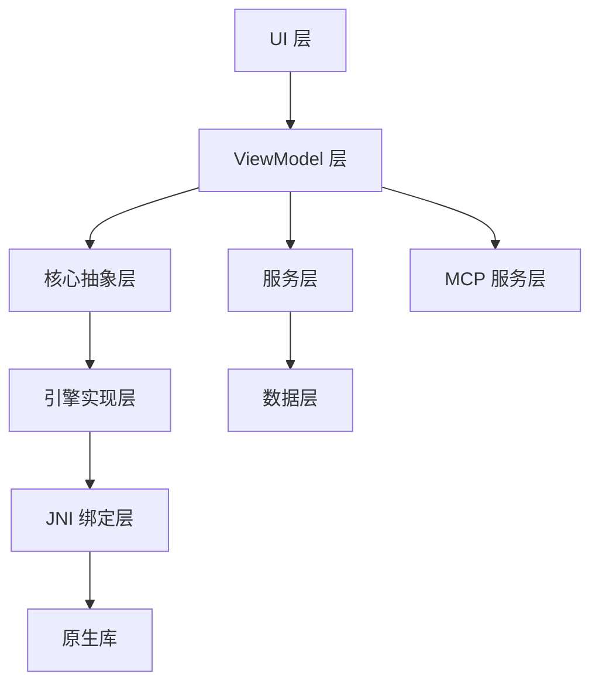

# 项目概述

<cite>
**本文引用的文件**   
- [FlerApplication.kt](file://app/src/main/java/com/ai/fler/FlerApplication.kt)
- [MainActivity.kt](file://app/src/main/java/com/ai/fler/MainActivity.kt)
- [AppNavGraph.kt](file://app/src/main/java/com/ai/fler/app/navigation/AppNavGraph.kt)
- [BinaryAnalysisEngine.kt](file://app/src/main/java/com/ai/fler/core/analysis/BinaryAnalysisEngine.kt)
- [RizinEngine.kt](file://app/src/main/java/com/ai/fler/core/analysis/engine/RizinEngine.kt)
- [AnalysisSession.kt](file://app/src/main/java/com/ai/fler/core/analysis/AnalysisSession.kt)
- [McpHttpServer.kt](file://app/src/main/java/com/ai/fler/core/mcp/McpHttpServer.kt)
- [EnginePackManager.kt](file://app/src/main/java/com/ai/fler/core/service/EnginePackManager.kt)
- [SoEditorViewModel.kt](file://app/src/main/java/com/ai/fler/features/so_editor/SoEditorViewModel.kt)
- [build.gradle.kts](file://app/build.gradle.kts)
- [CODE_WIKI.md](file://CODE_WIKI.md)
- [方案.md](file://方案.md)
</cite>

## 目录
1. [简介](#简介)
2. [项目结构](#项目结构)
3. [核心组件](#核心组件)
4. [架构总览](#架构总览)
5. [关键组件详解](#关键组件详解)
6. [依赖关系分析](#依赖关系分析)
7. [性能与可扩展性](#性能与可扩展性)
8. [快速开始指南](#快速开始指南)
9. [故障排查](#故障排查)
10. [结论](#结论)

## 简介
Fler 是一款面向 Android 平台的 Flutter 应用逆向工程工具，专注于对 APK 中 Flutter 引擎生成的 libapp.so 进行静态分析、反汇编、汇编与字节级编辑。其核心能力链包括：APK 导入 → 提取 libapp.so → Blutter 分析（Dart 方法/类/PP 条目）→ Rizin 深度分析（函数识别/交叉引用/CFG）→ SO 编辑器（结构查看/反汇编/十六进制编辑/字节修改/撤销）→ MCP 服务（对外暴露分析能力供 AI 工具链远程调用）。

技术栈概览：
- UI 层：Jetpack Compose + Material 3 + Navigation Compose
- 状态管理：ViewModel + StateFlow + SavedStateHandle
- 依赖注入：Hilt (KSP)
- 数据持久化：Room (SQLite)
- 网络：OkHttp
- 序列化：kotlinx.serialization (JSON)
- 反汇编/二进制分析：Rizin v0.9.x（静态链接）+ Capstone 5.0.9（静态链接）
- 汇编：Keystone（静态链接）
- Flutter 分析：Blutter 引擎（动态加载）
- 原生代码：C++20 + NDK r27（仅 arm64-v8a）

本项目的整体设计理念采用分层架构与多引擎抽象，通过统一的 BinaryAnalysisEngine 接口屏蔽底层实现差异；同时集成 MCP 协议，将分析能力以 HTTP JSON-RPC 形式对外暴露，便于与外部 AI 工具链集成。

章节来源
- [CODE_WIKI.md:31-58](file://CODE_WIKI.md#L31-L58)
- [方案.md:8-28](file://方案.md#L8-L28)

## 项目结构
- app/src/main/java/com/ai/fler
  - app/navigation：导航图与路由定义
  - core/analysis：引擎抽象层与数据模型
  - core/analysis/engine：引擎实现（RizinEngine、SelfAnalysisEngine 等）
  - core/jni：JNI 绑定（Rizin/Capstone/Keystone/ElfParser/Blutter）
  - core/service：引擎包管理、备份/撤销、地址转换、APK 提取等
  - core/di：Hilt 模块
  - core/mcp：MCP HTTP 服务器与协议处理
  - data：Room 数据库实体与 DAO
  - features：UI 功能模块（项目、SO 编辑器、设置、MCP 日志等）
- app/src/main/cpp：C++ 源码与 CMakeLists.txt（elf_parser、jni_bridge、keystone_include、capstone/include、rizin/include）
- gradle/libs.versions.toml：版本管理
- 构建配置：app/build.gradle.kts（Android/Kotlin/Compose/Hilt/Room/OKHttp/7z/xz/serialization）

图表来源
- [FlerApplication.kt:13-21](file://app/src/main/java/com/ai/fler/FlerApplication.kt#L13-L21)
- [MainActivity.kt:23-48](file://app/src/main/java/com/ai/fler/MainActivity.kt#L23-L48)
- [AppNavGraph.kt:78-163](file://app/src/main/java/com/ai/fler/app/navigation/AppNavGraph.kt#L78-L163)

章节来源
- [CODE_WIKI.md:61-104](file://CODE_WIKI.md#L61-L104)
- [build.gradle.kts:9-59](file://app/build.gradle.kts#L9-L59)

## 核心组件
- BinaryAnalysisEngine：统一二进制分析接口，声明生命周期、ELF 解析、函数分析、反汇编/汇编、交叉引用、字节读写、地址转换、哈希等能力，并通过 capabilities 声明支持项，驱动 MCP 自动暴露。
- AnalysisSession：会话门面，封装引擎挑选、句柄复用、路径到 handle 映射，并集中注入 BackupManager 实现字节编辑的撤销栈。
- RizinEngine：基于 Rizin 的高优先级引擎，提供完整分析能力（ELF、函数、xref、CFG、字符串扫描、反汇编/汇编、字节编辑、地址转换、哈希、签名匹配）。
- EnginePackManager：引擎包下载、校验、解压、就绪检查与更新检测，协调共享库加载顺序，确保 Blutter 引擎可用。
- McpHttpServer：内嵌 HTTP 服务器，支持 legacy SSE 与 Streamable HTTP JSON-RPC，按 Token 鉴权，暴露 engine_* 系列工具。
- SoEditorViewModel：SO 编辑器核心 ViewModel，管理 UI 状态、引擎调用、补丁记录、交叉引用查询、Dart 标签展示等。

章节来源
- [BinaryAnalysisEngine.kt:24-199](file://app/src/main/java/com/ai/fler/core/analysis/BinaryAnalysisEngine.kt#L24-L199)
- [AnalysisSession.kt:23-115](file://app/src/main/java/com/ai/fler/core/analysis/AnalysisSession.kt#L23-L115)
- [RizinEngine.kt:34-81](file://app/src/main/java/com/ai/fler/core/analysis/engine/RizinEngine.kt#L34-L81)
- [EnginePackManager.kt:36-131](file://app/src/main/java/com/ai/fler/core/service/EnginePackManager.kt#L36-L131)
- [McpHttpServer.kt:29-107](file://app/src/main/java/com/ai/fler/core/mcp/McpHttpServer.kt#L29-L107)
- [SoEditorViewModel.kt:34-120](file://app/src/main/java/com/ai/fler/features/so_editor/SoEditorViewModel.kt#L34-L120)

## 架构总览
分层架构设计：
- UI 层：Composable 页面与导航，Tab 布局（Projects / SoEditor / McpLog / Settings），子页面隐藏底部导航。
- ViewModel 层：状态管理与业务编排，通过 Hilt 注入 Session、DAO、BackupManager 等。
- 核心抽象层：BinaryAnalysisEngine 接口与数据模型，统一引擎能力与调用方式。
- 引擎实现层：RizinEngine（高优先级）、SelfAnalysisEngine（fallback），未来可扩展更多引擎。
- JNI 绑定层：Rizin/Capstone/Keystone/ElfParser/Blutter 的 Kotlin 绑定。
- 服务层：引擎包管理、备份/撤销、地址转换、APK 提取、分析结果导入等。
- 数据层：Room 数据库（Project/Analysis/DartClass/DartMethod/PpEntry/Library/AddressMapping）。
- 原生层：C++20 实现的 ELF 解析器与 JNI 桥接，静态链接 Capstone/Keystone/Rizin。

图表来源
- [AppNavGraph.kt:78-163](file://app/src/main/java/com/ai/fler/app/navigation/AppNavGraph.kt#L78-L163)
- [SoEditorViewModel.kt:34-120](file://app/src/main/java/com/ai/fler/features/so_editor/SoEditorViewModel.kt#L34-L120)
- [BinaryAnalysisEngine.kt:24-199](file://app/src/main/java/com/ai/fler/core/analysis/BinaryAnalysisEngine.kt#L24-L199)
- [AnalysisSession.kt:23-115](file://app/src/main/java/com/ai/fler/core/analysis/AnalysisSession.kt#L23-L115)
- [RizinEngine.kt:34-81](file://app/src/main/java/com/ai/fler/core/analysis/engine/RizinEngine.kt#L34-L81)
- [EnginePackManager.kt:36-131](file://app/src/main/java/com/ai/fler/core/service/EnginePackManager.kt#L36-L131)

## 关键组件详解

### 引擎抽象与多引擎支持
- BinaryAnalysisEngine 定义了所有分析能力的统一接口，包含生命周期、ELF 解析、函数分析、反汇编/汇编、交叉引用、字节读写、地址转换、哈希等。
- EngineRegistry 维护引擎注册表并按优先级排序（Rizin=100 > SelfAnalysis=10），根据能力选择最高优先级引擎。
- AnalysisSession 作为唯一入口，封装引擎挑选、句柄复用、路径到 handle 映射，并集中注入 BackupManager 实现撤销栈。

图表来源
- [BinaryAnalysisEngine.kt:24-199](file://app/src/main/java/com/ai/fler/core/analysis/BinaryAnalysisEngine.kt#L24-L199)
- [RizinEngine.kt:34-81](file://app/src/main/java/com/ai/fler/core/analysis/engine/RizinEngine.kt#L34-L81)
- [AnalysisSession.kt:23-115](file://app/src/main/java/com/ai/fler/core/analysis/AnalysisSession.kt#L23-L115)

章节来源
- [BinaryAnalysisEngine.kt:24-199](file://app/src/main/java/com/ai/fler/core/analysis/BinaryAnalysisEngine.kt#L24-L199)
- [AnalysisSession.kt:23-115](file://app/src/main/java/com/ai/fler/core/analysis/AnalysisSession.kt#L23-L115)
- [RizinEngine.kt:34-81](file://app/src/main/java/com/ai/fler/core/analysis/engine/RizinEngine.kt#L34-L81)

### MCP 协议集成与服务暴露
- McpHttpServer 基于 ServerSocket 自实现 HTTP 服务器，支持 legacy SSE 与 Streamable HTTP JSON-RPC，按 Token 鉴权。
- EngineMcpToolRegistry 根据 EngineRegistry 的能力自动生成 engine_* 前缀的 MCP 工具，无需手写暴露代码。
- 支持路由：GET /sse、POST /message、POST /mcp、GET /mcp，兼容 Claude Desktop 与标准 MCP 客户端。

图表来源
- [McpHttpServer.kt:29-107](file://app/src/main/java/com/ai/fler/core/mcp/McpHttpServer.kt#L29-L107)
- [AnalysisSession.kt:23-115](file://app/src/main/java/com/ai/fler/core/analysis/AnalysisSession.kt#L23-L115)

章节来源
- [McpHttpServer.kt:29-107](file://app/src/main/java/com/ai/fler/core/mcp/McpHttpServer.kt#L29-L107)

### 引擎包管理与动态加载
- EnginePackManager 负责引擎包的下载、SHA256 校验、7z 解压、就绪检查与更新检测。
- 支持双源下载（Gitee/GitHub），优先国内加速，失败回退 GitHub。
- 动态加载共享库顺序：libc++_shared.so → ICU → Capstone → dartvm_*.so，确保依赖正确加载。
- 解压后严格检查 isEnginePackReady()，失败立即抛错避免下次重启再触发下载。

图表来源
- [EnginePackManager.kt:124-131](file://app/src/main/java/com/ai/fler/core/service/EnginePackManager.kt#L124-L131)
- [EnginePackManager.kt:162-303](file://app/src/main/java/com/ai/fler/core/service/EnginePackManager.kt#L162-L303)

章节来源
- [EnginePackManager.kt:36-131](file://app/src/main/java/com/ai/fler/core/service/EnginePackManager.kt#L36-L131)
- [EnginePackManager.kt:162-303](file://app/src/main/java/com/ai/fler/core/service/EnginePackManager.kt#L162-L303)

### SO 编辑器与状态管理
- SoEditorViewModel 管理 SO 编辑器的 UI 状态、引擎调用、补丁记录、交叉引用查询、Dart 标签展示等。
- 支持无限滚动反汇编、点击指令行加载交叉引用、呼吸脉冲动画高亮修改位置。
- 通过 AnalysisSession 打开文件，缓存 sections/symbols/functions 避免重复查询。
- 集成 BackupManager 实现字节编辑的撤销栈，支持导出补丁。

章节来源
- [SoEditorViewModel.kt:34-120](file://app/src/main/java/com/ai/fler/features/so_editor/SoEditorViewModel.kt#L34-L120)

## 依赖关系分析
- UI 层依赖 ViewModel 层，ViewModel 层依赖核心抽象层与服务层。
- 核心抽象层通过 EngineRegistry 依赖具体引擎实现（RizinEngine、SelfAnalysisEngine）。
- 引擎实现层通过 JNI 绑定层依赖原生库（Rizin/Capstone/Keystone/ElfParser/Blutter）。
- 服务层依赖数据层（Room）与文件系统（引擎包、备份、临时文件）。
- MCP 服务层独立于 UI，通过 HTTP 暴露分析能力，供外部工具调用。

图表来源
- [AppNavGraph.kt:78-163](file://app/src/main/java/com/ai/fler/app/navigation/AppNavGraph.kt#L78-L163)
- [SoEditorViewModel.kt:34-120](file://app/src/main/java/com/ai/fler/features/so_editor/SoEditorViewModel.kt#L34-L120)
- [BinaryAnalysisEngine.kt:24-199](file://app/src/main/java/com/ai/fler/core/analysis/BinaryAnalysisEngine.kt#L24-L199)

章节来源
- [CODE_WIKI.md:61-104](file://CODE_WIKI.md#L61-L104)

## 性能与可扩展性
- 多引擎架构允许按需扩展新引擎（如 Unicorn/Unidbg），通过实现 BinaryAnalysisEngine 接口即可接入。
- EngineRegistry 按优先级排序，支持降级策略（Rizin 失败则回退到 SelfAnalysisEngine）。
- AnalysisSession 缓存句柄与路径映射，避免重复 open/close 开销。
- SoEditorCache 跨 ViewModel 缓存 sections/symbols/functions/Dart 标签，减少重复查询。
- MCP 自动暴露机制降低新增引擎的集成成本，无需手写 HTTP 暴露代码。

章节来源
- [BinaryAnalysisEngine.kt:24-199](file://app/src/main/java/com/ai/fler/core/analysis/BinaryAnalysisEngine.kt#L24-L199)
- [AnalysisSession.kt:23-115](file://app/src/main/java/com/ai/fler/core/analysis/AnalysisSession.kt#L23-L115)

## 快速开始指南
环境要求：
- Android Studio 支持 Kotlin 2.3.21、Compose、Hilt、Room、KSP
- NDK r27，仅 arm64-v8a 架构
- Gradle KTS 构建系统

安装步骤：
1. 克隆仓库到本地
2. 在 Android Studio 中打开项目
3. 同步 Gradle 依赖
4. 首次运行会自动下载引擎包（fler-engines.7z），支持 Gitee/GitHub 双源
5. 等待引擎包解压完成，即可开始使用

基本使用示例：
1. 打开“项目”Tab，导入 APK 或选择现有项目
2. 进入“SO 编辑器”Tab，选择 libapp.so 文件
3. 查看结构（Sections/Symbols/Functions/Strings）、反汇编、十六进制编辑
4. 通过 MCP 设置页启用服务，暴露分析能力给外部工具

章节来源
- [build.gradle.kts:9-59](file://app/build.gradle.kts#L9-L59)
- [EnginePackManager.kt:162-303](file://app/src/main/java/com/ai/fler/core/service/EnginePackManager.kt#L162-L303)
- [AppNavGraph.kt:78-163](file://app/src/main/java/com/ai/fler/app/navigation/AppNavGraph.kt#L78-L163)

## 故障排查
常见问题与解决方案：
- 引擎包下载失败：检查网络连接，确认 Gitee/GitHub 可达，尝试重置下载源为默认
- 引擎包解压失败：验证 7z 文件头（魔术字节 37 7A BC AF 27 1C），重新下载
- 引擎包就绪检查失败：检查 engines/lib/libc++_shared.so 是否存在，确认目录结构正确
- MCP 服务无法连接：检查 Token 配置，确认 Authorization: Bearer <token> 头部正确
- Rizin 分析缓慢：确认 autoAnalyze 选项，必要时手动触发 reanalyzeXrefs

章节来源
- [EnginePackManager.kt:124-131](file://app/src/main/java/com/ai/fler/core/service/EnginePackManager.kt#L124-L131)
- [EnginePackManager.kt:403-421](file://app/src/main/java/com/ai/fler/core/service/EnginePackManager.kt#L403-L421)
- [McpHttpServer.kt:269-274](file://app/src/main/java/com/ai/fler/core/mcp/McpHttpServer.kt#L269-L274)

## 结论
Fler 通过分层架构与多引擎抽象，实现了强大的 Flutter 应用逆向分析能力。其核心优势包括：
- 统一的 BinaryAnalysisEngine 接口，支持多引擎扩展与降级
- 完善的引擎包管理，支持动态加载与版本控制
- MCP 协议集成，暴露分析能力供 AI 工具链远程调用
- 高效的 SO 编辑器，支持结构查看、反汇编、十六进制编辑与撤销
- 清晰的依赖关系与模块化设计，便于维护与扩展

对于初学者，建议从 SO 编辑器入手，逐步了解引擎抽象与 MCP 协议；对于有经验的开发者，可关注多引擎扩展与性能优化方向。